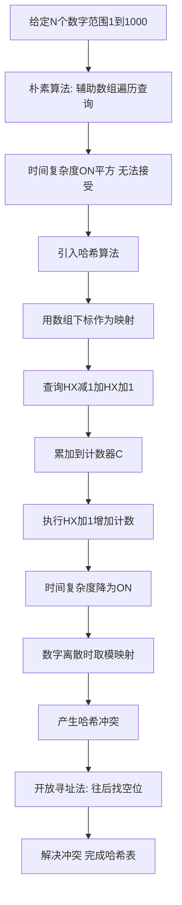

## 本节概述：哈希算法

哈希算法依赖于一种数据结构叫哈希表，底层通过数组来实现，利用数组随机访问的特性实现高效的增删改查。本节从一个"差一数对"问题出发，先展示朴素算法的不足，再引入哈希算法进行优化，最后分析哈希表的底层实现代码。

---

### 核心概念

**问题引入**：给定 N 个数（1万个），数字范围在 1 到 1000 之间，求其中有多少个差一数对。差一数对是指两个数的差为 1，例如 2 和 1、10 和 9 等。

**朴素算法**：选择一个辅助数组 A（1万个元素）和一个整数计数器 C。遍历 N 个数，对于遍历到的数 X，查询辅助数组 A 中存在多少个 X-1 和 X+1，累加到计数器 C 上，然后将 X 放入辅助数组末尾。

朴素算法的查询需要遍历辅助数组，最坏情况下有 N 个元素，所以查询的时间复杂度为 O(N)，放入操作也是 O(1)，遍历为 O(N)，总时间复杂度为 O(N 的平方)，对于 1 万个数就是 10 的 8 次方，无法接受。

**哈希算法**：同样采用一个数组，但利用下标作为映射来做增删改查。数组大小只需 1002（因为数字范围为 1 到 1000），H[X] 代表 X 的出现次数。

```cpp
// 哈希表核心操作
// 查询：H[X-1] + H[X+1] = 能和 X 组成差一数对的数目
// 更新：H[X] += 1，代表增加 X 的计数
// 查询和增加都是下标索引，时间复杂度 O(1)
```

由于数字映射到数组下标，当数字很大且离散时，会耗费非常大的空间，甚至可能开不出来。此时通过对每个 X 进行取模运算，可以重新产生映射。但取模后不同数字可能映射到同一位置，产生**哈希冲突**。

**哈希冲突的解决**：

1. **开放寻址法（本节介绍）**：当发现位置被占时，往后找一个没有被占的位置。
2. **链地址法（简单提及）**：将同余的元素以链表形式链接，哈希表变成数组加链表。

### 算法步骤



**代码分析**：

哈希表底层就是一个数组，H_max 代表哈希表的大小。初始化时将所有位置设为 -1（-1 代表位置未被占据）。

- **哈希插入**：对 X 取模得到 Y，进入死循环。若 H[Y] 等于 -1，说明位置未被占，设置 H[Y]=X，count[Y]=1；若 H[Y] 等于 X，说明之前已插入，count[Y] 自增；否则 Y 自增，继续在哈希表上往后游走，走到右边界回头。
- **哈希查找**：框架与插入相同。若 H[Y] 等于 -1，返回 0；若 H[Y] 等于 X，返回 count[Y]；否则 Y 自增继续往后找。

### 复杂度分析

- 朴素算法：查询 O(N)，遍历 O(N)，总时间复杂度 O(N 的平方)
- 哈希算法：查询 O(1)，增加计数 O(1)，遍历 O(N)，总时间复杂度 O(N)

> [!TIP]
> 在 C++ 中可以直接用 unordered_map 代替手写哈希表，Python 中可以用 dict，Lua 中可以用 table。但原生 C 语言没有哈希表实现，用 C 语言打比赛时必须手写哈希表。

## 本章小结

- 哈希表底层通过数组实现，利用下标作为映射实现 O(1) 的增删改查
- 当数字离散无法直接映射时，通过取模运算重新产生映射，但会引入哈希冲突
- 哈希冲突可以用开放寻址法（往后找空位）或链地址法（数组加链表）解决
- 朴素算法 O(N 平方) 优化为哈希算法 O(N) 是通过空间换时间实现的
