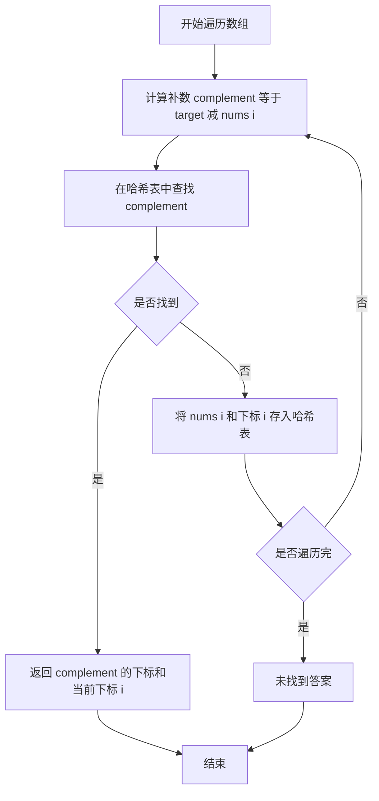

## 本节概述：哈希算法 实战

本节选用 LeetCode 第 1 题「两数之和」——这是哈希表最经典、最入门的应用题，几乎每个程序员都从这道题开始理解哈希表的威力。

---

### 题目描述

**两数之和** | LeetCode 1 | 难度：简单

给定一个整数数组 `nums` 和一个整数目标值 `target`，请你在该数组中找出和为目标值 `target` 的那两个整数，并返回它们的数组下标。

你可以假设每种输入只会对应一个答案，并且你不能使用两次相同的元素。可以按任意顺序返回答案。

**输入格式**：一个整数数组 `nums` 和一个整数 `target`

**输出格式**：两个整数的数组下标

**数据范围**：
- 2 <= nums.length <= 10^4
- -10^9 <= nums[i] <= 10^9
- -10^9 <= target <= 10^9
- 只会存在一个有效答案

**示例**：
输入：nums = [2,7,11,15], target = 9
输出：[0,1]
解释：因为 nums[0] + nums[1] == 9，返回 [0,1]

### 解题思路

**核心思想**：利用哈希表将「查找补数」的时间从 O(n) 降到 O(1)。

遍历数组时，对于当前元素 `nums[i]`，我们需要找到之前是否出现过 `target - nums[i]`。如果用暴力法，每次都要回头扫描一遍数组，时间复杂度 O(n^2)。而哈希表可以在 O(1) 时间内完成查找。

具体步骤：
1. 创建一个哈希表，键为数组元素的值，值为元素的下标
2. 遍历数组，对于每个元素 `nums[i]`，计算 `complement = target - nums[i]`
3. 如果 `complement` 已经在哈希表中，说明找到了答案，返回两个下标
4. 否则，将当前元素及其下标存入哈希表



### 代码实现

```cpp
#include <iostream>
#include <vector>
#include <unordered_map>
using namespace std;

class Solution {
public:
    vector<int> twoSum(vector<int>& nums, int target) {
        // 哈希表：键为元素值，值为下标
        unordered_map<int, int> hashTable;
        
        for (int i = 0; i < nums.size(); i++) {
            // 计算当前元素需要的补数
            int complement = target - nums[i];
            
            // 在哈希表中查找补数
            auto it = hashTable.find(complement);
            if (it != hashTable.end()) {
                // 找到了，返回两个下标
                return {it->second, i};
            }
            
            // 没找到，将当前元素存入哈希表
            hashTable[nums[i]] = i;
        }
        
        // 题目保证有解，不会走到这里
        return {};
    }
};

int main() {
    Solution sol;
    vector<int> nums = {2, 7, 11, 15};
    int target = 9;
    
    vector<int> result = sol.twoSum(nums, target);
    cout << "[" << result[0] << "," << result[1] << "]" << endl;
    // 输出: [0,1]
    
    return 0;
}
```

### 代码解析

1. **`unordered_map<int, int> hashTable`**：使用 C++ STL 中的 `unordered_map`，底层是哈希表，查找和插入的平均时间复杂度为 O(1)

2. **`complement = target - nums[i]`**：对每个元素，计算它需要的「搭档」值。比如 target=9，当前元素是 2，那么需要找 7

3. **`hashTable.find(complement)`**：在哈希表中查找补数是否已经存在。如果存在，说明之前遍历过的某个元素正好是当前元素的搭档

4. **`hashTable[nums[i]] = i`**：将当前元素存入哈希表，供后续元素查找。注意是「先查找、再插入」，避免使用同一元素两次

### 复杂度分析

- 时间复杂度：O(n)，只需遍历一次数组，每次哈希表查找和插入都是 O(1)
- 空间复杂度：O(n)，最坏情况下需要将 n-1 个元素存入哈希表

> [!TIP]
> 这道题的关键点在于「边遍历边存」。不要预先把所有元素存入哈希表，否则当 target = 2 * nums[i] 时会找到自身。先查再存的顺序保证了每个元素只会和它之前的元素配对。

## 本章小结

- 哈希表的核心优势是将查找时间从 O(n) 降到 O(1)
- `unordered_map` 是 C++ 中最常用的哈希表实现，适合需要快速查找的场景
- 「两数之和」是哈希表最经典的应用：用空间换时间，将 O(n^2) 暴力法优化到 O(n)
- 使用哈希表时要注意「先查找、再插入」的顺序，避免元素与自身配对
