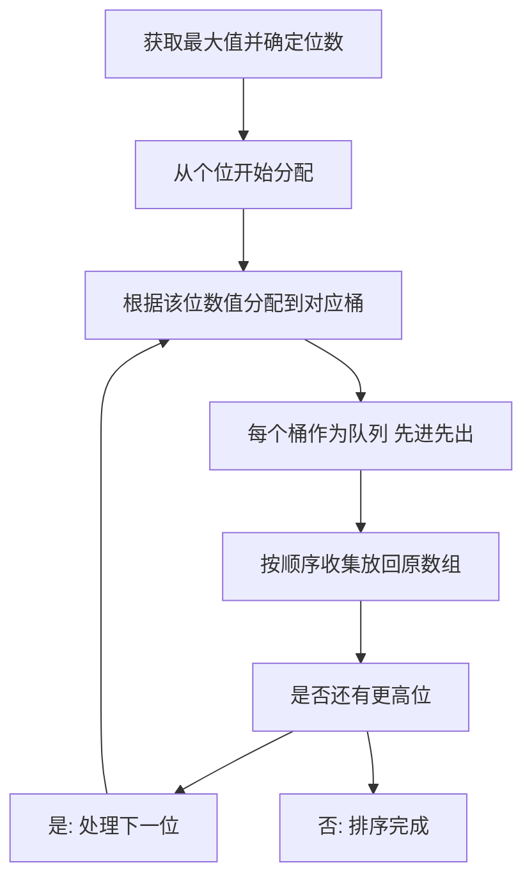

## 本节概述：基数排序

基数排序是一种非比较的排序算法，根据数字的每一位进行排序，通常用于整数的排序。它的思想是对所有元素进行若干次的分配和收集操作来实现排序。基数排序的"基数"就是进制转换里的那个"基数"，比如十进制的基数就是 10。

---

### 核心概念

**算法思想**：
1. 获取待排序元素的最大值，并确定它的位数
2. 从最低位（个位）开始，对每一位进行分配和收集操作
3. 根据该位的数值将元素分配到对应的桶中（十进制则建 10 个桶，0 到 9）
4. 每个桶中的元素进行顺序的收集（队列方式，先进先出），放回原数组
5. 再进行十位、百位的分配和收集，等所有位数都分配完毕，整个过程完成

**执行过程**（以含 357 等数字的数组为例）：
- **第一轮（个位）**：根据个位值分配到对应桶。个位是 1 的分到 1 号桶，个位是 3 的分到 3 号桶，个位是 7 的分到 7 号桶。分配完后按顺序收集放回原数组（队列，先进先出）
- **第二轮（十位）**：十位值同样分配到对应桶。357 的十位是 0，分配在最前面。此时会发现小的到前面去了，而且之前个位排序中 357 已经有序，出去时仍然有序，后续比较中顺序不会再改变
- **第三轮（百位）**：没有百位的被塞到 0 号桶位置。继续放回原数组
- **第四轮（千位）**：所有有百位的数字被放到 0 号桶。没有万位了，整个数据排序完成

**关键理解**：每一位比较时，高位区分了大数和小数，低位已经在之前的排序中有序了，所以再出去时仍然有序，后续比较中顺序不可能再改变。

### 算法步骤

### 复杂度分析

**时间复杂度**：D 乘以 N 加 R，其中 D 是数字的位数，N 是待排序元素的数量，R 是基数（十进制为 10）。每次分配和收集与位数有关，有 4 位则 D 为 4。一般 N 远大于 2，所以也可以认为是 D 乘 N。时间复杂度取决于数字的位数和待排序元素的数量。

对于位数较少的情况，基数排序效率非常高，因为它不需要进行元素间的比较。当数字位数较多时，可能需要较多的分配和收集操作，导致时间复杂度增加。

**空间复杂度**：需要额外的空间来存储桶，某种意义上基数排序就是一种特殊的桶排序，只不过要进行多次桶排序，所以空间复杂度为**大 O R**（R 为基数）。

**算法优点**：
- 不需要进行元素间的比较，对一些特殊情况比比较性排序更有效
- 可以有效排一些固定数字的序列，如电话号码、身份证号码

**算法缺点**：
- 需要用到很多桶，耗费额外空间
- 对于非整数类型没法排（如浮点数不好排，负数需要处理变成正数后再排）

**与桶排序的区别**：基数排序和桶排序很容易混淆。基数排序是一种特殊的桶排序，但要进行多次。

**优化方案**：可以采用其他排序来优化，或与其他排序算法进行组合，达到更好的排序效果。

> [!TIP]
> 基数排序的关键是"多次分配和收集"——每一位比较时高位区分大小，低位已有序所以出去仍有序。适合固定数字的序列如电话号码、身份证号。与桶排序容易混淆，区别在于基数排序要进行多次桶排序。

## 本章小结

- 基数排序是非比较排序，按数字每一位进行分配和收集
- 时间复杂度为 D 乘 N 加 R（D 为位数，N 为元素数，R 为基数）
- 适合整数排序，尤其适合电话号码、身份证等固定位数序列
- 与桶排序容易混淆，区别在于基数排序需要多次桶排序
