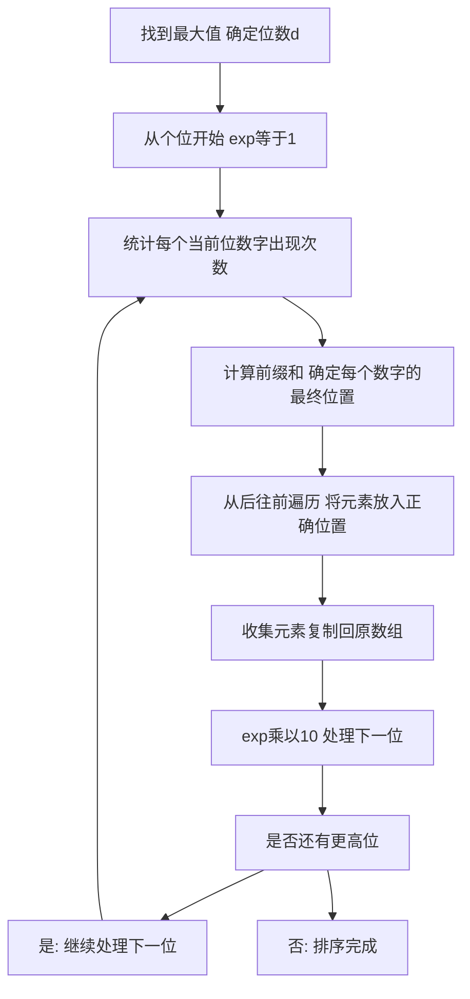

## 本节概述：基数排序 实战

本节选用洛谷 P1177"排序模板"，这是洛谷上最经典的排序题目。通过用基数排序解决这道题，读者可以彻底理解基数排序的核心思想——按数字的每一位进行分配和收集，从低位到高位依次排序，利用计数排序的稳定性保证最终结果有序。

---

### 题目描述

**题目名称**：排序模板

**来源平台**：洛谷

**题目编号**：P1177

将读入的 N 个数从小到大排序后输出。

**输入格式**：第一行为一个正整数 N。第二行包含 N 个空格隔开的正整数，为你需要进行排序的数。

**输出格式**：将给定的 N 个数从小到大输出，数之间空格隔开，行末换行且无空格。

**数据范围**：对于 100% 的数据，1 <= N <= 10 的 5 次方，1 <= 每个元素 <= 10 的 9 次方。

**示例**：
输入：
5
4 2 4 5 1

输出：
1 2 4 4 5

### 解题思路

基数排序是一种非比较排序，按数字的每一位进行排序。从最低位（个位）开始，依次对每一位进行计数排序，直到最高位。由于计数排序是稳定的，低位排序的结果在高位排序时不会被打乱，最终得到完全有序的序列。

**核心思想**：数字 357 有个位 7、十位 5、百位 3。先按个位排序，再按十位排序，再按百位排序。每一轮排序后，低位已经有序，高位排序不会改变低位已排好的顺序（稳定性保证）。

**LSD（最低位优先）法**：
1. 找到最大值，确定位数 d
2. 从个位开始，对每一位进行计数排序
3. 每轮排序使用当前位数字作为"键"，通过计数排序将元素分配到 0 到 9 共 10 个桶中
4. 按桶的顺序收集元素放回原数组
5. 处理完所有位后，排序完成

**计数排序的实现**：为了高效地分配和收集，使用计数数组 cnt 记录每个数字（0 到 9）出现的次数，然后计算前缀和确定每个数字的最终位置，最后从后往前遍历将元素放入正确位置（保证稳定性）。



### 代码实现

```cpp
#include <iostream>
using namespace std;

int a[100005];       // 原数组
int bucket[100005];  // 临时数组
int cnt[10];         // 计数数组 0到9

// 基数排序（LSD最低位优先）
void radixSort(int n) {
    // 找最大值，确定最大位数
    int maxVal = a[0];
    for (int i = 1; i < n; i++) {
        if (a[i] > maxVal) maxVal = a[i];
    }
    
    // 从个位开始，对每一位进行计数排序
    for (int exp = 1; maxVal / exp > 0; exp *= 10) {
        // 初始化计数数组
        for (int i = 0; i < 10; i++) cnt[i] = 0;
        
        // 统计每个当前位数字出现的次数
        for (int i = 0; i < n; i++) {
            int digit = (a[i] / exp) % 10;
            cnt[digit]++;
        }
        
        // 计算前缀和，cnt[i]表示数字小于等于i的元素个数
        // 即数字i的最后一个元素在bucket中的位置
        for (int i = 1; i < 10; i++) {
            cnt[i] += cnt[i - 1];
        }
        
        // 从后往前遍历，保证稳定性
        for (int i = n - 1; i >= 0; i--) {
            int digit = (a[i] / exp) % 10;
            bucket[--cnt[digit]] = a[i];
        }
        
        // 将排序结果复制回原数组
        for (int i = 0; i < n; i++) {
            a[i] = bucket[i];
        }
    }
}

int main() {
    ios::sync_with_stdio(false);
    cin.tie(0);
    
    int n;
    cin >> n;
    for (int i = 0; i < n; i++) {
        cin >> a[i];
    }
    
    radixSort(n);
    
    for (int i = 0; i < n; i++) {
        if (i > 0) cout << " ";
        cout << a[i];
    }
    cout << endl;
    return 0;
}
```

### 代码解析

**确定最大位数**：先找到数组中的最大值 maxVal，通过 maxVal 除以 exp 是否大于 0 来判断是否还有更高位需要处理。例如 maxVal 为 10 的 9 次方时，需要处理 10 位（个位到十亿位）。

**每一轮的计数排序**：对每一位进行稳定的计数排序。共四个步骤：

1. **统计**：遍历数组，取每个元素当前位的数字（a 中 i 除以 exp 模 10），在计数数组 cnt 中对应位置加 1。

2. **前缀和**：计算 cnt 的前缀和，使得 cnt 中 d 表示当前位数字小于等于 d 的元素总数，也就是数字 d 对应的最后一个元素在 bucket 数组中的位置加 1。

3. **放置**：从后往前遍历原数组，对每个元素取当前位数字 d，将其放入 bucket 中 cnt 的 d 减 1 的位置，然后 cnt 的 d 减 1。从后往前遍历是保证稳定性的关键——相同数字的元素保持原来的相对顺序。

4. **复制**：将 bucket 中的结果复制回原数组 a。

**稳定性**：基数排序依赖于每一轮计数排序的稳定性。从后往前遍历保证了在相同位数字的元素中，后面的元素仍然排在后面，不会打乱之前低位排序的结果。

### 复杂度分析

- 时间复杂度：大 O D 乘 N。D 是最大数字的位数（最大 10 的 9 次方有 10 位），每一轮计数排序的时间为 O N 加 10（基数），共 D 轮，总时间复杂度为 D 乘 N。对于 P1177 的数据范围，D 最大为 10，效率很高。
- 空间复杂度：大 O N。使用与原数组等大的临时数组 bucket 和大小为 10 的计数数组 cnt。

> [!TIP]
> 基数排序的核心是"按每一位进行稳定的计数排序"。从后往前遍历是保证稳定性的关键——相同位数字的元素保持原来的相对顺序。LSD 从个位开始排序，利用低位已有序的性质，高位排序不会打乱低位顺序。P1177 数据都是正整数，不需要处理负数。

## 本章小结

- 基数排序是非比较排序，按数字每一位从低位到高位进行计数排序
- 每一轮使用计数排序（统计、前缀和、从后往前放置），保证稳定性
- 从后往前遍历是保证稳定性的关键，相同位数字的元素保持原有相对顺序
- 时间复杂度为大 O D 乘 N（D 为最大位数），空间复杂度为大 O N
