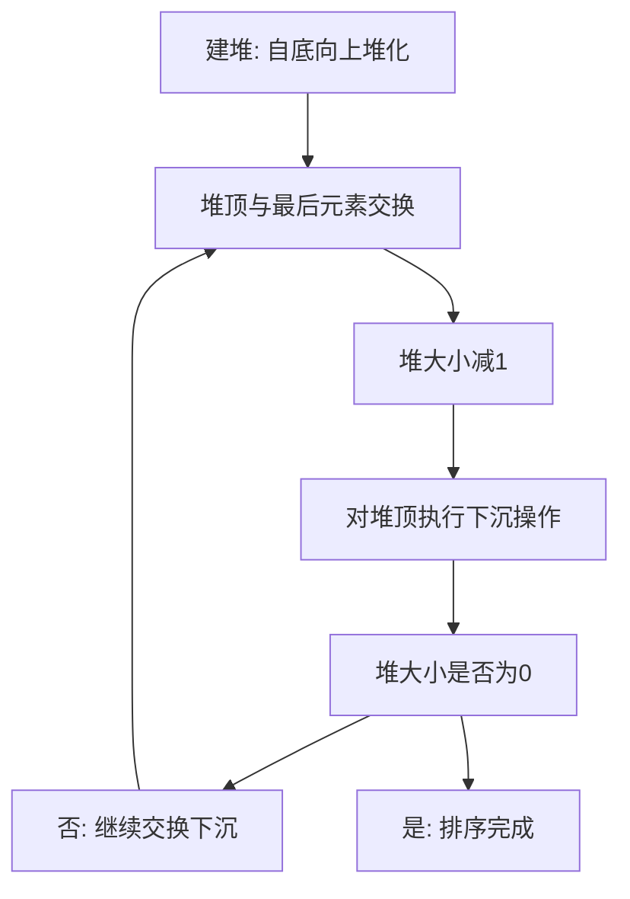

## 本节概述：堆排序

学习堆排序之前，首先需要了解二叉堆。二叉堆的物理结构实际上是一种完全二叉树。堆排序的核心在于：把数组和堆存储在同一个数组里，堆在不断减小，数组部分不断增大，最后数组部分把堆完全淹没。它本质上是对选择排序的优化——从大 O N 的查找优化为大 O log N。

---

### 核心概念

**前置概念——二叉树的数组表示法**：

完全二叉树的元素一层一层排列，可以用数组存储。通过公式可以从下标得到父子关系：
- 父节点下标：ID 减 1 除 2（取下整）
- 左子节点下标：ID 乘 2 加 1
- 右子节点下标：ID 乘 2 加 2（即左子 ID 加 1）
- 下标为奇数一定是左子节点，偶数一定是右子节点

**堆的概念**：堆满足任意一个节点都比它的两个子节点大或小。
- **大顶堆**：任意节点值都比左右子节点大（如 255 大于 128 和 200）
- **小顶堆**：任意节点值都比左右子节点小

**朴素算法的问题**：对于一个容器有三种操作——插入元素、查询最大元素、删除最大元素。
- 用数组模拟：插入 O(1)，但删除和查找都是 O(N)（需遍历数组）
- 用有序数组：删除和查找 O(1)（操作末尾元素），但插入 O(N)

**二叉堆的优势**：可以在 O(1) 时间内获取最大值，利用数组随机访问特性模拟二叉树，降低操作的时间复杂度。

**堆的三个操作**：

1. **元素插入**：在数组尾部插入元素，然后与父节点比较。大顶堆中如果比父节点大就交换（上浮），插入只会上浮不会下沉——因为基于大顶堆性质，父节点一定大于子节点，如果新元素比父节点大，则一定也比子节点大。交换后继续与爷爷节点比较，直到成为根节点或不再需要交换。

2. **获取堆顶**：直接返回数组第零个元素，大 O 1 时间复杂度。这是堆最简单的接口。

3. **元素删除**：删除堆顶元素。不能直接删除（会导致两个子树无家可归），而是：
   - 将堆顶元素与数组最后一个元素交换
   - 堆大小减 1
   - 对新的堆顶执行下沉操作：找到左右子节点中较大者进行交换，直到自己成为最大的
   - 注意：要删除的元素不参与比较
   - 最后返回原先的堆顶元素

**下沉操作**：比较当前节点与左右子节点，找到最优者（大顶堆中值最大者）。如果最优者不是自己，则与最优者交换并递归继续下沉。上浮只需比较自己和父亲，下沉需要比较自己和两个孩子。

### 算法步骤

**堆排序过程**：
1. 建堆：从第 N 除 2 个元素开始到第 0 个元素，自底向上对每个元素进行堆化（下沉操作）。N 除 2 加 1 到 N 减 1 的元素是叶子节点，叶子节点一定满足堆性质不需要处理
2. 交换：将堆顶（数组第零个元素，即最大值）与数组最后一个元素交换
3. 堆大小减 1：去掉最后一个元素与堆的连接
4. 对堆顶执行下沉操作，使其重新满足堆性质
5. 重复交换、减 1、下沉，直到堆大小变为 0

建堆过程的核心：从第一个非叶子节点开始，检查以该节点为根的子树是否满足堆。如果不满足，通过不断下沉使其满足。当左右子树都是堆时，如果根节点比两个子节点都大，整个就是一个堆；否则找大的交换上来。最终一定能构建出完整的二叉堆。

**堆排序的本质**：找到数组 0 到 N 减 1 的最大值，和第 N 减 1 位置交换；找到 0 到 N 减 2 的最大值，和第 N 减 2 位置交换......这实际上就是选择排序。只不过普通选择排序是遍历找最大值 O(N)，而堆排序通过堆将查找过程优化为 O(log N)。

### 复杂度分析

**时间复杂度**：建堆和排序都用到了 heapify（下沉操作）。每次交换后对堆顶执行下沉，下沉的时间复杂度为 O(log N)，共执行 N 次，总时间复杂度为**大 O N 乘 log N**。相比选择排序的 O(N 方)，是将选择过程从 O(N) 优化为 O(log N)。

**空间复杂度**：堆和有序数组共用同一个数组，原地排序，空间复杂度为**大 O 1**。

> [!TIP]
> 堆排序的核心是"数组和堆共用一个数组"——堆不断减小，有序数组不断增大，最后堆被完全淹没。本质是对选择排序的优化：通过堆将找最大值从 O(N) 优化为 O(log N)。建堆从第 N/2 个元素开始（跳过叶子节点），自底向上堆化。

## 本章小结

- 堆排序基于二叉堆（完全二叉树），利用数组表示父子关系
- 大顶堆中插入用上浮、删除用下沉，获取堆顶 O(1)
- 堆排序本质是优化的选择排序：堆顶与末尾交换、减堆大小、下沉
- 时间复杂度从选择排序的 O(N 方) 优化为 O(N log N)，空间复杂度 O(1)
