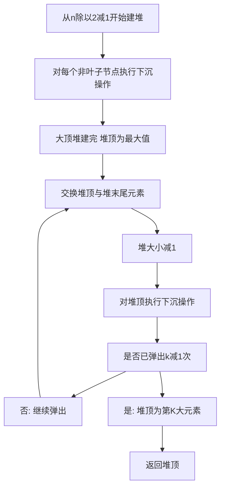

## 本节概述：堆排序 实战

本节选用 LeetCode 第 215 题"数组中的第 K 个最大元素"，这是堆排序最经典的实战题。题目要求在未排序数组中找第 K 大的元素，用堆排序可以在大 O N 加 K 乘 log N 时间内解决，也可以用小顶堆维护大小为 K 的堆在大 O N 乘 log K 时间内解决。通过这道题，读者可以深刻理解堆的建堆、上浮和下沉操作。

---

### 题目描述

**题目名称**：数组中的第 K 个最大元素

**来源平台**：LeetCode

**题目编号**：215

给定整数数组 nums 和整数 k，请返回数组中第 k 个最大的元素。

请注意，你需要找的是数组排序后的第 k 个最大的元素，而不是第 k 个不同的元素。

**输入格式**：第一行为整数数组 nums，第二行为整数 k。

**输出格式**：一个整数，表示第 k 个最大的元素。

**数据范围**：1 <= k <= 数组长度 <= 10 的 5 次方，负 10 的 4 次方 <= nums 中每个元素 <= 10 的 4 次方。

**示例**：
输入：nums = 3 2 1 5 6 4，k = 2
输出：5

解释：排序后为 1 2 3 4 5 6，第 2 大的元素是 5。

### 解题思路

这道题可以用堆排序来解决。核心思路是：建一个大顶堆，然后弹出 k 减 1 次堆顶（最大值），此时堆顶就是第 K 大的元素。

**堆排序的过程与选择排序的关系**：堆排序本质上是对选择排序的优化。选择排序每轮遍历找最大值需要 O N，而堆通过维护堆性质，找最大值只需 O 1（堆顶），调整堆需要 O log N。

**具体步骤**：
1. 建堆：从最后一个非叶子节点开始，自底向上对每个节点执行下沉操作（heapify），构建大顶堆
2. 弹出：将堆顶（最大值）与堆末尾交换，堆大小减 1，对新的堆顶执行下沉操作
3. 重复弹出 k 减 1 次，第 k 次的堆顶就是第 K 大的元素

**建堆的原理**：完全二叉树中，下标从 n 除以 2 到 n 减 1 的节点是叶子节点，已经满足堆性质。从 n 除以 2 减 1 开始往前遍历，对每个节点执行下沉操作。由于子节点所在子树已经堆化，下沉操作可以正确维护堆性质。



### 代码实现

```cpp
class Solution {
public:
    // 下沉操作：维护大顶堆性质
    void heapify(vector<int>& nums, int n, int i) {
        int largest = i;           // 当前节点
        int left = 2 * i + 1;     // 左子节点
        int right = 2 * i + 2;    // 右子节点
        
        // 找出当前节点和左右子节点中最大的
        if (left < n && nums[left] > nums[largest])
            largest = left;
        if (right < n && nums[right] > nums[largest])
            largest = right;
        
        // 如果最大值不是当前节点，交换并继续下沉
        if (largest != i) {
            swap(nums[i], nums[largest]);
            heapify(nums, n, largest);
        }
    }
    
    int findKthLargest(vector<int>& nums, int k) {
        int n = nums.size();
        
        // 第一步：建大顶堆
        // 从最后一个非叶子节点开始，自底向上堆化
        for (int i = n / 2 - 1; i >= 0; i--) {
            heapify(nums, n, i);
        }
        
        // 第二步：弹出k-1个最大值
        for (int i = 0; i < k - 1; i++) {
            // 交换堆顶和堆末尾
            swap(nums[0], nums[n - 1 - i]);
            // 堆大小减1，对堆顶执行下沉
            heapify(nums, n - 1 - i, 0);
        }
        
        // 堆顶就是第k大的元素
        return nums[0];
    }
};
```

### 代码解析

**下沉操作 heapify**：接收数组、堆大小 n 和当前节点下标 i。比较节点 i 与其左右子节点（2 乘 i 加 1 和 2 乘 i 加 2），找到三者中的最大值。如果最大值不是 i，则交换 i 与最大值节点，并递归对交换后的节点继续下沉。下沉操作的时间复杂度为大 O log N（树的高度）。

**建堆**：从下标 n 除以 2 减 1（最后一个非叶子节点）开始，倒序遍历到 0，对每个节点执行 heapify。为什么从 n 除以 2 减 1 开始？因为下标 n 除以 2 到 n 减 1 的节点都是叶子节点，已经满足堆性质。自底向上建堆的时间复杂度为大 O N（不是表面上的 N 乘 log N，因为底层节点多但下沉距离短，高层节点少但下沉距离长，总和为大 O N）。

**弹出过程**：每次将堆顶（当前最大值）与堆末尾元素交换，然后堆大小减 1，对新的堆顶执行 heapify 恢复堆性质。弹出 k 减 1 次后，堆顶就是第 K 大的元素。

**堆的数组表示**：完全二叉树用数组存储，下标 i 的左子节点为 2 乘 i 加 1，右子节点为 2 乘 i 加 2，父节点为 i 减 1 除以 2。无需额外的指针，通过下标计算即可访问。

### 复杂度分析

- 时间复杂度：大 O N 加 K 乘 log N。建堆大 O N，每次弹出后下沉大 O log N，共弹出 k 减 1 次。当 k 等于 n 时就是完整的堆排序，时间复杂度为大 O N 乘 log N。
- 空间复杂度：大 O 1。原地建堆和弹出，不需要额外空间（递归调用栈深度为 log N，可改为迭代实现）。

> [!TIP]
> 堆排序找第 K 大元素是堆最经典的应用。建堆从 n 除以 2 减 1 开始（最后一个非叶子节点），自底向上堆化。弹出 k 减 1 次堆顶后，第 k 次的堆顶就是答案。也可以用小顶堆维护大小为 K 的堆，空间更省但思路不同。

## 本章小结

- 堆排序找第 K 大元素是堆最经典的实战题，建大顶堆后弹出 k 减 1 次堆顶
- 建堆从最后一个非叶子节点（n 除以 2 减 1）开始，自底向上执行下沉操作
- 堆的数组表示：左子 2 乘 i 加 1，右子 2 乘 i 加 2，父节点 i 减 1 除以 2
- 时间复杂度为大 O N 加 K 乘 log N，空间复杂度为大 O 1（原地排序）
