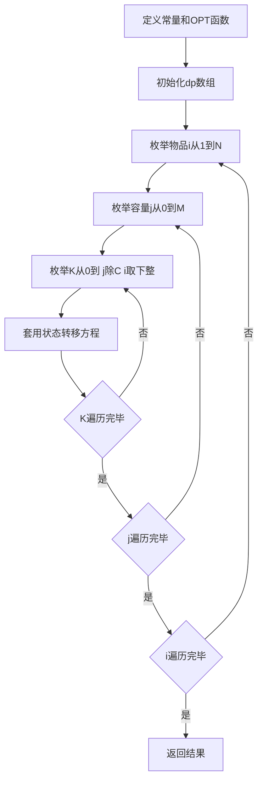

## 本节概述：完全背包

完全背包也是一种线性DP，状态转移方程固定。与01背包的区别在于每种物品可以无限选择。在没有任何优化的情况下，时间复杂度为O(N * M^2)，经过时间优化和空间优化后可降为O(N * M)。本节介绍未优化的版本。

---

### 核心概念

**问题描述**

有N个物品和一个容量为M的背包（N在100以内，M在1万以内）。第i个物品的容量是 `C[i]`，价值是 `W[i]`。选择一些物品放入背包，每种物品可以无限选择，总容量不能超过背包容量，求能够达到的物品最大总价值。

"完全"体现了与01背包的区别：01背包每种物品只有一个（取0或1），完全背包每种物品可以无限选择。由于每件物品都可以无限选择，所以描述时用"种"为单位。

**状态设计**

`dp[i][j]` 表示前i种物品恰好放入容量为j的背包所得到的最大价值。

- `i` 范围 0 到 N，0代表一个物品都不放，1到N代表前1种、前2种......前N种
- `j` 范围 0 到 M，代表容量为0、1、2......M
- 二维数组承担哈希表的功能

**状态转移方程**

与01背包不同，完全背包需要枚举第i种物品放入的个数K：

1. **不放第i种物品**（K=0）：问题转化为前i-1种物品放入容量为j的背包，即 `dp[i-1][j]`
2. **放K个第i种物品**（K > 0）：问题转化为前i-1种物品放入容量为 `j - K*C[i]` 的背包，再加上K个第i种物品的价值 `K*W[i]`

```cpp
dp[i][j] = max(dp[i-1][j - K*C[i]] + K*W[i])  // K从0到 floor(j/C[i])
```

K必须取整数，上界为 `j / C[i]` 取下整。枚举所有满足条件的K，取最大值。

**与01背包的关系**

完全背包是对01背包的扩展：01背包就是K取0或1的情况，完全背包就是K可以取0到 `floor(j/C[i])`。两者可以归纳为同一个状态转移方程。

### 算法步骤



**代码逻辑**

1. 定义常量 `infinite` 和 `unit`（与01背包一致）
2. 定义OPT函数（与01背包一致）
3. 初始化 `dp` 数组（与01背包一致）
4. 枚举第1到第N种物品
5. 枚举0到M的容量
6. 枚举第i种物品选择放入0个、1个、2个......直到 `floor(j/C[i])` 个
7. 套用状态转移方程

### 复杂度分析

- **状态数**：O(N * M)
- **状态转移消耗**：O(K)，K最大为 `floor(j/C[i])`
- **时间复杂度**：O(N * M^2)

最坏情况下 `C[i] = 1` 时，K等于j，总的状态转移次数为 `1 + 2 + 3 + ... + M = M*(M+1)/2`，所以整个算法时间复杂度为O(N * M^2)，状态转移均摊时间复杂度为O(M)。如果数据不卡，部分题目还是可以过的。

> [!TIP]
> 对于动态规划问题，写代码从来不是难点，难点在于如何设计状态、如何进行状态转移，只要状态转移理解了，写代码就是顺便的事情。完全背包与01背包初始化完全一致，区别只在于状态转移时多枚举了一层K。后续课程会介绍时间优化和空间优化版本。

## 本章小结

- 完全背包与01背包的区别：每种物品可以无限选择，用"种"为单位
- 状态定义：dp[i][j] 表示前i种物品恰好放入容量j的背包的最大价值
- 状态转移方程：枚举K个第i种物品，K从0到 floor(j/C[i])
- 完全背包是01背包的扩展，01背包是K取0或1的特例
- 未优化时间复杂度O(N * M^2)，后续课程将介绍时间优化和空间优化
