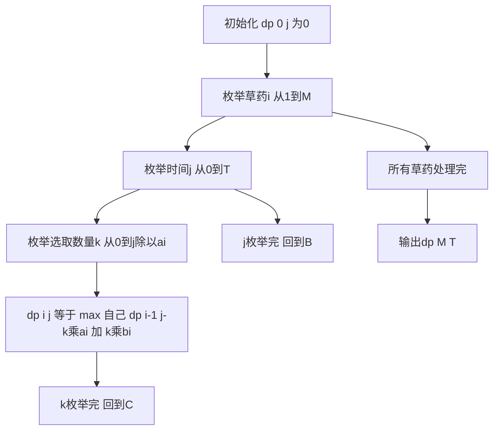

## 本节概述：完全背包 实战

本节选取洛谷 P1616 疯狂的采药，这是完全背包最经典的模板题。与 01 背包不同，每种草药可以无限次采摘，这道题让你彻底理解完全背包的状态转移。

---

### 题目描述

**题目名称**：疯狂的采药
**来源平台**：洛谷
**题目编号**：P1616

LiYuxiang 是个天资聪颖的孩子，医师把他带到一个到处都是草药的山洞里，给他一段时间采药。每种草药可以无限制地疯狂采摘，每种草药有采摘时间和自身价值，求在规定时间内能采到的草药的最大总价值。

**输入格式**：第一行有两个整数，分别代表总共能够用来采药的时间 t 和代表山洞里的草药的数目 m。第 2 到第 m+1 行，每行两个整数 ai, bi，分别表示采摘第 i 种草药的时间和该草药的价值。

**输出格式**：输出一行一个整数，表示在规定的时间内可以采到的草药的最大总价值。

**数据范围**：对于 100% 的数据，1 <= m <= 10^4，1 <= t <= 10^7，且 1 <= m x t <= 10^7，1 <= ai, bi <= 10^4。

**示例**：
输入：
```
70 3
71 100
69 1
1 2
```
输出：
```
140
```

### 解题思路

完全背包与 01 背包的唯一区别：每种物品可以无限次选取。

朴素思路：对于第 i 种草药，可以采 0 次、1 次、2 次...直到时间不够。三重循环：外层枚举物品，中层枚举容量，内层枚举选取数量。

状态设计：`dp[i][j]` 表示前 i 种草药在时间 j 内的最大价值。

朴素状态转移：`dp[i][j] = max(dp[i-1][j - k*ai] + k*bi)`，其中 k 是第 i 种草药的选取数量，0 <= k <= j/ai。

这个朴素做法时间复杂度为 O(n x t x max_count)，当数据范围较大时会超时。但由于 m x t <= 10^7 的限制，本题可以用这种方式理解，后续章节会讲时间优化和空间优化。

注意：数据量可能很大，价值之和可能超过 int 范围，必须使用 `long long`。



### 代码实现

```cpp
#include <iostream>
#include <algorithm>
using namespace std;

typedef long long ll;

const int MAXT = 10000005;
const int MAXM = 10005;

int m;
ll t_val;
ll a[MAXM], b[MAXM]; // a[i]: 采摘时间, b[i]: 草药价值
ll dp[MAXM][1005];    // dp[i][j]: 前i种草药在时间j内的最大价值
// 注意：m*t<=10^7，二维数组大小受限于m*t

int main() {
    ios::sync_with_stdio(false);
    cin.tie(0);

    // 为了演示朴素完全背包，使用较小的数据范围版本
    int t, M;
    cin >> t >> M;

    for (int i = 1; i <= M; i++) {
        cin >> a[i] >> b[i];
    }

    // 朴素完全背包：三重循环
    for (int i = 1; i <= M; i++) {
        for (int j = 0; j <= t; j++) {
            // 不选第i种
            dp[i][j] = dp[i - 1][j];
            // 枚举选k次
            for (int k = 1; k * a[i] <= j; k++) {
                dp[i][j] = max(dp[i][j], dp[i - 1][j - (int)(k * a[i])] + k * b[i]);
            }
        }
    }

    cout << dp[M][t] << endl;

    return 0;
}
```

### 代码解析

- **三重循环**：外层枚举草药种类 i，中层枚举时间 j，内层枚举第 i 种草药的选取数量 k。这是完全背包的朴素写法。
- **状态转移**：`dp[i][j] = max(dp[i-1][j], dp[i-1][j-k*a[i]] + k*b[i])`，对每个 k 值取最大。不选时 k=0，即 `dp[i-1][j]`。
- **long long**：由于草药价值可以很大（t 最大 10^7，bi 最大 10^4，乘积可能达到 10^11），必须使用 `long long` 防止溢出。
- **示例解释**：输入 70 分钟，第 3 种草药时间为 1、价值 2。70 分钟全部采第 3 种，可采 70 株，价值 70 x 2 = 140。第 1 种需要 71 分钟超时。

### 复杂度分析

- 时间复杂度：O(n x t x max_count)，max_count 是单种草药的最大选取次数。最坏情况下 O(n x t^2)，当 ai=1 时内层循环 t 次。
- 空间复杂度：O(n x t)，二维 DP 表。

> [!TIP]
> 这是完全背包的朴素写法，适合理解"每种物品可以无限选"的本质。但时间复杂度太高，实际比赛会超时。后续两节将分别介绍时间优化（消去第三重循环）和空间优化（一维数组），这两步优化是完全背包的标准写法。

## 本章小结

- 完全背包与 01 背包的区别：每种物品可以无限次选取。
- 朴素写法三重循环：枚举物品、容量、选取数量。
- 状态转移：`dp[i][j] = max(dp[i-1][j-k*a[i]] + k*b[i])`，k 从 0 到 j/a[i]。
- 数据范围大时必须用 long long，否则会溢出。
