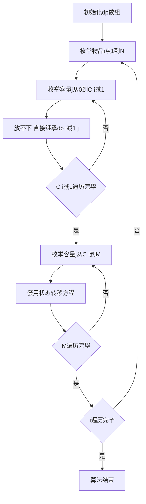

## 本节概述：完全背包时间优化

对完全背包进行时间优化，将状态转移的时间复杂度从O(M)降为O(1)。通过数学推导，将枚举K的状态转移方程化简为不含K的形式，得到与01背包高度相似的状态转移方程。

---

### 核心概念

**推导过程**

回顾完全背包的状态转移方程，K是变量。将K分别取0、1、2、3、4......代入，得到K+1个式子。然后把 `j` 替换为 `j - C[i]` 代入这些式子中。

代入后，由于要保证 `j - K*C[i]` 大于等于0，最后一个式子（当j也变成 `j-C[i]` 时，会变成 `j-(K+1)*C[i]`，肯定小于0）会被去掉，所以原本K+1个式子变成K个式子。

在等式两边同时加上 `W[i]`，然后对比最终的式子和最开始的式子，会发现两块内容是一模一样的，因此可以直接替换。

**推导结果**

优化后的状态转移方程为：

```cpp
dp[i][j] = max(dp[i-1][j], dp[i][j-C[i]] + W[i]);
```

**与01背包的对比**

- 01背包：`dp[i][j] = max(dp[i-1][j], dp[i-1][j-C[i]] + W[i])`
- 完全背包：`dp[i][j] = max(dp[i-1][j], dp[i][j-C[i]] + W[i])`

区别在于：01背包是 `dp[i-1][j-C[i]]`，完全背包是 `dp[i][j-C[i]]`。现在状态转移与K无关了，状态转移的时间从O(M)变成O(1)。

**原因分析**

对于第i种物品，其实只有两种选择：

1. **一个都不放**：就是前i-1种物品放满容量为j的背包的情况，即 `dp[i-1][j]`
2. **至少放一个**：在前i种物品放满容量为j的背包里拿掉一个第i种物品，即前i种物品放满容量为 `j - C[i]` 的背包，再加上 `W[i]`，即 `dp[i][j-C[i]] + W[i]`

### 算法步骤



**代码逻辑**

1. 初始化 `dp` 数组（与之前一致）
2. 枚举物品从1到N
3. 枚举容量从0到 `C[i]-1`：因为0到 `C[i]-1` 必然放不下第i种物品（连一个都放不下），所以直接继承前i-1种物品的情况
4. 枚举容量从 `C[i]` 到M：至少可以放一个（也可以不放），直接套用状态转移方程

### 复杂度分析

- **时间复杂度**：O(N * M)，状态数O(N*M)，状态转移消耗O(1)
- **空间复杂度**：O(N * M)

> [!TIP]
> 时间优化的核心在于数学推导：将枚举K的方程化简为不含K的形式。理解的关键在于第i种物品只有"一个都不放"和"至少放一个"两种选择，至少放一个时拿掉一个就回到了前i种物品放满容量 `j-C[i]` 的背包的子问题。

## 本章小结

- 完全背包时间优化通过数学推导，将枚举K的O(M)状态转移降为O(1)
- 优化后方程：dp[i][j] = max(dp[i-1][j], dp[i][j-C[i]] + W[i])
- 与01背包区别仅在第二项：01背包是dp[i-1][j-C[i]]，完全背包是dp[i][j-C[i]]
- 原因：第i种物品只有"不放"和"至少放一个"两种选择
- 时间复杂度从O(N * M^2)降为O(N * M)
