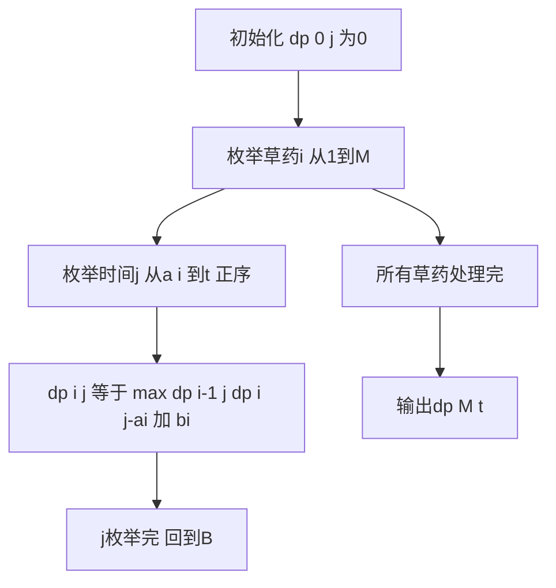

## 本节概述：完全背包时间优化 实战

本节同样选取洛谷 P1616 疯狂的采药，但使用时间优化版本。通过消除第三重循环，将朴素完全背包的 O(n x t x max_count) 优化到 O(n x t)，这是完全背包的标准写法。

---

### 题目描述

**题目名称**：疯狂的采药
**来源平台**：洛谷
**题目编号**：P1616

LiYuxiang 被带到一个草药山洞，每种草药可以无限制地疯狂采摘，每种草药有采摘时间和自身价值，求在规定时间内能采到的草药的最大总价值。

**输入格式**：第一行有两个整数 t 和 m，分别代表采药时间和草药数目。第 2 到 m+1 行，每行两个整数 ai, bi，分别表示采摘第 i 种草药的时间和价值。

**输出格式**：输出一行一个整数，表示在规定时间内可以采到的草药的最大总价值。

**数据范围**：1 <= m <= 10^4，1 <= t <= 10^7，1 <= m x t <= 10^7，1 <= ai, bi <= 10^4。

**示例**：
输入：
```
70 3
71 100
69 1
1 2
```
输出：
```
140
```

### 解题思路

朴素完全背包的状态转移：`dp[i][j] = max(dp[i-1][j-k*a[i]] + k*b[i])`，枚举 k 从 0 到 j/a[i]，时间复杂度过高。

**时间优化**：将状态转移方程改写，消除 k 的枚举。

关键观察：在完全背包中，第 i 种物品可以选多次。如果我们用当前阶段（第 i 种）的结果来更新，而不是只用上一阶段（第 i-1 种）的结果，就自然实现了"选多次"的效果。

优化后的状态转移方程：
- 不选第 i 种：`dp[i][j] = dp[i-1][j]`
- 选第 i 种（至少一个）：等价于"从当前阶段已选了一些"的基础上再选一个，即 `dp[i][j-a[i]] + b[i]`

合并：`dp[i][j] = max(dp[i-1][j], dp[i][j-a[i]] + b[i])`

注意 `dp[i][j-a[i]]` 是当前阶段（第 i 种）的值，而不是上一阶段。这正好实现了"同一物品可以多次选取"的效果。

与 01 背包对比：01 背包是 `dp[i][j] = max(dp[i-1][j], dp[i-1][j-a[i]] + b[i])`，用 `dp[i-1]`（上一阶段）。完全背包用 `dp[i]`（当前阶段），这是核心区别。



### 代码实现

```cpp
#include <iostream>
#include <algorithm>
using namespace std;

typedef long long ll;

const int MAXT = 10000005;
const int MAXM = 10005;

int main() {
    ios::sync_with_stdio(false);
    cin.tie(0);

    int t, m;
    cin >> t >> m;

    // 使用一维数组（空间优化的效果），但这里重点展示时间优化
    // 用滚动数组实现二维效果
    // dp[0][j] 和 dp[1][j] 交替使用
    // 但为了清晰展示时间优化的核心，用完整二维

    // 由于 m*t <= 10^7，我们用一维数组即可
    // 这里展示时间优化的核心逻辑
    ll a[MAXM], b[MAXM];
    for (int i = 1; i <= m; i++) {
        cin >> a[i] >> b[i];
    }

    // 时间优化的完全背包（使用一维数组，正序枚举）
    // dp[j] 表示时间j内的最大价值
    ll *dp = new ll[t + 1]();
    // 初始化全部为0

    for (int i = 1; i <= m; i++) {
        // 关键：正序枚举j
        // 因为 dp[j-a[i]] 可能已经被第i种草药更新过
        // 这正好实现了"同一种草药可以多次选取"
        for (int j = (int)a[i]; j <= t; j++) {
            dp[j] = max(dp[j], dp[j - (int)a[i]] + b[i]);
        }
    }

    cout << dp[t] << endl;

    delete[] dp;
    return 0;
}
```

### 代码解析

- **时间优化的核心**：将朴素的三重循环改为两重循环。状态转移从 `dp[i-1][j-k*a[i]] + k*b[i]`（枚举 k）变为 `dp[i][j-a[i]] + b[i]`（直接引用当前阶段）。
- **正序枚举**：`for (j = a[i]; j <= t; j++)` 正序枚举是关键。当处理 j 时，`dp[j-a[i]]` 可能已经被第 i 种草药更新过（因为 j-a[i] < j，正序时先处理），这表示"已经选了若干个第 i 种草药"。
- **与 01 背包对比**：01 背包逆序枚举，保证 `dp[j-a[i]]` 是上一阶段（第 i-1 种）的值；完全背包正序枚举，允许 `dp[j-a[i]]` 是当前阶段（第 i 种）的值，实现多次选取。
- **一维数组**：代码中直接使用一维数组 `dp[j]`，因为 `dp[i][j]` 只依赖 `dp[i-1][j]` 和 `dp[i][j-a[i]]`，一维数组中 `dp[j]` 和 `dp[j-a[i]]` 分别对应这两个值。正序枚举保证 `dp[j-a[i]]` 已经是当前阶段的值。

### 复杂度分析

- 时间复杂度：O(m x t)，两重循环，消除了内层 k 的枚举。
- 空间复杂度：O(t)，使用一维数组。

> [!TIP]
> 完全背包时间优化的核心洞察：dp[i][j] 选第 i 种物品时，依赖 dp[i][j-a[i]]（当前阶段），而非 dp[i-1][j-a[i]]（上一阶段）。因为"选第 i 种物品"可以叠加在"已经选了第 i 种物品"的基础上，这正是正序枚举的效果。对比 01 背包逆序枚举，完全背包正序枚举，这是两者唯一的代码区别。

## 本章小结

- 完全背包时间优化：消除第三重 k 循环，时间复杂度从 O(n x t x max_count) 降到 O(n x t)。
- 核心改写：`dp[i][j] = max(dp[i-1][j], dp[i][j-a[i]] + b[i])`，用当前阶段的值替代枚举 k。
- 正序枚举 j 是关键：保证 dp[j-a[i]] 已被当前物品更新，实现多次选取。
- 与 01 背包的唯一代码区别：枚举方向（正序 vs 逆序）。
