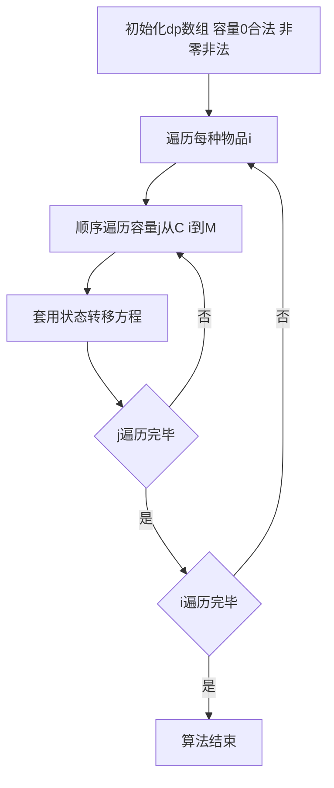

## 本节概述：完全背包空间优化

对完全背包进行空间优化，将二维状态数组降为一维。核心思路与01背包空间优化类似，但关键区别在于：01背包是逆序遍历容量，完全背包是顺序遍历容量。两者的状态转移方程一模一样，但遍历方向不同决定了物品使用次数的限制。

---

### 核心概念

**优化原理**

回顾完全背包（时间优化后）的状态转移方程，计算 `dp[i][j]` 就是在计算一个二维表格。每行的数据只取决于当前行和上一行，计算当前行时上一行的数据已经无用。

**关键分析**

以 `dp[i][3]` 的计算为例，需要：

- 容量1是当前行（第i行）的值
- 容量3是上一行（第i-1行）的值

**优化方法**

定义一维数组 `dp[M+1]`，去掉物品维度：

```cpp
// 优化前（二维）
dp[i][j] = max(dp[i-1][j], dp[i][j-C[i]] + W[i]);

// 优化后（一维）
dp[j] = max(dp[j], dp[j-C[i]] + W[i]);
```

去掉物品维度后，完全背包和01背包的状态转移方程一模一样。

**为什么必须顺序遍历**

由于从前往后计算，当计算到容量3的时候：

- 容量0、1、2已经是第i行的值（浅绿色，已计算）
- 容量4、5还是第i-1行的值（深绿色，未计算）

计算 `dp[3]` 需要上一行的3和当前行的1，顺序遍历保证了1已经是当前行的值（代表可以再次使用第i种物品），3还是上一行的值。顺序遍历容量保证每个物品可以使用多次。

**与01背包的对比**

| | 状态转移方程 | 遍历方向 | 物品使用次数 |
|---|---|---|---|
| 01背包 | `dp[j] = max(dp[j], dp[j-C[i]] + W[i])` | 逆序 | 每个物品最多用1次 |
| 完全背包 | `dp[j] = max(dp[j], dp[j-C[i]] + W[i])` | 顺序 | 每个物品可用多次 |

### 算法步骤



**代码逻辑**

1. 初始化 `dp` 数组：容量0为合法状态，容量非零为非法状态
2. 遍历每种物品（第1种、第2种......第N种）
3. 顺序遍历容量，从 `C[i]` 到M
4. 套用状态转移方程 `dp[j] = max(dp[j], dp[j-C[i]] + W[i])`

**不从零开始遍历的原因**

容量0到 `C[i]-1` 小于 `C[i]`，第i种物品一定放不进来，相当于 `dp[j] = dp[j]`（什么都不干），所以不需要遍历，直接从 `C[i]` 开始。

### 复杂度分析

- **时间复杂度**：O(N * M)
- **空间复杂度**：O(M)，从二维降为一维

> [!TIP]
> 完全背包空间优化的关键在于顺序遍历容量，与01背包的逆序遍历形成对比。两者状态转移方程一模一样，但遍历方向决定了物品使用次数的限制：逆序保证每个物品只用一次（01背包），顺序保证每个物品可用多次（完全背包）。完全背包可以对比01背包去理解，会更加容易。

## 本章小结

- 完全背包空间优化将二维数组降为一维，去掉物品维度
- 核心关键：顺序遍历容量，保证每个物品可以使用多次
- 与01背包状态转移方程一模一样，区别只在遍历方向：01背包逆序，完全背包顺序
- 容量小于物品容量时无需遍历，`dp[j]=dp[j]` 无意义
- 空间复杂度从O(N*M)降为O(M)，核心代码更精简
