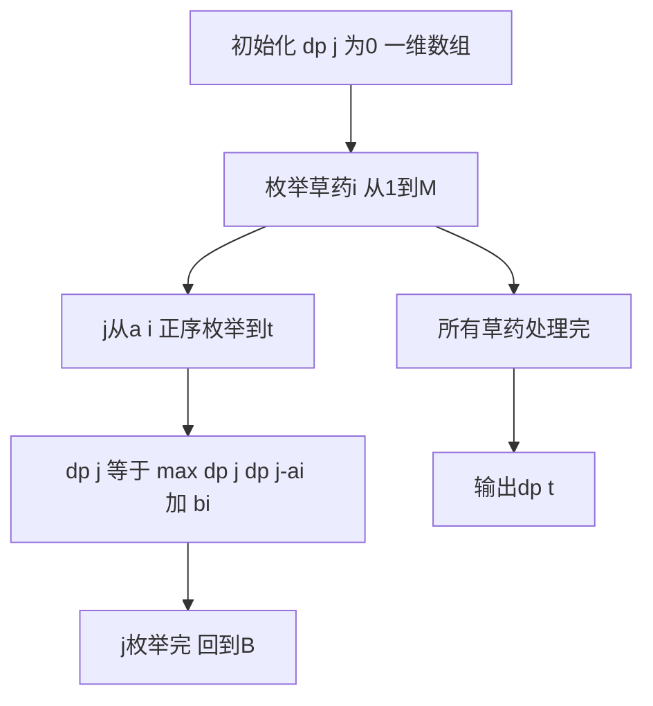

## 本节概述：完全背包空间优化 实战

本节同样选取洛谷 P1616 疯狂的采药，使用一维数组的最终优化版本。同时实现时间优化（消去 k 循环）和空间优化（二维压一维），这是完全背包竞赛中实际使用的标准写法。

---

### 题目描述

**题目名称**：疯狂的采药
**来源平台**：洛谷
**题目编号**：P1616

LiYuxiang 被带到一个草药山洞，每种草药可以无限制地疯狂采摘，每种草药有采摘时间和自身价值，求在规定时间内能采到的草药的最大总价值。

**输入格式**：第一行有两个整数 t 和 m，分别代表采药时间和草药数目。第 2 到 m+1 行，每行两个整数 ai, bi，分别表示采摘第 i 种草药的时间和价值。

**输出格式**：输出一行一个整数，表示在规定时间内可以采到的草药的最大总价值。

**数据范围**：1 <= m <= 10^4，1 <= t <= 10^7，1 <= m x t <= 10^7，1 <= ai, bi <= 10^4。

**示例**：
输入：
```
70 3
71 100
69 1
1 2
```
输出：
```
140
```

### 解题思路

经过前面两节的铺垫，我们已经知道：
- 朴素完全背包：三重循环，O(n x t x max_count)
- 时间优化：消去 k 循环，状态转移改为 `dp[i][j] = max(dp[i-1][j], dp[i][j-a[i]] + b[i])`，O(n x t)

现在进一步做空间优化：`dp[i][j]` 只依赖 `dp[i-1][j]`（上一阶段）和 `dp[i][j-a[i]]`（当前阶段）。用一维数组 `dp[j]` 可以同时表示这两个值：

- `dp[j]` 在更新前是上一阶段（第 i-1 种）的值，对应 `dp[i-1][j]`
- `dp[j-a[i]]` 在正序枚举时已经被更新为当前阶段（第 i 种）的值，对应 `dp[i][j-a[i]]`

因此一维数组 `dp[j] = max(dp[j], dp[j-a[i]] + b[i])` 正序枚举即可。

**空间优化的核心**：正序枚举 j，使得 `dp[j-a[i]]` 被当前阶段更新后再用于 `dp[j]`，实现完全背包的多次选取效果。同时省去 i 维度，空间从 O(n x t) 降到 O(t)。



### 代码实现

```cpp
#include <iostream>
#include <algorithm>
using namespace std;

typedef long long ll;

const int MAXT = 10000005;

int main() {
    ios::sync_with_stdio(false);
    cin.tie(0);

    int t, m;
    cin >> t >> m;

    // a[i]: 采摘时间, b[i]: 草药价值
    // 由于 t 最大 10^7，用静态数组
    // m 最大 10^4
    ll a[10005], b[10005];
    for (int i = 1; i <= m; i++) {
        cin >> a[i] >> b[i];
    }

    // 一维 DP 数组，空间优化
    // dp[j] 表示时间j内的最大价值
    ll *dp = new ll[t + 1](); // 初始化为0

    for (int i = 1; i <= m; i++) {
        // 关键：正序枚举
        // dp[j-a[i]] 已经被第i种草药更新过，实现了"同一种草药多次选取"
        for (int j = (int)a[i]; j <= t; j++) {
            dp[j] = max(dp[j], dp[j - (int)a[i]] + b[i]);
        }
    }

    cout << dp[t] << endl;

    delete[] dp;
    return 0;
}
```

### 代码解析

- **一维数组**：`dp[j]` 只用一维，空间从 O(m x t) 降到 O(t)。由于 t 最大 10^7，数组大小为 10^7 个 long long（约 80MB），需要在堆上分配（`new`）避免栈溢出。
- **正序枚举**：`for (j = a[i]; j <= t; j++)` 正序从 a[i] 到 t。当处理 j 时，`dp[j-a[i]]` 可能已被第 i 种草药更新过（因为 j-a[i] < j，正序时先处理），表示"已经选了若干个第 i 种草药"。
- **与 01 背包对比**：01 背包逆序枚举 `for (j = t; j >= a[i]; j--)`，完全背包正序枚举 `for (j = a[i]; j <= t; j++)`。枚举方向是两者唯一的代码区别。
- **long long**：t 最大 10^7，bi 最大 10^4，乘积可达 10^11，必须用 long long。
- **示例解释**：70 分钟采第 3 种草药（时间 1，价值 2），全部采可获 70 x 2 = 140。第 1 种需 71 分钟超时，第 2 种 69 分钟价值仅 1，不如第 3 种。

### 复杂度分析

- 时间复杂度：O(m x t)，两重循环。由于 m x t <= 10^7，实际运算量约 10^7，可以接受。
- 空间复杂度：O(t)，一维数组。t 最大 10^7，约 80MB（long long）。

> [!TIP]
> 完全背包的最终标准写法只有两行核心代码：外层枚举物品，内层正序枚举容量。与 01 背包一维写法相比，唯一的区别就是枚举方向（正序 vs 逆序）。正序使得 dp[j-a[i]] 被当前物品更新后参与后续计算，实现多次选取；逆序则保证 dp[j-a[i]] 始终是上一阶段值，实现最多选一次。理解了这一点，两种背包问题就都掌握了。

## 本章小结

- 完全背包空间优化：一维数组 dp[j]，正序枚举，同时实现时间优化和空间优化。
- 核心代码仅两重循环：外层物品，内层正序枚举容量。
- 与 01 背包一维写法的唯一区别：枚举方向（正序 vs 逆序）。
- 正序枚举使 dp[j-a[i]] 反映当前物品已更新状态，实现无限次选取。
- 数据范围大时注意使用 long long 和堆分配大数组。
