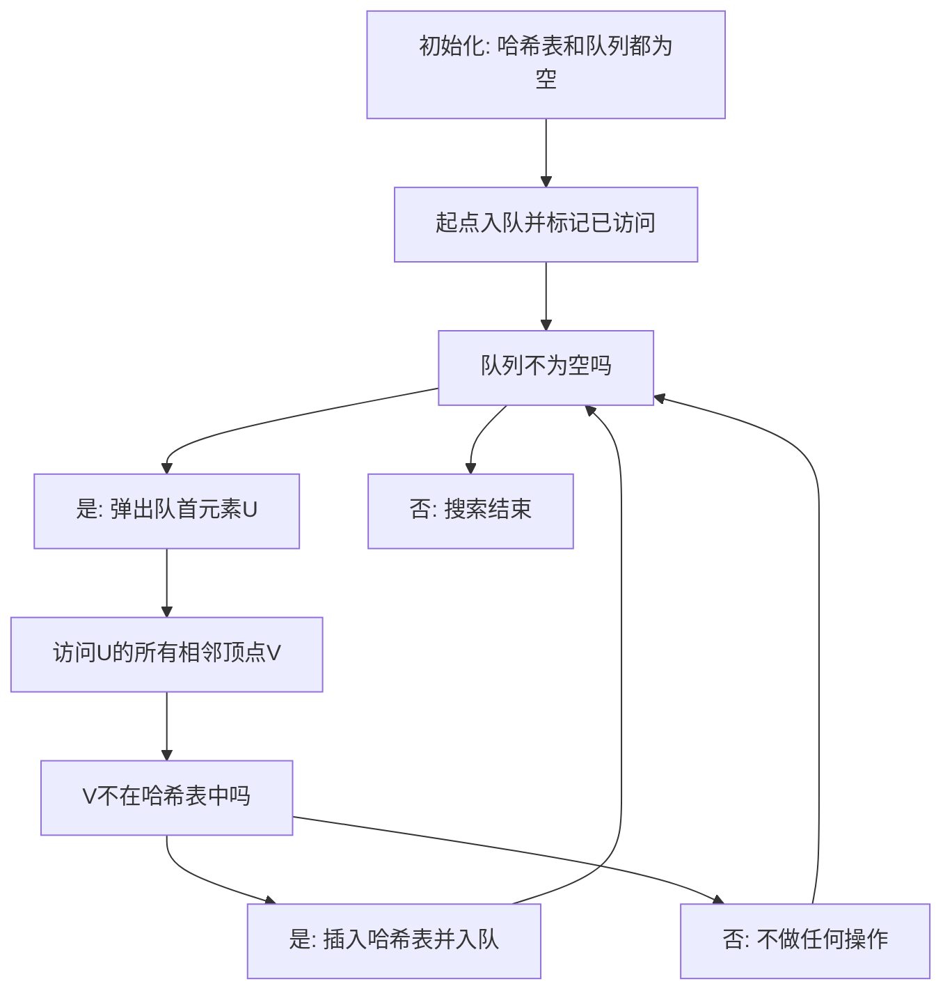

## 本节概述：广度优先搜索

广度优先搜索（BFS）是通过搜索来枚举问题的解从而找到最优解的过程。学习广搜前务必搞清楚数据结构中队列的概念。广搜没有严格的固定模板，本节讲解一个最朴素的广搜模板。广搜最主要的用途是解决最短路问题，也能解决一部分连通性问题。因为有状态哈希，时间复杂度相对于深搜更稳定。

---

### 核心概念

**学习前提**：需要了解哈希表和队列这两个数据结构的增删改查。

**数据结构**：

- **哈希表 visited**：存储已经访问过的顶点，快速查找某个顶点是否被访问过并执行插入操作
- **队列 Q**：利用先进先出的性质，按顺序存储将要访问的顶点
- **邻接表**：只读数据结构，记录每个顶点的相邻顶点

**广搜与深搜的关系**：广搜和深搜都是通过搜索来枚举问题的解从而找到最优解。广搜因为有状态哈希（访问过的状态不再访问），时间复杂度相对于深搜更稳定。

```cpp
// 伪代码：BFS 框架
// 第一步：初始化
queue Q
hash_table visited
Q.clear()
visited.clear()
Q.push(s)            // 起点入队
visited.add(s)       // 起点标记已访问

// 第二步：迭代访问
while not Q.empty():
    u = Q.front()    // 获取队首元素
    Q.pop()          // 弹出队首
    for v in adj[u]: // 访问u的所有相邻顶点
        if v not in visited:
            visited.add(v)  // 插入哈希表
            Q.push(v)        // 入队
// 队列为空时搜索结束
```

### 算法步骤



**执行过程示例**（7 个顶点的图，起点为 0）：

1. 初始：visited 为空，队列为空
2. 起点 0 入队并标记 visited
3. 0 出队，访问 0 的相邻顶点 1,2,3，都不在哈希表中，全部插入哈希表并入队
4. 1 出队，1 没有相邻顶点
5. 2 出队，访问 2 的相邻顶点 4,5,3。4 和 5 不在哈希表，入队；3 已在哈希表，不做操作
6. 3 出队，相邻顶点 0 已在哈希表，不做操作
7. 4 出队，相邻顶点 1 已在哈希表
8. 5 出队，相邻顶点 3 已在哈希表，6 不在，6 入队
9. 6 出队，没有相邻顶点，队列为空，算法结束

### 复杂度分析

- 广搜因为有状态哈希（访问过的不再访问），时间复杂度相对于深搜更稳定
- 每个顶点最多入队一次，每条边最多被访问一次
- 当边有权值时，广搜可以改进为 Dijkstra 加堆优化或 SPFA

> [!TIP]
> 如果求解的是最短路问题且终点确定，访问到终点就可以直接返回，不需要再扩展队列。起点可以有多个，初始化时一起插入队列即可。迷宫问题也可以用广搜求解——将每个格子的上下左右抽象为顶点和边，变成一个图。当边有权值时，可以改进为 Dijkstra 或 SPFA 算法。

## 本章小结

- 广搜用哈希表判重、用队列按先进先出顺序存储待访问顶点
- 核心流程：起点入队标记 -> 出队 -> 访问相邻顶点 -> 未访问则入队标记 -> 队列为空结束
- 最主要用途是解决最短路问题，也能解决连通性问题
- 状态哈希使时间复杂度比深搜更稳定
- 迷宫问题可抽象为图，用广搜求解；边有权值时改进为 Dijkstra 或 SPFA
