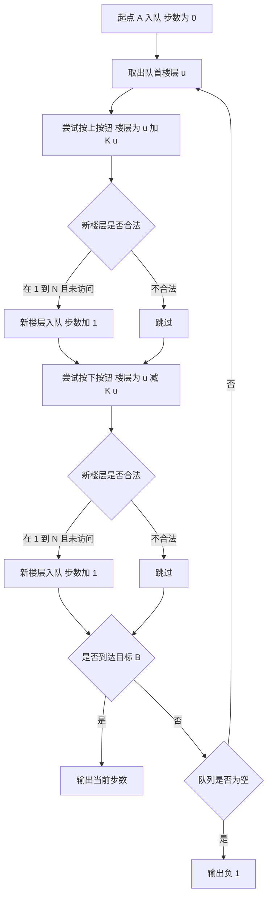

## 本节概述：广度优先搜索 实战

本节选用洛谷 P1135「奇怪的电梯」——这是 BFS 最经典的入门题，在楼层间通过「上/下」按钮转移状态，求最少按键次数到达目标楼层，完美展示了 BFS「逐层扩展、最先到达即最优」的核心特性。

---

### 题目描述

**奇怪的电梯** | 洛谷 P1135 | 难度：普及

呵呵，有一天做了一个梦，梦见了一种很奇怪的电梯。大楼的每一层楼都可以停电梯，而且第 i 层楼（1 <= i <= N）上有一个数字 Ki（0 <= Ki <= N）。电梯只有四个按钮：开、关、上、下。上下的层数等于当前楼层上的那个数字。当然，如果不能满足要求，相应的按钮就会失灵。例如：3 3 1 2 5 代表了 Ki（K1=3，K2=3，...），从 1 楼开始。在 1 楼，按「上」可以到 4 楼，按「下」是不起作用的，因为没有 -2 楼。那么，从 A 楼到 B 楼至少要按几次按钮呢？

**输入格式**：第一行为三个用空格隔开的正整数，表示 N, A, B（1 <= N <= 200，1 <= A, B <= N）。第二行为 N 个用空格隔开的非负整数，表示 Ki。

**输出格式**：一行，即最少按键次数，若无法到达，则输出 -1。

**数据范围**：1 <= N <= 200，1 <= A, B <= N，0 <= Ki <= N。

**示例**：
输入：
```
5 1 5
3 3 1 2 5
```
输出：
```
3
```

### 解题思路

**核心思想**：将每层楼看作一个状态节点，按「上/下」按钮就是状态转移。BFS 逐层扩展，第一次到达目标楼层时的步数即为最少按键次数。

BFS 的关键性质：在无权图（每条边权为 1）中，BFS 先扩展的节点步数一定不多于后扩展的节点。因此第一次到达目标状态时的步数就是最短路径。

具体步骤：
1. 从起点 A 开始入队，步数为 0
2. 取出队首楼层 u，尝试按「上」和「下」按钮
3. 如果新楼层在 [1, N] 范围内且未访问过，入队，步数加 1
4. 如果新楼层就是目标 B，返回当前步数
5. 队列为空仍未到达则输出 -1



### 代码实现

```cpp
#include <iostream>
#include <queue>
#include <cstring>
using namespace std;

const int MAXN = 210;

int k[MAXN];         // 每层楼的数字 Ki
int dis[MAXN];       // 到达每层楼的最少步数
int n, a, b;

int main() {
    cin >> n >> a >> b;
    
    for (int i = 1; i <= n; i++) {
        cin >> k[i];
    }
    
    // 初始化距离为 -1（未访问）
    memset(dis, -1, sizeof(dis));
    
    // BFS
    queue<int> q;
    q.push(a);
    dis[a] = 0;
    
    while (!q.empty()) {
        int u = q.front();
        q.pop();
        
        // 尝试按「上」按钮
        int up = u + k[u];
        if (up <= n && dis[up] == -1) {
            dis[up] = dis[u] + 1;
            q.push(up);
        }
        
        // 尝试按「下」按钮
        int down = u - k[u];
        if (down >= 1 && dis[down] == -1) {
            dis[down] = dis[u] + 1;
            q.push(down);
        }
    }
    
    cout << dis[b] << endl;
    
    return 0;
}
```

### 代码解析

1. **`dis[]` 数组双重含义**：初始为 -1 表示未访问，非 -1 时表示从 A 到该楼层的最少步数。一个数组同时实现访问标记和距离记录

2. **`int up = u + k[u]`**：按「上」按钮后的目标楼层。当前楼层 u 的数字 Ki 决定了上下移动的层数

3. **`if (up <= n && dis[up] == -1)`**：两个条件：边界检查（不能超过 N 楼）和未访问检查（每个楼层只入队一次，保证 BFS 的正确性）

4. **`dis[up] = dis[u] + 1`**：步数等于上一层到达时的步数加 1。BFS 的层序遍历保证这个步数是最小的

5. **`cout << dis[b]`**：如果目标楼层 B 被访问过，`dis[b]` 就是最少步数；如果没被访问过，`dis[b]` 仍是初始值 -1，表示无法到达

### 复杂度分析

- 时间复杂度：O(N)，每层楼最多入队一次，每次处理两个方向
- 空间复杂度：O(N)，队列和距离数组

> [!TIP]
> BFS 求无权图最短路径的关键：每个节点只入队一次。第一次到达某个节点时的步数就是最短步数。因此用 `dis[v] == -1` 判断是否访问过，保证不会重复入队。这道题也可以用 DFS 加回溯做，但 DFS 需要搜索所有路径取最小值，效率远不如 BFS。

## 本章小结

- BFS 的核心特性：在无权图中，最先到达某节点的路径就是最短路径
- BFS 用队列实现，先进先出保证层序遍历
- `dis` 数组兼做访问标记和距离记录：-1 表示未访问，非 -1 表示最短步数
- 每个节点只入队一次，是 BFS 保证正确性和效率的关键
- 适合求「最少操作次数」「最少步数」等无权最短路径问题
