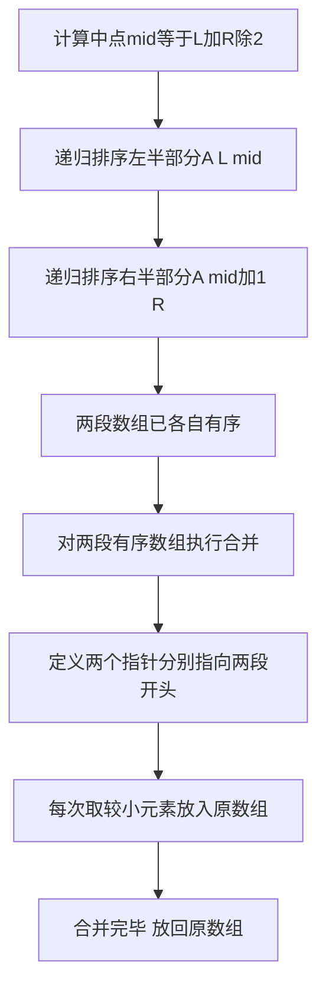

## 本节概述：归并排序

归并是一种常见的算法思想，归并排序的主要目的是将两个已排序的序列合并成一个有序的序列。对于非有序的序列，可以拆成两个非有序的序列分别调用归并排序，再对两个有序序列执行合并。"归"其实是递归，"并"就是合并。

---

### 核心概念

**算法描述**（merge sort A L R）：
- A 代表待排序数组，左区间为 L，右区间为 R

分为以下几步：
1. **计算中点**：L 加 R 除 2，记录在 mid 下标中
2. **递归调用**：对左半部分 merge sort A L mid，对右半部分 merge sort A mid 加 1 R
3. **合并**：两个递归调用后这两段数组有序了，对两段有序数组进行合并，存储到原来的数组里

实际调用时就是调用 merge sort A 0 N 减 1，就能得到整个数组的排序结果。

**执行过程**（以数组 85643712 为例）：
- 递归切分：85643712 切成 8564 和 3 7 1 2
- 8564 再切成 85 和 64，继续切到 8 5、6 4（单个元素时各自有序）
- 8 和 5 合并变成 5 8，6 和 4 合并变成 4 6
- 5 8 和 4 6 合并变成 4 5 6 8
- 后半部分同样递归处理，3 7 和 1 2 合并变成 1 2 3 7
- 最终 4 5 6 8 和 1 2 3 7 合并，定义两个指针每次取小的出来，得到 1 2 3 4 5 6 7 8

**归并排序的本质**：如果把图画出来，归并排序其实是一棵二叉树。每次把区间折成两半分别排序，所以归并排序对应的数据结构是一棵二叉树。需要了解二叉树才能理解归并排序。

### 算法步骤

合并过程的细节：可以在大 O N 时间内将两个有序数组合并，通过简单的比较两个数组前面的元素，始终取较小的那个来实现。

### 复杂度分析

**时间复杂度**：每次都是对半切，归并过程就像二叉树的构建过程，合并次数就是二叉树的高度，即 log N。每次合并的时间为 O(N)，所以总时间复杂度为**大 O N 乘 log N**。

**空间复杂度**：需要使用一个额外的辅助数组，最大长度是原数组的长度，空间复杂度为**大 O N**。

**算法优点**：
- 稳定性和可扩展性，可以运用到并行计算中

**算法缺点**：
- 需要额外的空间，相比其他简单排序算法空间开销更大
- 实现上稍微复杂，代码量比其他排序要长（不是思想复杂，而是代码长）

**优化方案**：申请数组会带来时间开销，比较好的做法是实现一个和给定元素个数一样大的数组，作为函数传参传进去，所有辅助数组的操作都在这个传参数组上进行，避免内存的频繁申请和释放。

> [!TIP]
> 归并排序本质是一棵二叉树——每次把区间折半排序，合并次数对应二叉树高度 log N。优化建议：预分配一个和原数组等大的辅助数组作为参数传入，避免频繁申请和释放内存。

## 本章小结

- 归并排序中"归"是递归，"并"是合并，本质对应一棵二叉树
- 时间复杂度为大 O N 乘 log N，空间复杂度为大 O N
- 合并过程通过两个指针取较小元素实现，时间 O(N)
- 优化：预分配辅助数组作为参数传入，避免频繁内存申请释放
