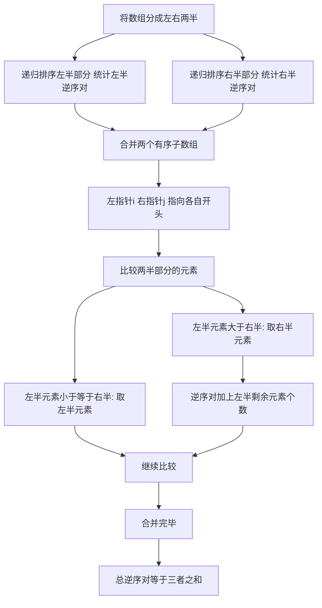

## 本节概述：归并排序 实战

本节选用洛谷 P1908"逆序对"，这是归并排序最经典的实战题。题目要求统计数组中逆序对的数量，直接枚举的时间复杂度是大 O N 方，而归并排序在合并过程中可以顺便统计逆序对，将时间复杂度降到大 O N 乘 log N。通过这道题，读者可以深刻理解归并排序的分治思想和合并过程。

---

### 题目描述

**题目名称**：逆序对

**来源平台**：洛谷

**题目编号**：P1908

对于给定的一段正整数序列，逆序对就是序列中下标 i 小于 j 但 a 中 i 大于 a 中 j 的数对。给定一个序列，求其中逆序对的数量。

**输入格式**：第一行一个数 n，表示序列中有 n 个数。第二行 n 个数，表示给定的序列。

**输出格式**：输出序列中逆序对的数目。

**数据范围**：对于所有数据，1 <= n <= 5 乘 10 的 5 次方，序列中每个数字不超过 10 的 9 次方。

**示例**：
输入：
6
5 4 2 6 3 1

输出：11

解释：序列 5 4 2 6 3 1 中的逆序对有：5 和 4、5 和 2、5 和 3、5 和 1、4 和 2、4 和 3、4 和 1、2 和 1、6 和 3、6 和 1、3 和 1，共 11 个。

### 解题思路

直接用双重循环枚举所有数对来统计逆序对，时间复杂度是大 O N 方，对于 n 等于 50 万会超时。归并排序在合并两个有序子数组时，可以高效地统计跨越左右两部分的逆序对。

**关键观察**：归并排序将数组分成左右两半，递归排序后再合并。在合并阶段，左半部分和右半部分各自已经有序。当左半部分的某个元素 a 中 i 大于右半部分的某个元素 a 中 j 时，由于左半部分有序，a 中 i 到左半部分末尾的所有元素都大于 a 中 j，这些元素与 a 中 j 都构成逆序对。因此每次从右半部分取元素时，逆序对数量增加左半部分剩余元素的个数。

**具体过程**：
1. 递归排序左半部分，统计左半部分内部的逆序对
2. 递归排序右半部分，统计右半部分内部的逆序对
3. 合并两个有序子数组，统计跨越左右两部分的逆序对
4. 总逆序对数等于三者之和



### 代码实现

```cpp
#include <iostream>
using namespace std;

int a[500005];     // 原数组
int temp[500005];  // 辅助数组
long long cnt = 0; // 逆序对计数

void mergeSort(int left, int right) {
    if (left >= right) return;
    
    int mid = (left + right) / 2;
    
    // 递归排序左半部分和右半部分
    mergeSort(left, mid);
    mergeSort(mid + 1, right);
    
    // 合并两个有序子数组
    int i = left;       // 左半部分指针
    int j = mid + 1;    // 右半部分指针
    int k = left;       // 辅助数组指针
    
    while (i <= mid && j <= right) {
        if (a[i] <= a[j]) {
            temp[k++] = a[i++];
        } else {
            // a[i] > a[j]，左半部分从i到mid都大于a[j]
            cnt += mid - i + 1;
            temp[k++] = a[j++];
        }
    }
    
    // 处理剩余元素
    while (i <= mid) temp[k++] = a[i++];
    while (j <= right) temp[k++] = a[j++];
    
    // 将合并结果复制回原数组
    for (int idx = left; idx <= right; idx++) {
        a[idx] = temp[idx];
    }
}

int main() {
    ios::sync_with_stdio(false);
    cin.tie(0);
    
    int n;
    cin >> n;
    for (int i = 0; i < n; i++) {
        cin >> a[i];
    }
    
    mergeSort(0, n - 1);
    
    cout << cnt << endl;
    return 0;
}
```

### 代码解析

**递归分治**：mergeSort 函数接收区间左端 left 和右端 right。先计算中点 mid，递归排序左半部分（left 到 mid）和右半部分（mid 加 1 到 right），然后合并。

**合并与统计**：合并时使用双指针 i 和 j 分别指向左右两半的开头。当 a 中 i 小于等于 a 中 j 时，取左半元素放入辅助数组。当 a 中 i 大于 a 中 j 时，取右半元素，并且逆序对数量加上 mid 减 i 加 1——因为左半部分从 i 到 mid 的所有元素都大于 a 中 j（左半部分有序，a 中 i 是最小的剩余元素，它大于 a 中 j，后面的更大）。

**数据类型**：逆序对数量最多为 n 乘 n 减 1 除以 2，当 n 等于 50 万时约为 1.25 乘 10 的 11 次方，超过 int 范围，所以计数变量 cnt 使用 long long 类型。

**辅助数组**：使用预分配的辅助数组 temp 避免频繁申请内存，合并结果先写入 temp，再复制回原数组。

### 复杂度分析

- 时间复杂度：大 O N 乘 log N。每次对半切分，递归深度为 log N，每层合并时间为 O N。
- 空间复杂度：大 O N。使用与原数组等大的辅助数组。

> [!TIP]
> 逆序对是归并排序最经典的应用。关键是在合并时，当左半元素大于右半元素，逆序对增加左半剩余元素个数（mid 减 i 加 1）。计数变量必须用 long long，因为 50 万个数的逆序对可达 1.25 乘 10 的 11 次方，超过 int 范围。

## 本章小结

- 逆序对是归并排序最经典的实战题，利用合并过程高效统计逆序对
- 关键：合并时左半元素大于右半元素，逆序对加上左半剩余元素个数
- 计数变量必须用 long long 防止溢出
- 时间复杂度为大 O N 乘 log N，空间复杂度为大 O N
