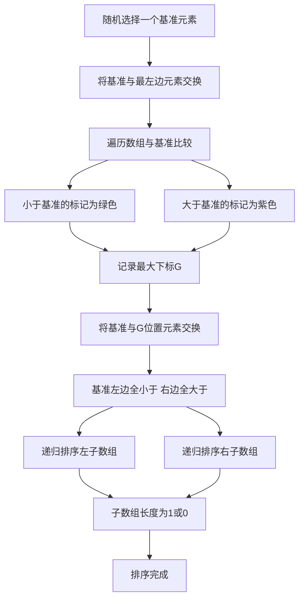

## 本节概述：快速排序

快速排序是一种分治的思想。它的实现原理是：首先找到一个基准元素，将所有小于基准数的数放到数组左边，大于基准数的数放到基准数右边，然后递归调用快速排序分别排左边和右边的部分。

---

### 核心概念

**算法步骤**：
1. **选择基准元素**：从数组中选择一个元素作为基准（采用随机方式）
2. **分割数组**：将比基准数小的元素放在基准左边，比基准大的元素放在基准右边
3. **递归排序**：对基准左边和右边的子数组分别进行快速排序，重复步骤 1 到 3，直到子数组长度为 1 或 0

**执行过程**（以有序数组 1 到 12 为例）：
- 随机选择一个下标，选到了 9 这个值，把它和最左边的数交换
- 交换完后不断遍历，和 9 进行比较
- 用颜色标记：红色代表当前遍历到的值，绿色代表小于基准数的值，紫色代表大于基准数的值
- 存储两个下标：I 是当前遍历位置，G 是最大的小于基准数的下标
- 遍历完毕后，将基准数和下标最大的那个比它小的数进行交换
- 此时基准数左边都小于它，右边都大于它
- 继续找新的基准数，递归排序左右两部分

### 算法步骤

### 复杂度分析

**时间复杂度**：
- **最优情况**：每次都分成相等的两部分，时间复杂度为**大 O N 乘 log N**
- **最坏情况**：退化成斜树，树高度变成 O(N)，时间复杂度为**大 O N 方**
- **平均情况**：时间复杂度为**大 O N 乘 log N**

因此选择基准时采用随机方式，避免最坏情况。

**空间复杂度**：递归过程中需要用栈存储中间结果，空间复杂度为**大 O log N**。

**算法优点**：
- 高效性以及原地排序，时间复杂度低且空间复杂度低
- 一般在开源源码中使用的就是快速排序加一些变形

**算法缺点**：
- 最坏情况下时间复杂度退化成大 O N 方
- 不是一种稳定的排序

**优化方案**：
- 选择合适的基准元素
- 当数组比较小时直接采用插入排序，减少递归

> [!TIP]
> 快速排序的核心是分治思想。选择基准时一定要用随机方式，避免最坏情况退化为 O(N 方)。当子数组较小时切换为插入排序可以减少递归开销。

## 本章小结

- 快速排序基于分治思想：选基准、分割、递归排序
- 最优和平均时间复杂度为大 O N 乘 log N，最坏退化为大 O N 方
- 空间复杂度为大 O log N，是原地排序但不稳定
- 优化：随机选基准、小数组切换插入排序
