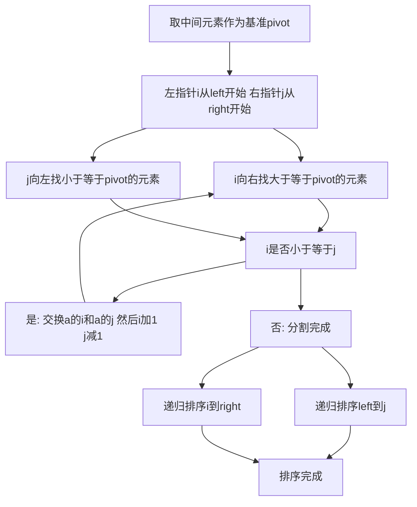

## 本节概述：快速排序 实战

本节选用洛谷 P1177"排序模板"，这是洛谷上最经典的排序题目，也是快速排序的标准模板题。通过用快速排序解决这道题，读者可以彻底理解快速排序的分治思想——选基准、分割数组、递归排序左右两部分。

---

### 题目描述

**题目名称**：排序模板

**来源平台**：洛谷

**题目编号**：P1177

将读入的 N 个数从小到大排序后输出。

**输入格式**：第一行为一个正整数 N。第二行包含 N 个空格隔开的正整数，为你需要进行排序的数。

**输出格式**：将给定的 N 个数从小到大输出，数之间空格隔开，行末换行且无空格。

**数据范围**：对于 100% 的数据，1 <= N <= 10 的 5 次方，1 <= 每个元素 <= 10 的 9 次方。

**示例**：
输入：
5
4 2 4 5 1

输出：
1 2 4 4 5

### 解题思路

快速排序基于分治思想，核心是三步：选择基准元素、分割数组、递归排序。

**选择基准**：取数组中间位置的元素作为基准（pivot）。选择中间元素可以有效避免有序数组导致的最坏情况。

**分割数组（Hoare 分割法）**：使用两个指针 i 和 j，i 从左端开始向右走，j 从右端开始向左走。当 i 指向的元素小于基准时 i 向右移动，当 j 指向的元素大于基准时 j 向左移动。当两者都停下来时，交换 a 中 i 和 a 中 j，然后继续移动。当 i 大于 j 时分割完成。此时 j 及其左侧都小于等于基准，i 及其右侧都大于等于基准。

**递归排序**：对左半部分（left 到 j）和右半部分（i 到 right）分别递归调用快速排序。



### 代码实现

```cpp
#include <iostream>
using namespace std;

int a[100005];

// 快速排序（Hoare 分割法）
void quickSort(int left, int right) {
    if (left >= right) return;
    
    int i = left, j = right;
    // 取中间元素作为基准，避免有序数组的最坏情况
    int pivot = a[(left + right) / 2];
    
    while (i <= j) {
        // i向右找第一个大于等于pivot的元素
        while (a[i] < pivot) i++;
        // j向左找第一个小于等于pivot的元素
        while (a[j] > pivot) j--;
        
        if (i <= j) {
            swap(a[i], a[j]);
            i++;
            j--;
        }
    }
    
    // 递归排序左右两部分
    quickSort(left, j);
    quickSort(i, right);
}

int main() {
    ios::sync_with_stdio(false);
    cin.tie(0);
    
    int n;
    cin >> n;
    for (int i = 0; i < n; i++) {
        cin >> a[i];
    }
    
    quickSort(0, n - 1);
    
    for (int i = 0; i < n; i++) {
        if (i > 0) cout << " ";
        cout << a[i];
    }
    cout << endl;
    return 0;
}
```

### 代码解析

**Hoare 分割法**：与 Lomuto 分割法不同，Hoare 分割法使用两个指针从两端向中间移动。i 找大于等于 pivot 的元素，j 找小于等于 pivot 的元素，找到后交换。这种方法的交换次数更少，效率更高。

**基准选择**：取数组中间位置的元素 `a 中 left 加 right 除以 2` 作为基准。选择中间元素可以避免有序数组退化为最坏情况（每次只分出一个元素）。

**分割后的范围**：分割完成后，left 到 j 部分的元素都小于等于基准，i 到 right 部分的元素都大于等于基准。注意 j 和 i 可能交叉，所以递归调用时使用 `quickSort(left, j)` 和 `quickSort(i, right)` 而非 `quickSort(left, pivot_idx - 1)`。

**快读优化**：使用 `ios::sync_with_stdio(false)` 和 `cin.tie(0)` 加速输入输出，应对 10 的 5 次方级数据量。

### 复杂度分析

- 时间复杂度：平均和最优情况为大 O N 乘 log N。每次分割将数组分成大致相等的两部分，递归深度为 log N，每层分割时间为 O N。最坏情况（极端不平衡分割）退化为大 O N 方，但选择中间元素作为基准可以有效避免。
- 空间复杂度：大 O log N。递归调用栈的深度最多为 log N。

> [!TIP]
> 快速排序的核心是 Hoare 分割法——两个指针从两端向中间走，交换不符合条件的元素。基准选择中间元素可以有效避免有序数组的最坏情况。注意递归范围是 left 到 j 和 i 到 right，不是传统的 pivot 减 1 和 pivot 加 1。

## 本章小结

- 快速排序基于分治思想：选基准、分割数组、递归排序左右两部分
- Hoare 分割法使用双指针从两端向中间移动，交换不符合条件的元素，效率高于 Lomuto 法
- 基准选择中间元素，避免有序数组的最坏情况
- 平均时间复杂度为大 O N 乘 log N，空间复杂度为大 O log N
