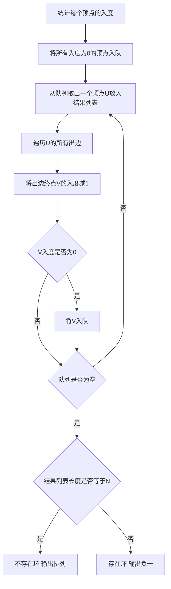

## 本节概述：拓扑排序

拓扑排序是一种在有向图上根据顶点之间的依赖关系来确定先后关系的算法思想。它不同于常规排序（常规排序根据元素自身数据排序），而是根据两个顶点之间的依赖关系确定先后顺序。拓扑排序与有向无环图（DAG）息息相关，可以用来判断图中是否存在环。

---

### 核心概念

**拓扑排序的特点**

- **依赖关系**：问题中一定存在图中两个顶点之间的依赖关系
- **与有向无环图相关**：拓扑排序和有向无环图息息相关，可以用来判断是否存在环
- **算法思想而非实现**：拓扑排序本身是一种算法思想，可以用暴力迭代、广度优先搜索（BFS）或深度优先搜索（DFS）来实现

**问题描述**

给定N个小朋友以及M组数据，AB代表小朋友A排在小朋友B的前面，N和M的范围都在1万以内。把所有小朋友排成一排并满足所有给定的关系，输出任意一个满足条件的排列，如果不存在则输出-1。

**问题抽象**

- 每个小朋友看成图中的一个顶点
- 小朋友之间的先后关系看成图中的有向边
- 如果给出AB，则从A到B引一条有向边

**核心思路**

没有被任何顶点指向的点（入度为0的顶点）一定可以排在前面。取出这些点后，删除它们及其出边，又会产生新的入度为0的点，继续迭代。由于每次可能有多个入度为0的点，所以最终结果可能有多个。

### 算法步骤

1. **统计每个顶点的入度**
2. **选择入度为0的顶点U**，放入结果列表中
3. **删除顶点U和它的所有出边**，更新对应顶点的入度（实际实现时不需要删除邻接表中的元素，只需将V的入度减1即可）
4. **回到第2步迭代计算**
5. 如果结果列表元素个数为N，说明不存在环，列表就是所求排列
6. 如果结果列表元素个数小于N，说明存在环，输出-1

**数据结构**

- 采用邻接表存储图（点数约1万个）
- `degree[i]` 存储顶点i的入度
- 用队列辅助实现BFS

**calculateDegree 函数**

- 初始化所有顶点入度为0
- 遍历每个顶点的所有出边
- 对每条出边UV，`degree[V]` 自增（入度加1）

**拓扑排序主过程（BFS实现）**

- 统计所有入度为0的点，全部塞入队列
- 迭代取出队首元素放入 `answer` 列表
- 遍历取出顶点的所有出边，对V的入度减1
- 当入度减到0时继续入队
- 反复迭代求出拓扑序列

### 复杂度分析

- **时间复杂度**：O(N + M)，N是顶点数量，M是边数量。最坏情况下要把所有顶点和所有边都遍历到
- **空间复杂度**：邻接表存储，O(N + M)

> [!TIP]
> 删除边的操作并不是删除邻接表中的元素（效率低），只需要把V的入度减1即可。当入度减到0时，该顶点自然就可以入队了。拓扑排序结束后，如果结果列表长度不等于N，说明存在未被访问到的顶点，这些顶点的入度都不为零，这就意味着图中存在环。

## 本章小结

- 拓扑排序是在有向图上根据依赖关系确定先后顺序的算法思想，不同于常规排序
- 核心思路：不断取出入度为0的顶点，删除其出边，重复直到没有入度为0的点
- 可用BFS实现，用队列辅助，删边操作只需将入度减1
- 时间复杂度O(N + M)
- 结果列表长度等于N则无环，小于N则存在环
