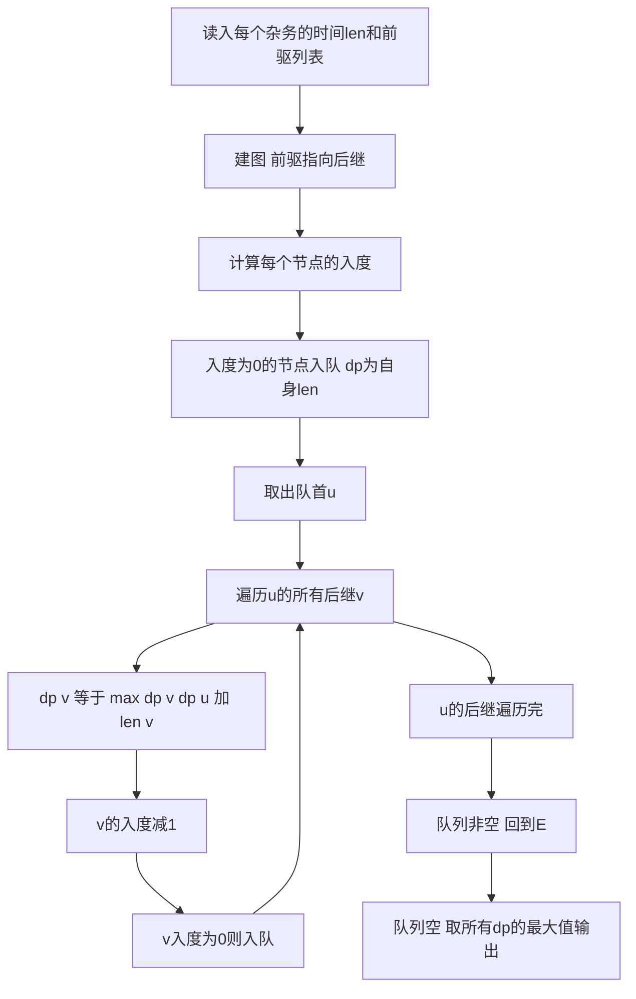

## 本节概述：拓扑排序 实战

本节选取洛谷 P1113 [USACO02FEB] 杂务，这是拓扑排序最经典的模板题。它将拓扑排序与动态规划结合，求有向无环图中的最长路径，是拓扑排序的典型应用。

---

### 题目描述

**题目名称**：[USACO02FEB] 杂务
**来源平台**：洛谷
**题目编号**：P1113

John 有非常多的杂务要做。有些杂务必须在其他杂务完成之后才能做。杂务之间有先决条件关系。完成所有杂务所需的最短时间。有足够多的工人，只要有先决条件满足就能立即开始。杂务 1 没有先决条件。

**输入格式**：第 1 行，一个整数 n（3 <= n <= 10000），必须完成的杂务的数目。第 2 至 n+1 行，每行有一些用空格隔开的整数，分别表示：工作序号（保证在输入文件中是从 1 到 n 有序递增的）、完成工作所需要的时间 len（1 <= len <= 100）、列出一些必须完成的准备工作（序号列表）。

**输出格式**：一个整数，表示完成所有杂务所需的最少时间。

**数据范围**：3 <= n <= 10000，1 <= len <= 100。

**示例**：
输入：
```
7
1 5 0
2 2 1 0
3 3 2 0
4 6 1 0
5 1 2 4 0
6 8 2 3 0
7 4 2 3 4 0
```
输出：
```
23
```

### 解题思路

这道题本质是求有向无环图（DAG）中的最长路径。每个杂务是一个节点，先决条件构成有向边（从前驱指向后继）。因为有足够多的工人，所有没有依赖关系的杂务可以同时进行，所以完成所有杂务的最短时间就是 DAG 中的最长路径。

解法：在拓扑排序的过程中做 DP。设 `dp[u]` 表示完成杂务 u 及其所有前置杂务所需的时间。对于每个节点 u，`dp[u] = len[u] + max(dp[v])`，其中 v 是 u 的所有前驱。如果 u 没有前驱，则 `dp[u] = len[u]`。

在 BFS 拓扑排序（Kahn 算法）的过程中，每处理一个节点时计算其 dp 值。最终答案就是所有 dp 值的最大值。



### 代码实现

```cpp
#include <iostream>
#include <vector>
#include <queue>
#include <algorithm>
using namespace std;

const int N = 10005;

int n;
int len[N];         // 每个杂务的完成时间
int in_degree[N];   // 每个节点的入度
int dp[N];           // dp[i] 完成杂务i及其前驱所需的最少时间
vector<int> adj[N];  // 邻接表存图，前驱指向后继

int main() {
    ios::sync_with_stdio(false);
    cin.tie(0);

    cin >> n;

    for (int i = 1; i <= n; i++) {
        int id;
        cin >> id;
        cin >> len[id];

        int pre;
        while (cin >> pre && pre != 0) {
            // pre 是 id 的前驱，建边 pre -> id
            adj[pre].push_back(id);
            in_degree[id]++;
        }
    }

    queue<int> q;
    // 入度为0的节点（没有前驱的杂务）入队
    for (int i = 1; i <= n; i++) {
        if (in_degree[i] == 0) {
            dp[i] = len[i];
            q.push(i);
        }
    }

    int ans = 0;

    // Kahn 算法拓扑排序 + DP
    while (!q.empty()) {
        int u = q.front();
        q.pop();

        ans = max(ans, dp[u]);

        for (int v : adj[u]) {
            // dp[v] = len[v] + max(所有前驱的dp值)
            dp[v] = max(dp[v], dp[u] + len[v]);
            in_degree[v]--;
            if (in_degree[v] == 0) {
                q.push(v);
            }
        }
    }

    cout << ans << endl;

    return 0;
}
```

### 代码解析

- **建图方向**：前驱指向后继（`pre -> id`），这样在拓扑排序中先处理前驱，后处理后继，保证 DP 值的正确传播。
- **dp 转移**：`dp[v] = max(dp[v], dp[u] + len[v])`。当处理节点 u 时，更新其所有后继 v 的 dp 值。因为 u 的 dp 值已经确定（拓扑排序保证了 u 的前驱都先于 u 被处理），所以 `dp[u] + len[v]` 就是经过 u 到达 v 的最长时间。
- **初始化**：入度为 0 的节点（没有前驱的杂务）的 dp 值就是自身的完成时间 `len[i]`。
- **答案**：所有节点 dp 值的最大值，因为完成所有杂务的时间取决于最慢的那条路径。

### 复杂度分析

- 时间复杂度：O(n + m)，拓扑排序每个节点和每条边各处理一次。
- 空间复杂度：O(n + m)，邻接表存储图。

> [!TIP]
> 这道题的关键在于理解"有足够多的工人"意味着没有依赖关系的杂务可以并行执行，所以答案就是 DAG 中的最长路径。拓扑排序保证在处理节点 u 时，其所有前驱的 dp 值已计算完毕，使得 DP 正确。注意建边方向：前驱指向后继，与拓扑排序方向一致。

## 本章小结

- 拓扑排序的核心应用之一是求 DAG 中的最长路径，本题将拓扑排序与 DP 结合。
- Kahn 算法（BFS 拓扑排序）天然保证了处理顺序的正确性：处理 u 时其所有前驱已完成。
- dp[u] 表示完成 u 及其所有前驱所需的最短时间，转移方程 dp[v] = dp[u] + len[v]。
- 答案是所有 dp 值的最大值，代表关键路径的总时间。
