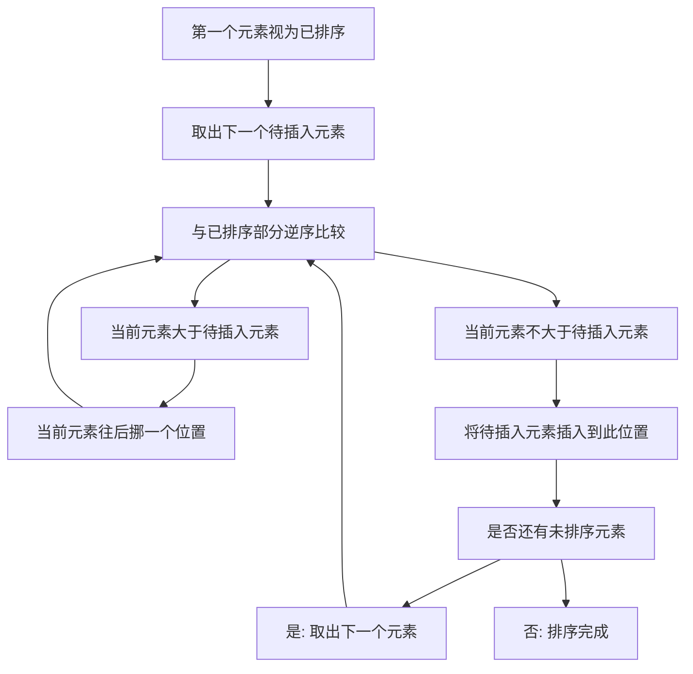

## 本节概述：插入排序

插入排序也是一种简单直观的排序算法，时间复杂度为大 O N 方。它的思想是：从第一个元素开始，只有一个元素时认为它已经排好序；对于后续每个元素，和已经排好序的元素进行比较，找到它应该插入的位置并插进去。

---

### 核心概念

**算法思想**：
1. 从第一个元素开始，当只有一个元素时认为它已经排好序
2. 对于第二个元素，和已经排好序的元素进行比较，找到它应该去的位置并插进去
3. 比如已有 5 个元素排好序，第 6 个元素要插到前面 5 个元素的某个位置去

**执行过程**（以数组 8564310 7 2 为例）：
- 第一个元素 8 直接有序
- 5 出现时：5 小于 8，把 8 往后挪一个位置，5 插入到前面，得到 5 8
- 6 出现时：6 小于 8，8 往后挪；6 大于 5，6 插入到 5 和 8 之间，得到 5 6 8
- 4 出现时：4 小于 8，8 往后挪；4 小于 6，6 往后挪；4 小于 5，5 往后挪；4 插入到最前面，得到 4 5 6 8
- 3、7、2 依次插入到各自正确的位置

**总结**：将第二个元素和第一个元素比较，如果小于就往后挪并插入。进行第二轮比较，第三个元素和前两个元素逆序比较，直到三个元素都有序。经过一定轮次的比较后，保证所有元素升序排列。

### 算法步骤

### 复杂度分析

**时间复杂度**：如果序列是逆序的，每次要插入的数一定是当前序列中最小的数，前面的数要不断往后挪位置，每次比较都要往后挪，整个时间复杂度变成**大 O N 方**。

**空间复杂度**：移动过程中只有一次将数据存储到临时变量，没有其他额外空间，空间复杂度为**大 O 1**。

**算法特点**：
- 时间复杂度和空间复杂度与选择排序、冒泡排序一样
- 实现简单但效率不高，实际应用基本在 1000 左右的量级
- 数据高于一两千就不能用插入排序了

**优化思路**：由于插入排序每次插入前前面的数组一定是有序的，可以利用二分查找找到要插入的位置。但是插入过程中后面的元素必然要往后移，所以整个时间复杂度还是不变的。即使查找用二分查找，时间复杂度也不会改变。

> [!TIP]
> 插入排序的时间复杂度和空间复杂度与选择排序、冒泡排序相同。虽然可以用二分查找优化插入位置，但由于元素移动的开销不变，整体时间复杂度仍为大 O N 方。一定要自己写一遍代码，加深理解。

## 本章小结

- 插入排序将每个元素插入到已排序部分的正确位置
- 时间复杂度为大 O N 方（逆序序列最坏），空间复杂度为大 O 1
- 实际应用在 1000 左右量级，数据超过一两千就不适用
- 可用二分查找优化插入位置，但由于元素移动开销不变，整体复杂度不变
