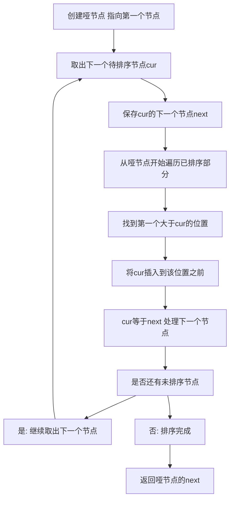

## 本节概述：插入排序 实战

本节选用 LeetCode 第 147 题"对链表进行插入排序"，这是插入排序最经典的实战题。与数组不同，链表的插入排序需要处理指针操作，更能锻炼对插入排序本质的理解。通过这道题，读者可以深刻理解插入排序"逐个取出元素，插入到已排序部分的正确位置"的核心思想。

---

### 题目描述

**题目名称**：对链表进行插入排序

**来源平台**：LeetCode

**题目编号**：147

给定单个链表的头节点 head，使用插入排序对链表进行排序，并返回排序后链表的头节点。

插入排序的算法步骤：
1. 插入排序是迭代的，每次只移动一个元素，直到所有元素可以形成一个有序的输出列表
2. 每次迭代中，插入排序只从输入数据中移除一个待排序的元素，找到它在序列中相应的位置，并将其插入
3. 重复直到所有输入数据插入完成

**输入格式**：链表的头节点 head。

**输出格式**：排序后链表的头节点。

**数据范围**：链表中的节点数在范围 1 到 10 的 4 次方 内，负 500 <= 节点值 <= 500。

**示例**：
输入：4 2 1 3（链表节点值）
输出：1 2 3 4

解释：第一个元素 4 视为已排序。取出 2，插入到 4 前面，得到 2 4。取出 1，插入到 2 前面，得到 1 2 4。取出 3，插入到 2 和 4 之间，得到 1 2 3 4。

### 解题思路

链表的插入排序与数组的插入排序思路相同：维护一个已排序部分，逐个取出未排序的节点，在已排序部分中找到正确的位置并插入。

**关键技术**：使用哑节点（dummy node）简化头插操作。哑节点指向已排序部分的头部，这样当待插入节点需要插入到最前面时，不需要特殊处理头指针。

**具体过程**：
1. 创建哑节点，初始时哑节点的 next 指向第一个节点（第一个节点视为已排序）
2. 取出下一个待排序节点 cur
3. 从哑节点开始遍历已排序部分，找到第一个大于 cur 的位置
4. 将 cur 插入到该位置之前
5. 重复直到所有节点插入完毕



### 代码实现

```cpp
/**
 * Definition for singly-linked list.
 * struct ListNode {
 *     int val;
 *     ListNode *next;
 *     ListNode() : val(0), next(nullptr) {}
 *     ListNode(int x) : val(x), next(nullptr) {}
 *     ListNode(int x, ListNode *next) : val(x), next(next) {}
 * };
 */
class Solution {
public:
    ListNode* insertionSortList(ListNode* head) {
        if (!head || !head->next) return head;
        
        // 创建哑节点，方便处理头插情况
        ListNode* dummy = new ListNode(0);
        dummy->next = head;
        
        // 已排序部分的最后一个节点
        ListNode* lastSorted = head;
        // 当前待插入的节点
        ListNode* cur = head->next;
        
        while (cur) {
            // 保存下一个待处理节点
            ListNode* next = cur->next;
            
            if (cur->val >= lastSorted->val) {
                // cur已经有序，不需要移动
                lastSorted = cur;
            } else {
                // 在已排序部分找到插入位置
                ListNode* prev = dummy;
                while (prev->next && prev->next->val <= cur->val) {
                    prev = prev->next;
                }
                // 将cur从原位置取出，插入到prev之后
                lastSorted->next = cur->next;  // 断开cur
                cur->next = prev->next;        // 接入新位置
                prev->next = cur;
            }
            
            cur = next;  // 处理下一个节点
        }
        
        return dummy->next;
    }
};
```

### 代码解析

**哑节点**：创建一个值为 0 的哑节点，其 next 指向链表头部。当待插入节点需要插入到最前面时，通过哑节点可以统一处理，避免对 head 的特殊判断。

**lastSorted 指针**：指向已排序部分的最后一个节点。如果当前节点 cur 的值大于等于 lastSorted 的值，说明 cur 已经在正确位置，不需要移动，直接更新 lastSorted 即可。这是对普通插入排序的优化，避免不必要的遍历。

**插入过程**：当 cur 需要插入时，从哑节点开始遍历已排序部分，找到第一个大于 cur 的节点的前驱 prev。然后将 cur 从原位置断开，插入到 prev 之后。具体操作是：先将 lastSorted 的 next 指向 cur 的 next（断开 cur），然后让 cur 的 next 指向 prev 的 next，最后让 prev 的 next 指向 cur。

**遍历方向**：每次从头开始遍历已排序部分（从哑节点出发），这是因为链表只能单向遍历，不能像数组那样从后往前比较。

### 复杂度分析

- 时间复杂度：大 O N 方。最坏情况下（逆序链表），每个节点都需要从头遍历到已排序部分的末尾才能找到插入位置。
- 空间复杂度：大 O 1。只使用了常数个指针变量，原地排序。

> [!TIP]
> 链表插入排序的关键是使用哑节点简化头插操作。优化点：如果当前节点已经大于等于已排序部分的最后一个节点，则无需移动，直接更新 lastSorted。虽然可以用二分查找优化插入位置，但链表不支持随机访问，整体时间复杂度仍为大 O N 方。

## 本章小结

- 链表插入排序的核心是"逐个取出节点，插入到已排序部分的正确位置"
- 使用哑节点简化头插操作，避免对头指针的特殊处理
- 优化：当待插入节点已经有序时（大于等于 lastSorted），跳过遍历
- 时间复杂度为大 O N 方，空间复杂度为大 O 1
