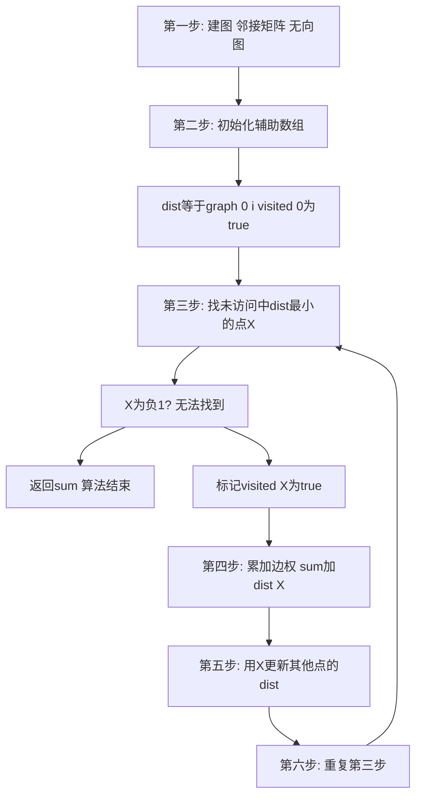

## 本节概述：最小生成树 Prim 朴素算法

最小生成树有多个算法，Prim 是相对最简单的一种。Kruskal 需要依赖并查集，而 Prim 只需要会求一个数组中最小值的基础枚举知识即可。Prim 朴素算法时间复杂度为 O(N 的平方)，是一个贪心算法，适合非负边权且无向图，越稠密越好。

---

### 核心概念

**算法特点**：

1. 是一个贪心算法
2. 适合非负边权且无向图
3. 越稠密越好
4. 顶点数最好小于 1000
5. 需要少量的数据结构知识和一点算法基础（求一个数组中最小值）

**数据结构**：采用邻接矩阵存储图。需要两个辅助数组：
- `dist[i]`：顶点 i 与已经生成的最小生成树之间的最小距离
- `visited[i]`：dist[i] 是否已经确定（i 所在的最小生成树的边是否已确定）
- `sum`：记录最小生成树的权值和

**初始化**：

- 原点取 0（因为最小生成树要把所有顶点连接起来，0 一定存在）
- `dist[i] = graph[0][i]`（0 到 i 的距离，因为初始最小生成树只有顶点 0）
- `visited[0] = true`（0 已经在最小生成树中），其余为 false
- `sum = 0`

```cpp
// 伪代码框架
// 初始化
for i = 0 to N-1:
    dist[i] = graph[0][i]  // 各顶点到顶点0的距离
    visited[i] = false
visited[0] = true
sum = 0

// 主循环
while true:
    u = find_min(dist, visited)  // 找未访问中dist最小的点
    if u == -1: break             // 找不到则结束
    visited[u] = true
    sum += dist[u]                // 累加边权
    // 用u更新其他点的dist
    for i = 0 to N-1:
        if not visited[i]:
            dist[i] = min(dist[i], graph[u][i])
return sum
```

### 算法步骤



**算法图解过程**：

以 6 个顶点的无向图为例：

1. 初始化：visited 全为 false，dist[0]=0，visited[0]=true，sum=0
2. 第一轮：找未访问中 dist 最小的点 1，标记为 true，sum += dist[1]。用 1 更新：dist[2] 从 4 更新为 2（从 1 连过来更优）
3. 第二轮：找到点 2（dist=2），标记为 true，sum += 2。更新 dist[3]=5, dist[4]=1, dist[5]=3
4. 第三轮：找到点 4（dist=1），标记为 true，sum += 1。更新 dist[5] 从 3 更新为 1
5. 第四轮：找到点 5（dist=1），标记为 true，sum += 1。更新 dist[3] 从 5 更新为 1
6. 第五轮：找到点 3（dist=1），标记为 true，sum += 1
7. 最后再尝试一次找最小值，但所有点都已访问，找不到，返回 sum=6

最终得到最小生成树：6 个顶点、5 条边，权值和为 6。

**关键理解**：dist[i] 表示的是顶点 i 与已经生成的最小生成树之间的最小距离。当新顶点 X 加入最小生成树后，需要用 X 去更新其他顶点的 dist，如果从 X 连过来比原先更短就更新。

### 复杂度分析

- 初始化：O(N)
- 每轮找最小值：O(N)（线性枚举）
- 每轮更新：O(N)（遍历所有顶点）
- while 循环最多执行 N-1 次
- 总时间复杂度：O(N 的平方)

> [!TIP]
> 建无向图时，如果两点之间有多条边（重边），权值大的边可以舍弃，取最小值即可。visited 数组实际上是一个哈希表的功能，可以在 O(1) 时间内快速查找和插入，用数组实现只是最简单的方式。

## 本章小结

- Prim 是贪心算法，适合非负边权无向图，越稠密越好
- dist[i] 表示顶点 i 与已生成最小生成树之间的最小距离
- 核心步骤：找未访问中 dist 最小的点，加入最小生成树，更新其他点的 dist
- 原点取 0（一定存在），邻接矩阵存储，时间复杂度 O(N 方)
- 重边取最小值即可，邻接矩阵不支持重边但可以取舍
