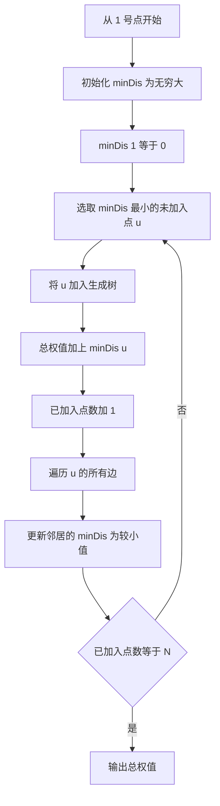

## 本节概述：最小生成树 Prim 实战

本节选用洛谷 P3366「最小生成树」——这是 Prim 算法的标准模板题，使用堆优化求无向图的最小生成树，是图论中必会的经典模板。

---

### 题目描述

**最小生成树** | 洛谷 P3366 | 难度：普及

如题，给出一个无向图，求出最小生成树，如果该图不连通，则输出 `orz`。

**输入格式**：第一行包含两个整数 N, M，表示该图共有 N 个结点和 M 条无向边。接下来 M 行每行包含三个整数 Xi, Yi, Zi，表示有一条长度为 Zi 的无向边连接结点 Xi, Yi。

**输出格式**：如果该图连通，则输出一个整数表示最小生成树的各边的长度之和。如果该图不连通则输出 `orz`。

**数据范围**：
- 1 <= N <= 5000
- 1 <= M <= 2*10^5
- 1 <= Zi <= 10^4
- 1 <= Xi, Yi <= N

**示例**：
输入：
```
4 5
1 2 2
1 3 2
1 4 3
2 3 4
3 4 3
```
输出：
```
7
```

### 解题思路

**核心思想**：Prim 算法从任意一个点开始，逐步将距离当前生成树最近的点加入生成树，直到所有点都加入为止。

Prim 算法类似于 Dijkstra 的过程：
1. 从起点（如 1 号点）开始，将其加入生成树
2. 维护每个未加入点到当前生成树的最短距离 `minDis`
3. 每次选取 `minDis` 最小的未加入点，加入生成树
4. 用新加入点的出边更新其他未加入点的 `minDis`
5. 重复直到所有点加入（生成树有 N-1 条边）

如果加入的点数不足 N，说明图不连通。



### 代码实现

```cpp
#include <iostream>
#include <vector>
#include <queue>
using namespace std;

const int MAXN = 5010;
const int INF = 0x3f3f3f3f;

// 链式前向星存图
struct Edge {
    int to;
    int next;
    int w;
} edge[400010];  // 无向图，边数乘 2

int head[MAXN];
int cnt = 0;

void addEdge(int u, int v, int w) {
    edge[++cnt].to = v;
    edge[cnt].w = w;
    edge[cnt].next = head[u];
    head[u] = cnt;
}

int minDis[MAXN];  // 每个点到生成树的最短距离
bool inTree[MAXN]; // 是否已在生成树中

int main() {
    ios::sync_with_stdio(false);
    cin.tie(nullptr);
    
    int n, m;
    cin >> n >> m;
    
    // 建无向图（加两条有向边）
    for (int i = 0; i < m; i++) {
        int x, y, z;
        cin >> x >> y >> z;
        addEdge(x, y, z);
        addEdge(y, x, z);
    }
    
    // 初始化
    fill(minDis, minDis + MAXN, INF);
    minDis[1] = 0;  // 从 1 号点开始
    
    long long totalWeight = 0;  // 生成树总权值
    int nodeCount = 0;          // 已加入的点数
    
    // 优先队列：first 为距离，second 为点编号
    priority_queue<pair<int,int>, vector<pair<int,int>>, greater<pair<int,int>>> pq;
    pq.push({0, 1});
    
    while (!pq.empty() && nodeCount < n) {
        auto [d, u] = pq.top();
        pq.pop();
        
        if (inTree[u]) continue;  // 已在树中，跳过
        inTree[u] = true;
        totalWeight += d;
        nodeCount++;
        
        // 用 u 的边更新邻居的距离
        for (int i = head[u]; i != 0; i = edge[i].next) {
            int v = edge[i].to;
            int w = edge[i].w;
            if (!inTree[v] && w < minDis[v]) {
                minDis[v] = w;
                pq.push({minDis[v], v});
            }
        }
    }
    
    // 判断图是否连通
    if (nodeCount < n) {
        cout << "orz" << endl;
    } else {
        cout << totalWeight << endl;
    }
    
    return 0;
}
```

### 代码解析

1. **无向图建图**：每条无向边 `addEdge(x, y, z)` 和 `addEdge(y, x, z)` 各加一次

2. **`minDis[i]`**：表示点 i 到当前生成树的最短距离。初始为无穷大，起点 `minDis[1] = 0`。注意这里 `minDis` 存的是到生成树的距离，不是到源点的距离

3. **优先队列**：小根堆，存储 `{到生成树的距离, 点编号}`，每次取出距离最小的未加入点

4. **`if (inTree[u]) continue`**：与 Dijkstra 类似，堆中可能有同一节点的多个记录，用 `inTree` 标记已加入的点，重复取出直接跳过

5. **更新邻居 `if (!inTree[v] && w < minDis[v])`**：如果 v 还没在树中，且 u 到 v 的边权比 v 当前到生成树的距离更短，就更新。注意更新的是「到生成树的最短距离」，而非累加距离

6. **连通性判断**：如果最终 `nodeCount < n`，说明有些点无法到达，图不连通，输出 `orz`

### 复杂度分析

- 时间复杂度：O(m log n)，每条边最多被检查一次，优先队列操作 O(log n)
- 空间复杂度：O(n + m)，存储图和辅助数组

> [!TIP]
> Prim 和 Dijkstra 的区别在于：Dijkstra 更新的是 `dis[v] = dis[u] + w`（累加源点到 u 的距离），而 Prim 更新的是 `minDis[v] = min(minDis[v], w)`（只取边权本身，不累加）。这是因为最小生成树关注的是边权，而最短路关注的是路径长度。

## 本章小结

- Prim 算法通过逐步扩张生成树，每次加入距离最近的点
- 堆优化的 Prim 算法时间复杂度 O(m log n)，适合稠密图
- Prim 与 Dijkstra 结构相似，但松弛操作不同：Prim 不累加距离，只取边权本身
- 需要判断图是否连通：如果加入的点数不足 N，图不连通
- 无向图建图时每条边要加两次（双向边）
