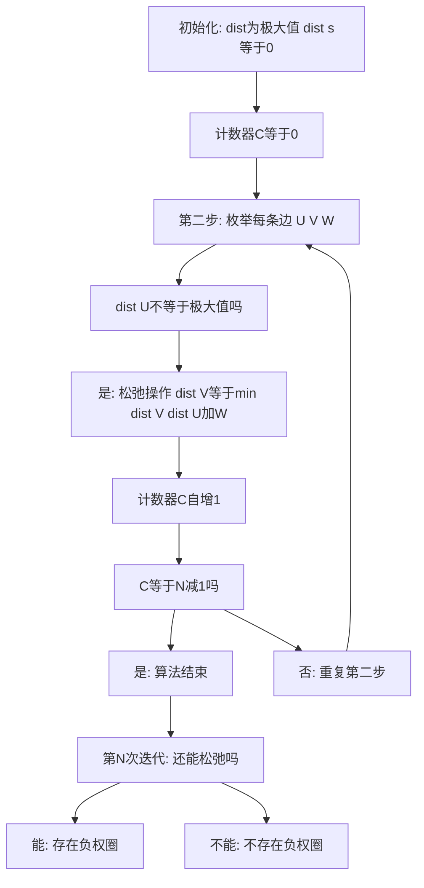

## 本节概述：最短路 Bellman-Ford

Bellman-Ford 算法时间复杂度为 O(N*M)，其中 N 为顶点数，M 为边数。它能解决 Dijkstra 不能解决的带负边权的问题，同样是单源最短路。算法实现非常简单，只需要少量数据结构和算法基础。最好顶点数乘边数小于 10 的 6 次。

---

### 核心概念

**问题引入**：在一个 N 个顶点 M 条边的连通图上，有两种类型的路——正常的路（双向，行走花费时间）和虫洞（单向，行走时让时间倒流）。问是否存在某个点出发，能够在过去的某个时间点回到该点。这个问题本质上是判断图中是否存在负权圈。

**负权圈**：如 1 到 2、2 到 3、3 到 1 形成的圈，且它们的权值之和为负数。如果存在负权圈，可以利用它把时间无限往前推（时光倒流）。

**算法原理**：基于最短路的最优子结构性质。用 D[i] 表示起点 S 到 i 的最短路。边数上限为 J 的最短路，可以通过边数上限为 J-1 的最短路加入一条边得到。通过 N-1 次迭代，最后求得 S 到所有点的最短路。

**事实依据**：一个图的最短路如果存在，那么最短路中必定不存在负权圈（反证法：如果有负权圈，可以不停走让路越来越短）。所以最短路的顶点数除起点外最多只有 N-1 个。

```cpp
// 伪代码：Bellman-Ford 框架
// 边的结构：三元组 (u, v, w)，存入数组
// 松弛操作
bool relax(edges[], dist[]) {
    bool is_relax = false
    for (u, v, w) in edges:
        if dist[u] != infinite:        // S能到达U
            if dist[u] + w < dist[v]:  // 从U过来更短
                dist[v] = dist[u] + w
                is_relax = true
    return is_relax  // 是否有更新
}

// 主函数
for i = 0 to N-1:
    dist[i] = infinite  // 初始化为极大值
dist[s] = 0              // 起点到起点为0

for i = 0 to N-2:        // N-1次迭代
    if not relax(edges, dist):
        return false     // 没有松弛，不存在负权圈

// 第N次迭代判断负权圈
return relax(edges, dist)  // 如果还能更新则存在负权圈
```

### 算法步骤



**代码分析**：

1. **边的存储**：采用三元组 (u, v, w) 存储在数组中，既不用邻接表也不用邻接矩阵
2. **松弛操作**：遍历所有边，如果 dist[u] + w < dist[v] 则更新 dist[v]，并标记 is_relax 为 true。如果至少有一个点被更新则返回 true，否则返回 false
3. **主循环**：进行 N-1 次迭代，每次调用松弛操作。如果某次松弛没有更新，提前返回 false（不存在负权圈）
4. **判断负权圈**：N-1 次迭代后，进行第 N 次松弛。如果还能更新，说明存在负权圈

### 复杂度分析

- 每次松弛操作要遍历所有 M 条边
- 最多遍历 N 次（N-1 次求最短路 + 1 次判断负权圈）
- 最坏情况（存在负权圈时）时间复杂度：O(N*M)
- 空间复杂度：只需存储边数组和 dist 数组，不需要邻接矩阵或邻接表

> [!TIP]
> Bellman-Ford 不仅能求最短路，将松弛操作中的小于号改成大于号就可以求最长路。算法实现非常简单，只需要存储边的三元组数组和 dist 数组，不需要邻接表或邻接矩阵。

## 本章小结

- Bellman-Ford 解决 Dijkstra 不能解决的带负边权问题，时间复杂度 O(N*M)
- 算法原理：边数上限为 J 的最短路可由边数上限为 J-1 的最短路加一条边得到
- 松弛操作：dist[v] = min(dist[v], dist[u] + w)，遍历所有边
- N-1 次迭代求最短路，第 N 次迭代判断是否存在负权圈
- 边用三元组存储，不需要邻接表或邻接矩阵，实现非常简单
- 将小于号改大于号即可求最长路
