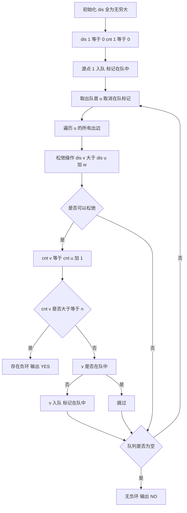

## 本节概述：最短路 Bellman-Ford 实战

本节选用洛谷 P3385「负环」——这是 Bellman-Ford / SPFA 算法最经典的模板题，通过检测最短路径边数是否超过 n-1 来判断图中是否存在负环，是图论中处理负权图的必会模板。

---

### 题目描述

**负环** | 洛谷 P3385 | 难度：普及

给定一个 n 个点的有向图，请求出图中是否存在从顶点 1 出发能到达的负环。

负环的定义是：一条边权之和为负数的回路。

**输入格式**：本题单测试点有多组测试数据。输入的第一行是一个整数 T，表示测试数据的组数。对于每组数据的格式如下：

第一行有两个整数，分别表示图的点数 n 和接下来给出边信息的条数 m。接下来 m 行，每行三个整数 u, v, w。

- 若 w >= 0，则表示存在一条从 u 至 v 边权为 w 的边，还存在一条从 v 至 u 边权为 w 的边。
- 若 w < 0，则只表示存在一条从 u 至 v 边权为 w 的边。

**输出格式**：对于每组数据，输出一行一个字符串，若所求负环存在，则输出 `YES`，否则输出 `NO`。

**数据范围**：
- 1 <= n <= 2*10^3
- 1 <= m <= 3*10^3
- 1 <= u, v <= n
- -10^4 <= w <= 10^4
- 1 <= T <= 10

**示例**：
输入：
```
2
3 4
1 2 2
1 3 4
2 3 1
3 1 -3
3 3
1 2 3
2 3 4
3 1 -8
```
输出：
```
NO
YES
```

### 解题思路

**核心思想**：Bellman-Ford 的变体 SPFA 算法。在无负环的图中，任意两点间的最短路径最多经过 n-1 条边。如果一个点被松弛（入队）的次数超过 n 次，说明存在负环。

SPFA 检测负环的原理：
1. 从源点 1 出发执行 SPFA
2. 维护 `cnt[v]`：到达点 v 的最短路径经过的边数
3. 每次松弛 `dis[v] = dis[u] + w` 时，`cnt[v] = cnt[u] + 1`
4. 如果 `cnt[v] >= n`（边数达到 n 条），说明存在从源点可达的负环

为什么？在 n 个点的图中，简单路径最多 n-1 条边。如果最短路径边数 >= n，说明路径上有重复点，即存在环。而能不断松弛说明环的边权和为负，即负环。



### 代码实现

```cpp
#include <iostream>
#include <vector>
#include <queue>
#include <cstring>
using namespace std;

const int MAXN = 2010;
const int INF = 0x3f3f3f3f;

// 链式前向星存图
struct Edge {
    int to;
    int next;
    int w;
} edge[12010];

int head[MAXN];
int cnt_edge;

void addEdge(int u, int v, int w) {
    edge[++cnt_edge].to = v;
    edge[cnt_edge].w = w;
    edge[cnt_edge].next = head[u];
    head[u] = cnt_edge;
}

int dis[MAXN];   // 最短距离
int cnt[MAXN];   // 到达该点的最短路径边数
bool inQueue[MAXN]; // 是否在队列中

bool spfa(int n) {
    // 初始化
    memset(dis, 0x3f, sizeof(dis));
    memset(cnt, 0, sizeof(cnt));
    memset(inQueue, false, sizeof(inQueue));
    
    queue<int> q;
    dis[1] = 0;
    inQueue[1] = true;
    q.push(1);
    
    while (!q.empty()) {
        int u = q.front();
        q.pop();
        inQueue[u] = false;
        
        for (int i = head[u]; i != 0; i = edge[i].next) {
            int v = edge[i].to;
            int w = edge[i].w;
            
            // 松弛操作
            if (dis[u] + w < dis[v]) {
                dis[v] = dis[u] + w;
                cnt[v] = cnt[u] + 1;
                
                // 边数达到 n 说明有负环
                if (cnt[v] >= n) {
                    return true;  // 存在负环
                }
                
                // v 不在队列中才入队
                if (!inQueue[v]) {
                    inQueue[v] = true;
                    q.push(v);
                }
            }
        }
    }
    
    return false;  // 不存在负环
}

int main() {
    ios::sync_with_stdio(false);
    cin.tie(nullptr);
    
    int T;
    cin >> T;
    
    while (T--) {
        // 每组数据初始化
        cnt_edge = 0;
        memset(head, 0, sizeof(head));
        
        int n, m;
        cin >> n >> m;
        
        for (int i = 0; i < m; i++) {
            int u, v, w;
            cin >> u >> v >> w;
            addEdge(u, v, w);
            if (w >= 0) {
                addEdge(v, u, w);  // w >= 0 时加反向边
            }
        }
        
        if (spfa(n)) {
            cout << "YES" << endl;
        } else {
            cout << "NO" << endl;
        }
    }
    
    return 0;
}
```

### 代码解析

1. **建图规则**：当 w >= 0 时加双向边（u 到 v 和 v 到 u），当 w < 0 时只加 u 到 v 的单向边。这是题目的特殊要求

2. **SPFA 算法**：Bellman-Ford 的队列优化版本。只有被松弛过的点才需要再次更新其邻居，用队列管理待处理的点

3. **`cnt[v] = cnt[u] + 1`**：记录到达 v 的最短路径经过的边数。如果边数 >= n，说明路径上有环（n 个点最多 n-1 条边的简单路径），且环为负环（否则不会被松弛）

4. **`inQueue[]` 标记**：避免同一节点重复入队。一个点已经在队列中时，不需要再次入队——它出队时会更新所有邻居

5. **多组数据初始化**：每组测试数据需要清空 `head`、`cnt_edge` 和图结构，以及 SPFA 中的所有数组

6. **返回值**：SPFA 返回 `true` 表示发现负环，返回 `false` 表示无负环

### 复杂度分析

- 时间复杂度：O(nm)，最坏情况下每个点入队 O(n) 次，每次遍历所有边
- 空间复杂度：O(n + m)，存储图和辅助数组

> [!TIP]
> SPFA 判断负环有两种常用方法：一是 `cnt[v] >= n`（边数法，推荐使用），二是 `入队次数 >= n`。边数法更严格正确：在 n 个点的图中，最短路径最多 n-1 条边，达到 n 条边必然存在负环。注意多组数据时一定要初始化所有数组，包括图结构。

## 本章小结

- Bellman-Ford / SPFA 可以处理负权边，这是 Dijkstra 做不到的
- SPFA 是 Bellman-Ford 的队列优化，只松弛被更新过的点的邻居
- 判断负环的关键：最短路径边数 `cnt[v] >= n` 时说明存在负环
- `inQueue` 标记避免重复入队，提高效率
- 多组测试数据时务必重置图结构和所有数组
