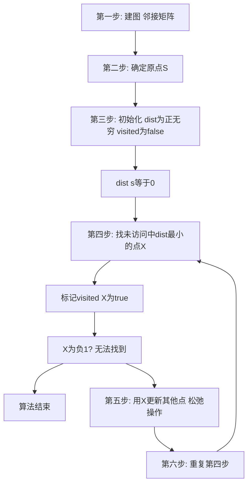

## 本节概述：最短路 Dijkstra 朴素算法

Dijkstra 朴素算法是单源最短路径算法，时间复杂度为 O(N 的平方)。它的每一步都非常清晰，就像模拟一样。算法要求非负边权，适合顶点数在 1000 左右量级的问题。学朴素算法不需要堆等高深数据结构，只需了解图的概念和线性枚举即可。

---

### 核心概念

**算法特点**：

1. 一定是非负边权（如果有负数环会越小越走越小，无法找到最短路）
2. 求的是单源最短路（给定一个起点，求到所有点的最短路）
3. 顶点数最好小于 1000（橙色条件，2000 可接受，3000 可能被卡）
4. 需要少量的数据结构知识（图的概念）和一点算法基础（线性枚举）

**数据结构**：采用邻接矩阵存储图。需要两个辅助数组：
- `dist[i]`：从源点 S 到 i 的最短路径
- `visited[i]`：dist[i] 是否最终确定（true 表示已确定，false 表示未确定）

```cpp
// 伪代码框架
// 初始化
for i = 0 to N-1:
    visited[i] = false
    dist[i] = infinite  // 正无穷
dist[s] = 0  // 源点到自身距离为0

// 主循环
while true:
    u = find_min(dist, visited)  // 找未访问中dist最小的点
    if u == -1: break             // 找不到则结束
    visited[u] = true
    // 松弛操作：用u更新其他点
    for i = 0 to N-1:
        if not visited[i]:
            dist[i] = min(dist[i], dist[u] + graph[u][i])
```

**松弛操作**：对于节点 Y，如果原来从其他节点过来的最短路是 dist[Y]，而从 X 过来的最短路是 dist[X] + W(X,Y) 更短，则选择更短的那条路。即 dist[Y] = min(dist[Y], dist[X] + W(X,Y))。

### 算法步骤



**算法图解过程**：

以 6 个顶点的有向图为例，源点为 0：

1. 初始化：visited 全为 false，dist 全为正无穷，dist[0]=0
2. 第一轮：找到 dist 最小的点 0，标记为 true。用 0 更新出边：dist[1]=1, dist[2]=4, dist[3]=10
3. 第二轮：从未访问中找到 dist 最小的点 1，标记为 true。用 1 更新：dist[2] 从 4 更新为 3（从 1 过来更优）
4. 第三轮：找到点 2，标记为 true。更新 dist[3]=8, dist[4]=6, dist[5] 更新
5. 第四轮：找到点 4，更新 dist[5]=5
6. 第五轮：找到点 5，更新 dist[3]=6
7. 第六轮：找到点 3，没有出边
8. 最终：visited 全为 true，dist 存储从源点到各点的最短路径

**代码分析**：

- **初始化函数**：遍历所有顶点，visited[i]=false，dist[i]=infinite，dist[s]=0
- **找最小值函数**：线性枚举未访问的顶点中 dist 最小的，时间复杂度 O(N)
- **更新函数**：标记 u 为 true，遍历所有顶点，对未访问的点执行松弛操作

### 复杂度分析

- 初始化：O(N)
- 每轮找最小值：O(N)（线性枚举）
- 每轮更新：O(N)（遍历所有顶点）
- while 循环执行 N 次
- 总时间复杂度：O(N 的平方)
- 因为是 O(N 方)，所以可以用邻接矩阵，空间也可接受

> [!TIP]
> 很多题目不是直接让你写 Dijkstra 函数，而是考察你如何建图。建图才是最麻烦也是最难的部分，有点像数学建模。顶点数在 5000 以上或 1 万以上时，朴素算法过不了，需要优化算法（堆优化）。

## 本章小结

- Dijkstra 朴素算法要求非负边权，求单源最短路，时间复杂度 O(N 方)
- 核心思想：每轮找未访问中 dist 最小的点，标记后用松弛操作更新其他点
- 松弛操作：dist[Y] = min(dist[Y], dist[X] + W(X,Y))
- 适合顶点数 1000 左右量级，用邻接矩阵存储
- 建图往往是题目考察的重点，类似数学建模
