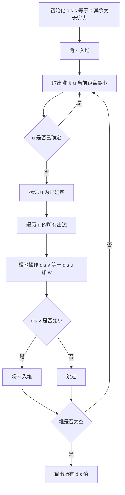

## 本节概述：最短路 Dijkstra 实战

本节选用洛谷 P4779「单源最短路径（标准版）」——这是 Dijkstra 算法的标准模板题，使用堆优化将时间复杂度降到 O(m log n)，是图论最短路问题的必会模板。

---

### 题目描述

**单源最短路径（标准版）** | 洛谷 P4779 | 难度：普及

给定一个 n 个点，m 条有向边的带非负权图，请你计算从 s 出发，到每个点的距离。数据保证你能从 s 出发到任意点。

**输入格式**：第一行为三个正整数 n, m, s。第二行起 m 行，每行三个非负整数 ui, vi, wi，表示从 ui 到 vi 有一条权值为 wi 的有向边。

**输出格式**：输出一行 n 个空格分隔的非负整数，表示 s 到每个点的距离。

**数据范围**：
- 1 <= n <= 10^5
- 1 <= m <= 2*10^5
- s = 1
- 1 <= ui, vi <= n
- 0 <= wi <= 10^9

**示例**：
输入：
```
4 6 1
1 2 2
2 3 2
2 4 1
1 3 5
3 4 3
1 4 4
```
输出：
```
0 2 4 3
```

### 解题思路

**核心思想**：Dijkstra 算法基于贪心——每次从未确定最短路的点中选取距离源点最近的点，用该点更新其邻居的距离。使用优先队列（小根堆）优化选取最小距离的点的过程。

算法步骤：
1. 初始化：源点距离为 0，其余点距离为无穷大
2. 将源点放入优先队列
3. 每次取出堆顶（当前距离最小的未确定点 u）
4. 如果 u 已经确定过最短路，跳过（堆中可能有重复元素）
5. 用 u 的出边松弛邻居：如果 `dis[u] + w < dis[v]`，更新 `dis[v]` 并将 v 入堆
6. 重复直到堆空



### 代码实现

```cpp
#include <iostream>
#include <vector>
#include <queue>
using namespace std;

const int MAXN = 100010;
const long long INF = 0x3f3f3f3f3f3f3f3fLL;

// 链式前向星存图
struct Edge {
    int to;       // 边的终点
    int next;     // 下一条边的编号
    long long w;  // 边权
} edge[200010];

int head[MAXN];  // 每个点的第一条边
int cnt = 0;     // 边的计数器

// 加边函数
void addEdge(int u, int v, long long w) {
    edge[++cnt].to = v;
    edge[cnt].w = w;
    edge[cnt].next = head[u];
    head[u] = cnt;
}

// 距离数组
long long dis[MAXN];
bool visited[MAXN];

// 堆中元素：first 为距离，second 为点编号
// 小根堆：greater<pair> 使距离小的在堆顶
typedef pair<long long, int> pli;

int main() {
    ios::sync_with_stdio(false);
    cin.tie(nullptr);
    
    int n, m, s;
    cin >> n >> m >> s;
    
    // 建图
    for (int i = 0; i < m; i++) {
        int u, v;
        long long w;
        cin >> u >> v >> w;
        addEdge(u, v, w);
    }
    
    // 初始化距离数组
    fill(dis, dis + MAXN, INF);
    dis[s] = 0;
    
    // 优先队列（小根堆）
    priority_queue<pli, vector<pli>, greater<pli>> pq;
    pq.push({0, s});
    
    while (!pq.empty()) {
        auto [d, u] = pq.top();
        pq.pop();
        
        // 如果已经确定过最短路，跳过
        if (visited[u]) continue;
        visited[u] = true;
        
        // 遍历 u 的所有出边
        for (int i = head[u]; i != 0; i = edge[i].next) {
            int v = edge[i].to;
            long long w = edge[i].w;
            
            // 松弛操作
            if (dis[u] + w < dis[v]) {
                dis[v] = dis[u] + w;
                pq.push({dis[v], v});
            }
        }
    }
    
    // 输出结果
    for (int i = 1; i <= n; i++) {
        cout << dis[i];
        if (i < n) cout << " ";
    }
    cout << endl;
    
    return 0;
}
```

### 代码解析

1. **链式前向星 `addEdge`**：用数组模拟邻接表，比 `vector` 更快。每条边存储终点、边权和下一条边的编号。`head[u]` 指向点 u 的第一条边

2. **`priority_queue<pli, vector<pli>, greater<pli>>`**：小根堆，`greater` 使距离最小的元素在堆顶。堆中存储 `{距离, 点编号}` 的 pair

3. **`if (visited[u]) continue`**：堆中可能有同一节点的多个记录（每次松弛都会入堆），但只有第一次取出时才是最短距离。用 `visited` 数组标记已确定最短路的点，后续重复取出直接跳过

4. **松弛操作 `if (dis[u] + w < dis[v])`**：如果通过 u 到达 v 的距离更短，就更新 `dis[v]` 并将新的距离入堆

5. **`long long` 类型**：边权最大 10^9，路径长度可能超过 `int` 范围，必须用 `long long`

### 复杂度分析

- 时间复杂度：O(m log n)，每条边最多被松弛一次，每次松弛入堆 O(log n)
- 空间复杂度：O(n + m)，存储图和距离数组

> [!TIP]
> 堆优化的关键在于 `visited` 标记。由于每次松弛都入堆，堆中同一节点可能有多个记录，但只有距离最小的那个先被取出。取出后标记 `visited`，后续重复记录直接跳过，保证每个点只处理一次。

## 本章小结

- Dijkstra 算法适用于非负权图的单源最短路问题
- 堆优化将朴素 Dijkstra 的 O(n^2) 优化到 O(m log n)
- 链式前向星是竞赛中常用的存图方式，比 vector 邻接表更快
- `visited` 标记防止重复处理：同一节点在堆中可能有多个记录，只有第一次取出有效
- 注意边权较大时距离要用 `long long`，防止溢出
