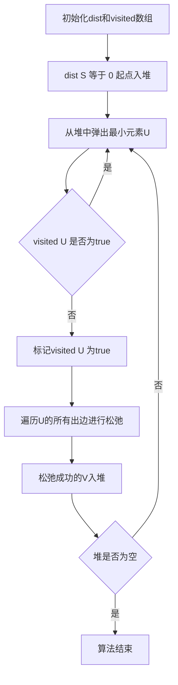

## 本节概述：最短路 Dijkstra + Heap

利用堆来优化Dijkstra算法，时间复杂度为O(N + M*logN)，其中N是点数，M是边数。该算法只能处理非负边权，属于单源最短路，适合点数较多的稀疏图，点数和边数在10的6次以内都可以求解。

---

### 核心概念

**算法特点**

- 只能处理非负边权
- 属于单源最短路
- 点数和边数在10的6次以内可以求解
- 相比朴素邻接矩阵存储的Dijkstra，求解范围更广
- 需要数据结构基础：邻接表、哈希表、二叉堆

**问题描述**

给定一张N个顶点M条边的有向图，顶点编号从0到N-1，图可以有自环和重边。求输出0号顶点到其他所有点的最短路，如果不存在最短路则值为-1。N和M的范围都比较大，朴素的O(N^2) Dijkstra算法过不了。

**数据结构设计**

- 采用邻接表存储图
- `dist[i]` 表示源点S到i的最短路
- `visited[i]` 表示i是否已经确定（布尔值）
- 小顶堆存放二元组 `(dest, v)`，`dest` 是估计的最短距离，`v` 是顶点编号，`dest` 越小优先出队

**初始化**

- `dist` 和 `visited` 数组初始化
- `dist[S] = 0`（起点到起点最短路为0）
- 将起点S的二元组插入优先队列
- 插入时不能只插入顶点（无法判断哪个顶点距离最近），也不能只插入距离（无法反推顶点编号），需要二元组

**松弛操作**

松弛操作与Bellman算法中的松弛一致：如果从U到达V的距离比原先从其他点到达V的距离更短，则选择从U过来：

```cpp
dist[v] = min(dist[v], dist[u] + w[u][v]);
```

### 算法步骤



**算法过程**

1. 从小顶堆中弹出元素U
2. 判断 `visited[u]` 是否为true，如果为true则继续弹出
3. 否则标记为true，并从U出发进行松弛操作
4. 当堆为空时算法结束

**代码规范**

大写开头的函数（如 `DijkstraHeap`）是提供给外部调用的接口，小写开头的函数（如 `dijkstra_init`、`dijkstra_find`、`dijkstra_update`）是内部自己调用的。

**dijkstra_init 函数**

- 初始化 `dist` 和 `visited` 数组
- `dist[S] = 0`
- 将起点二元组塞入堆

**dijkstra_find 函数**

- 利用小顶堆性质，返回堆顶（距离原点最小的点）
- 返回的是二元组，需取第一个数据域（顶点编号V）

**dijkstra_update 函数**

- 判断点是否被访问过，没访问过则标记
- 遍历从U出发的所有出边进行松弛
- 松弛成功后将V塞入堆

### 复杂度分析

- **时间复杂度**：O(N + M*logN)，N是点数，M是边数
- **空间复杂度**：邻接表存储，O(N + M)

> [!TIP]
> `infinite` 必须比可能的最长路径的最大值还要大。如果有N个点且边权最大值为 `w_max`，则 `infinite` 必须比 `N * w_max` 大，否则松弛操作的逻辑会出错。用邻接表存储是因为点数超过1000后，邻接矩阵的内存和时间都吃不消。堆的作用是把原本需要遍历才能获取最小 `dist[u]` 的操作，变成在O(logN)内快速获取。`visited` 数组用数组实现，但起的是哈希表的作用。

## 本章小结

- Dijkstra+堆优化利用小顶堆快速获取距离原点最小的点，时间复杂度O(N + M*logN)
- 只能处理非负边权，适合稀疏图，采用邻接表存储
- 堆中存放二元组（距离估计值，顶点编号），不能只存顶点或只存距离
- 松弛操作与Bellman算法一致：dist[v] = min(dist[v], dist[u] + w[u][v])
- infinite必须大于N乘以最大边权，否则松弛逻辑会出错
