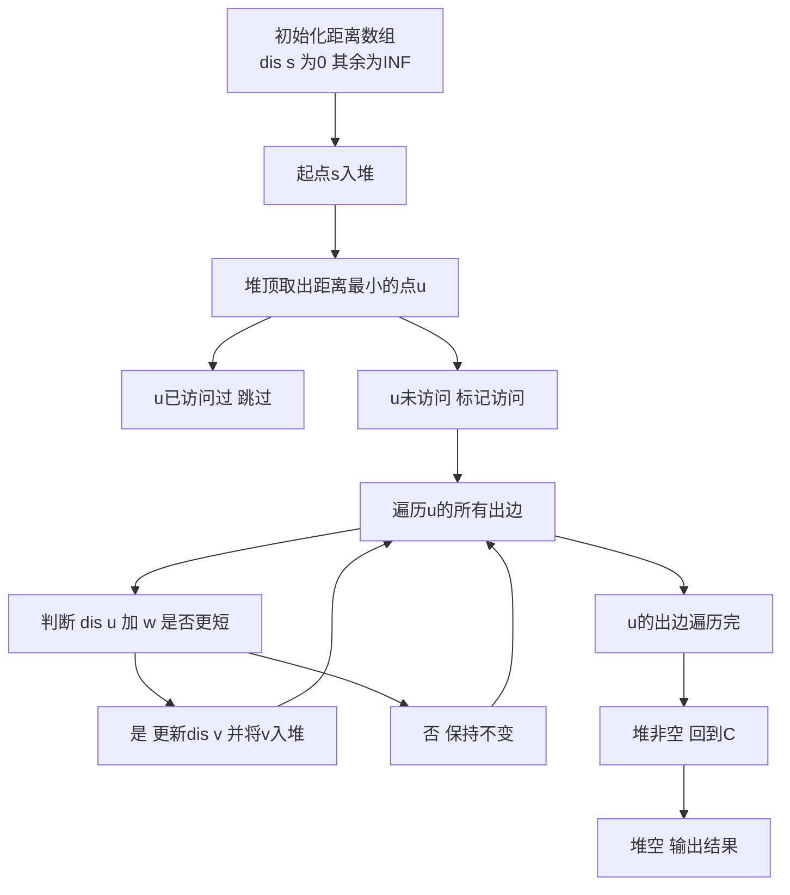

## 本节概述：最短路 Dijkstra 加 Heap 实战

本节选取洛谷 P4779【模板】单源最短路径（标准版），这是堆优化 Dijkstra 最经典的模板题。当 n 和 m 达到 10^5 级别时，朴素 Dijkstra 的 O(n^2) 会超时，必须用堆优化到 O(m log n)。

---

### 题目描述

**题目名称**：【模板】单源最短路径（标准版）
**来源平台**：洛谷
**题目编号**：P4779

给定一个 n 个点 m 条有向边的带非负权图，请你计算从 s 出发到每个点的距离。数据保证你能从 s 出发到任意点。

**输入格式**：第一行三个整数 n, m, s，分别表示点数、边数和出发点。接下来 m 行，每行三个整数 u, v, w，表示一条 u 到 v 的有向边，边权为 w。

**输出格式**：输出一行 n 个整数，第 i 个表示 s 到第 i 个点的最短路径。

**数据范围**：1 <= n <= 10^5，1 <= m <= 2 x 10^5，s = 1，1 <= u, v <= n，0 <= w <= 10^9。

**示例**：
输入：
```
4 6 1
1 2 2
1 3 5
2 3 2
2 4 6
3 4 1
4 1 10
```
输出：
```
0 2 4 5
```

### 解题思路

朴素 Dijkstra 每次找最小距离的点需要 O(n)，总共 n 轮，总复杂度 O(n^2)。当 n = 10^5 时会超时。

堆优化的核心改进：用优先队列（小根堆）维护当前距离最小的点。每次从堆顶取出距离最小的点进行松弛操作，取出的复杂度降为 O(log n)，每条边最多被松弛一次，总复杂度 O(m log n)。

使用链式前向星存图以应对大规模数据，并用 `long long` 防止边权之和溢出。



### 代码实现

```cpp
#include <iostream>
#include <cstring>
#include <queue>
using namespace std;

typedef long long ll;
typedef pair<ll, int> pli; // first: 距离, second: 节点编号

const int N = 100005;
const ll INF = 0x3f3f3f3f3f3f3f3fLL;

int n, m, s;
int head[N], cnt_edge;
ll dis[N];
bool vis[N];

// 链式前向星存图
struct Edge {
    int to;
    ll w;
    int next;
} edges[200005];

void add_edge(int u, int v, ll w) {
    cnt_edge++;
    edges[cnt_edge].to = v;
    edges[cnt_edge].w = w;
    edges[cnt_edge].next = head[u];
    head[u] = cnt_edge;
}

int main() {
    ios::sync_with_stdio(false);
    cin.tie(0);

    cin >> n >> m >> s;

    // 初始化链式前向星
    memset(head, -1, sizeof(head));
    cnt_edge = 0;

    for (int i = 0; i < m; i++) {
        int u, v;
        ll w;
        cin >> u >> v >> w;
        add_edge(u, v, w); // 有向图
    }

    // 初始化距离数组
    memset(dis, 0x3f, sizeof(dis));
    dis[s] = 0;

    // 小根堆：按距离排序
    priority_queue<pli, vector<pli>, greater<pli>> pq;
    pq.push({0, s});

    while (!pq.empty()) {
        // 取出堆顶：当前距离最小的点
        auto [d, u] = pq.top();
        pq.pop();

        // 如果已经访问过，跳过（防止重复处理）
        if (vis[u]) continue;
        vis[u] = true;

        // 遍历u的所有出边
        for (int i = head[u]; i != -1; i = edges[i].next) {
            int v = edges[i].to;
            ll w = edges[i].w;
            // 松弛操作
            if (dis[u] + w < dis[v]) {
                dis[v] = dis[u] + w;
                pq.push({dis[v], v});
            }
        }
    }

    // 输出结果
    for (int i = 1; i <= n; i++) {
        cout << dis[i];
        if (i < n) cout << " ";
    }
    cout << endl;

    return 0;
}
```

### 代码解析

- **链式前向星**：使用 `head` 数组和 `Edge` 结构体构建链式前向星存图，适合大规模稀疏图，比 `vector` 更高效。
- **小根堆**：`priority_queue<pli, vector<pli>, greater<pli>>` 构造小根堆，堆顶始终是距离最小的点。`pair` 的 first 是距离，second 是节点编号，自动按距离排序。
- **vis 数组**：标记已确定最短路的点。堆中可能有同一个点的多个副本（每次松弛都入堆），但只有第一次取出时是最优的，之后直接跳过。
- **long long**：边权最大 10^9，路径和可能超过 int 范围，必须用 `long long`。

### 复杂度分析

- 时间复杂度：O(m log n)，每个点最多入堆一次（出边松弛时），每条边最多被处理一次，堆操作 O(log n)。
- 空间复杂度：O(n + m)，链式前向星存储。

> [!TIP]
> 堆中可能有同一节点的多个副本，使用 vis 数组跳过已处理的节点是关键优化。不能省略 vis，否则可能超时。另外，边权之和可能很大，务必使用 long long。

## 本章小结

- 堆优化 Dijkstra 将朴素版本的 O(n^2) 优化到 O(m log n)，适用于大规模稀疏图。
- 用小根堆维护"当前距离最小的未确定点"，每次取出堆顶进行松弛。
- 链式前向星比 vector 更节省内存，适合竞赛场景。
- vis 数组防止重复处理同一节点，是保证效率的关键。
