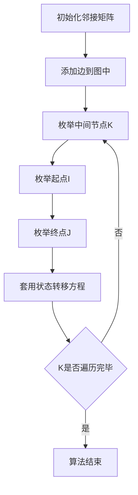

## 本节概述：最短路 Floyd

Floyd算法（弗洛伊德华沙）是一种求解全源最短路的算法，即给定N个点，可以求出任意两点之间的最短路。它属于动态规划问题，算法非常简单，代码更短且更好理解，适合顶点数小于100左右的场景。

---

### 核心概念

Floyd算法属于动态规划问题，用于求解全源最短路。由于是全源最短路，顶点数不能太多，最好小于100。如果500个点且处理细节不好，可能会被卡超时。

**状态设计**

令 `D[k][i][j]` 为只允许经过节点 `0` 到 `K` 作为中间点的情况下，`i` 到 `j` 的最短路。这里的 `K` 是一个左闭右开区间：

- 当 `K=0` 时，不经过任何中间节点
- 当 `K=1` 时，可以经过节点 `0`
- 当 `K=2` 时，可以经过节点 `0`、`1`
- 当 `K=3` 时，可以经过节点 `0`、`1`、`2`

**初始状态**

当 `K=0` 时，即不经过任何中间点：

- 如果 `i` 到 `j` 有边，则 `D[0][i][j]` 等于这条边的权重
- 如果 `i` 到 `j` 没有边，则 `D[0][i][j]` 等于 `infinite`（无限大），因为要求最短路，所以初始化一个最大值

**状态转移方程**

对于状态转移，有两种情况：

1. **不包含K**：如果最短路不经过K点，则 `D[k][i][j] = D[k-1][i][j]`，因为既然不经过K，就等于只允许经过 `0` 到 `K-1` 的情况

2. **包含K**：如果最短路经过K点，则先从 `i` 到 `K`，再从 `K` 到 `j`，即 `D[k-1][i][k] + D[k-1][k][j]`

取两种情况的最小值：

```cpp
D[k][i][j] = min(D[k-1][i][j], D[k-1][i][k] + D[k-1][k][j]);
```

范围说明：`i` 和 `j` 是 `0` 到 `N-1`（顶点编号），`K` 是 `1` 到 `N`（左闭右开区间，能取到N）。

**空间优化**

可以把第一维K去掉，因为 `D[k][i][j]` 来自于 `D[k-1]` 的情况，所有数据都从上一维过来，所以直接优化成二维数组。

### 算法步骤



**第一步：初始化邻接矩阵**

顶点数100左右，邻接矩阵完全存得下。遍历两个顶点U和V，如果 `U=V` 则值为0（自己到自己），否则为无穷大（说明没有边）。

**第二步：添加边**

传入 `U`、`V`、`W`，去邻接矩阵中查找，如果当前边权比原先边权小，则更新。

**第三步：核心框架代码**

三层 for 循环，注意顺序：先枚举K，再枚举I，最后枚举J。核心代码就是状态转移方程的直接实现。

```cpp
for (int k = 0; k < n; k++) {
    for (int i = 0; i < n; i++) {
        for (int j = 0; j < n; j++) {
            graph[i][j] = min(graph[i][j], graph[i][k] + graph[k][j]);
        }
    }
}
```

### 复杂度分析

- **时间复杂度**：三层循环，O(N^3)
- **空间复杂度**：邻接矩阵存储，O(N^2)

> [!TIP]
> Floyd算法有三个关键点要记住：第一，三层循环；第二，K先枚举，再枚举I和J；第三，状态转移方程。K一定要放在第一层枚举，千万不能放在I和J之后，否则代码会错误。

## 本章小结

- Floyd算法是求解全源最短路的动态规划算法，适合顶点数小于100的场景
- 状态定义为 `D[k][i][j]`，表示只允许经过节点0到K作为中间点时i到j的最短路
- 状态转移分两种情况取最小值：不经过K点 和 经过K点
- 核心代码是三层嵌套循环，K必须在最外层枚举
- 可以将三维数组优化为二维数组，因为每个状态只依赖于上一维的状态
