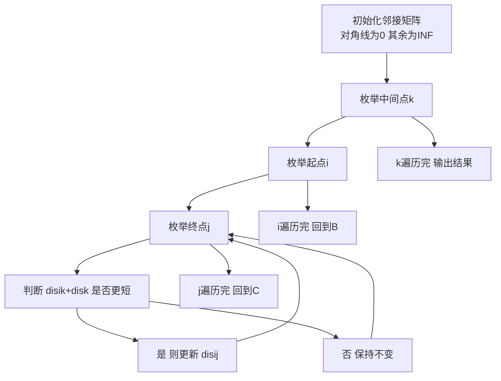

## 本节概述：最短路 Floyd 实战

本节选取洛谷 B3647【模板】Floyd 算法，这是 Floyd 最经典的模板题，让你通过这道题彻底掌握全源最短路的精髓。

---

### 题目描述

**题目名称**：【模板】Floyd
**来源平台**：洛谷
**题目编号**：B3647

给出一张由 n 个点 m 条边组成的无向图，求任意两点之间的最短路径。

**输入格式**：第一行为两个整数 n, m，分别代表点的个数和边的条数。接下来 m 行，每行三个整数 u, v, w，代表 u, v 之间存在一条边权为 w 的边。

**输出格式**：输出 n 行每行 n 个整数。第 i 行的第 j 个整数代表从 i 到 j 的最短路径。

**数据范围**：对于 100% 的数据，n <= 100，m <= 4500，任意一条边的权值 w 是正整数且 1 <= w <= 1000。数据中可能存在重边。

**示例**：
输入：
```
4 4
1 2 1
2 3 1
3 4 1
4 1 1
```
输出：
```
0 1 2 1
1 0 1 2
2 1 0 1
1 2 1 0
```

### 解题思路

Floyd 算法是求解全源最短路的标准方法。核心思想是动态规划：逐步允许更多的节点作为中间节点，更新任意两点之间的最短路径。

具体来说，三重循环枚举中间点 k、起点 i、终点 j，检查经过 k 是否能让 i 到 j 的路径更短。由于 n <= 100，三重循环的时间复杂度 O(n^3) = O(10^6) 完全可以接受。

注意处理重边：输入时取边权最小值即可。



### 代码实现

```cpp
#include <iostream>
#include <cstring>
#include <algorithm>
using namespace std;

const int N = 105;
const int INF = 0x3f3f3f3f;

int n, m;
int dis[N][N]; // 邻接矩阵存储任意两点间最短距离

int main() {
    // 读入点数和边数
    cin >> n >> m;

    // 初始化：对角线为0，其余为INF
    memset(dis, 0x3f, sizeof(dis));
    for (int i = 1; i <= n; i++) {
        dis[i][i] = 0;
    }

    // 读入边，处理重边（取较小值）
    for (int i = 0; i < m; i++) {
        int u, v, w;
        cin >> u >> v >> w;
        dis[u][v] = min(dis[u][v], w);
        dis[v][u] = min(dis[v][u], w); // 无向图
    }

    // Floyd 算法核心：三重循环
    // 最外层必须是中间点k
    for (int k = 1; k <= n; k++) {
        for (int i = 1; i <= n; i++) {
            for (int j = 1; j <= n; j++) {
                if (dis[i][k] + dis[k][j] < dis[i][j]) {
                    dis[i][j] = dis[i][k] + dis[k][j];
                }
            }
        }
    }

    // 输出结果
    for (int i = 1; i <= n; i++) {
        for (int j = 1; j <= n; j++) {
            cout << dis[i][j];
            if (j < n) cout << " ";
        }
        cout << endl;
    }

    return 0;
}
```

### 代码解析

- **初始化**：`memset(dis, 0x3f, sizeof(dis))` 将所有距离初始化为 INF（大数），`0x3f3f3f3f` 足够大且相加不会溢出。对角线 `dis[i][i] = 0` 表示自己到自己的距离为 0。
- **重边处理**：读入边时用 `min` 取较小值，因为两点之间可能有多条边，只需保留最短的。
- **三重循环**：最外层是中间点 k，这是 Floyd 算法的关键。必须先枚举 k，再枚举 i 和 j，否则状态转移的语义会出错。
- **状态转移**：`dis[i][j] = min(dis[i][j], dis[i][k] + dis[k][j])`，判断经过 k 点是否更短。

### 复杂度分析

- 时间复杂度：O(n^3)，三重循环，n <= 100 时约 10^6 次运算，完全可接受。
- 空间复杂度：O(n^2)，使用邻接矩阵存储。

> [!TIP]
> Floyd 算法最易犯的错误是循环顺序。必须保证最外层是中间点 k，内层是起点 i 和终点 j。如果写反，会导致某些最短路没有被正确更新，因为状态转移依赖的是"逐步放松中间点"的过程。

## 本章小结

- Floyd 算法适用于 n 较小（n <= 100）的全源最短路问题，代码极简。
- 三重循环的顺序是 k -> i -> j，不能写反。
- 初始化时注意处理自环（对角线为 0）和重边（取最小权值）。
- `0x3f3f3f3f` 是常用的 INF 值，两个 INF 相加不会溢出 int 范围。
