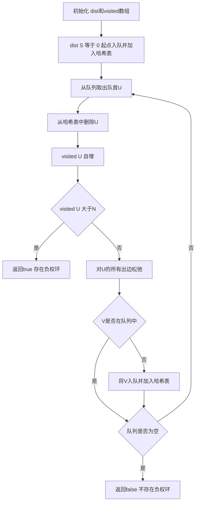

## 本节概述：最短路 SPFA

SPFA（Shortest Path Faster Algorithm，最短路快速算法）是对Bellman-Ford算法的一个优化。在Bellman-Ford算法的基础上多加了一个队列，利用先进先出的队列保存待松弛的节点，避免不必要的重复松弛，从而提高效率。一般用于求解带负权边的最短路问题。

---

### 核心概念

**问题描述**

经典的虫洞问题，当N和M的数据范围变大后，采用传统的Bellman-Ford算法最坏情况下会超时，因此引入SPFA算法。

**算法描述**

SPFA在Bellman-Ford算法的基础上多加了一个队列：

- `dist[i]` 表示源点S到i的最短路
- 利用先进先出（FIFO）的队列保存待松弛的节点
- 每次取出队首节点U，枚举从U出发的所有边UV进行松弛操作（松弛操作与Bellman算法一致）
- 判断V是否在队列中，如果不在则将V塞入队列
- 不断从队列中取出节点进行松弛，直到队列为空

**数据结构**

边的数据结构是一个二元组 `(V, W)`，V是出边的终点，W是边的权重。U不需要存储，因为采用邻接表存储，`edges[i]` 就代表以i为起点的所有出边的集合。

**辅助结构**

- `visited[i]`：记录顶点i入队的次数
- `inQ`：哈希表，用于快速查找某个点是否在队列中（因为队列结构无法遍历）

### 算法步骤

**SPFA_init 函数**

- `dist[i] = infinite`（S到i的距离初始为无限大）
- `visited[i] = 0`（所有顶点未被访问）
- `dist[S] = 0`（S到S的最短路为0）
- `visited[S] = 1`（S已访问一次）
- S入队并加入 `inQ` 哈希表

**SPFA_relax 函数**

- 遍历U的所有出边 `(V, W)`
- 进行松弛操作
- 判断V是否在队列中，不在则入队并加入哈希表

**主框架**

- 取出队首U，从哈希表删除
- `visited[U]` 自增，如果大于N则返回true（存在负权环）
- 对U进行松弛操作
- 队列为空且未返回true，则返回false（不存在负权环）

### 复杂度分析

- **最坏时间复杂度**：O(N * M)，N是顶点数，M是边数
- **期望时间复杂度**：O(k * M)，k是一个常数，M是边数
- 时间复杂度只是估计值，具体和图的结构有很大关系，而且很难证明
- 肯定比传统的Bellman-Ford高效很多

> [!TIP]
> 最短路存在的情况下，SPFA必定能求出最小值，因为每次入队的顶点V对应的 `dist[V]` 都在不断变小，没有负权圈时每个节点都有最短路径值，算法不会无限执行。如果存在负权圈且起点可达，SPFA会进入死循环（dist越来越小无下限）。用 `visited[i]` 记录入队次数，任何最短路上的点数必定小于等于N，一旦 `visited[i]` 大于N就说明存在负权圈。哈希表 `inQ` 的作用是快速判断某个点是否在队列中，因为队列结构无法遍历。

## 本章小结

- SPFA是对Bellman-Ford算法的优化，通过队列保存待松弛节点避免不必要的重复松弛
- 算法过程：取队首松弛出边，V不在队列则入队，直到队列为空
- 通过 `visited[i]` 记录入队次数判断负权圈：大于N则存在负权圈
- 最坏时间复杂度O(N*M)，期望O(k*M)，比Bellman-Ford高效
- 需要辅助哈希表快速判断顶点是否在队列中
