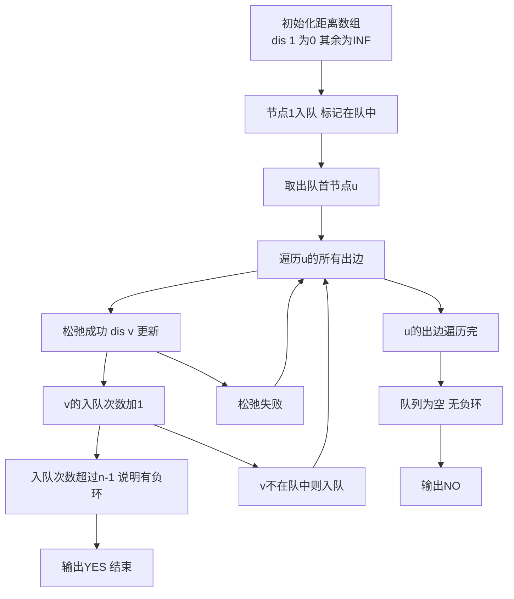

## 本节概述：最短路 SPFA 实战

本节选取洛谷 P3385【模板】负环，这是 SPFA 最经典的应用场景。SPFA 的核心优势在于能处理负权边，而判断负环正是 SPFA 独有的能力。

---

### 题目描述

**题目名称**：【模板】负环
**来源平台**：洛谷
**题目编号**：P3385

给定一个 n 个点的有向图，请求出图中是否存在从顶点 1 出发能到达的负环。负环的定义是：一条边权之和为负数的回路。

**输入格式**：第一行一个正整数 T，表示数据组数。对于每组数据：第一行两个正整数 n, m，表示点数和边数。接下来 m 行，每行三个整数 u, v, w，表示一条 u 到 v 的有向边，权值为 w。

**输出格式**：对于每组数据，输出一行一个字符串，若负环存在则输出 YES，否则输出 NO。

**数据范围**：1 <= n <= 2000，1 <= m <= 3000。对于全部数据，1 <= T <= 10，图中可能有重边，|w| <= 10000。

**示例**：
输入：
```
2
2 2
1 2 1
2 1 1
2 2
1 2 -1
2 1 -1
```
输出：
```
NO
YES
```

### 解题思路

SPFA（Shortest Path Faster Algorithm）是 Bellman-Ford 的队列优化版本。它通过队列维护需要松弛的节点，避免了 Bellman-Ford 中对所有边的盲目扫描。

判断负环的关键：如果从起点 1 出发，某个节点被松弛超过 n-1 次，则说明存在负环。因为在一个没有负环的图中，任意两点间的最短路径最多经过 n-1 条边。如果某个节点的最短路经过的边数达到 n，说明存在负环。

注意：不是所有节点都能从 1 出发到达。为避免遗漏，初始时将所有节点入队，或者只从 1 出发但判断时注意可达性。本模板中从节点 1 出发。



### 代码实现

```cpp
#include <iostream>
#include <cstring>
#include <queue>
using namespace std;

const int N = 2005;
const int M = 6005; // 注意边数开两倍，因为有向边
const int INF = 0x3f3f3f3f;

int n, m;
int head[N], cnt_edge;
int dis[N], cnt[N]; // cnt[i]: 节点i被松弛的次数
bool inqueue[N];     // 是否在队列中

struct Edge {
    int to, w, next;
} edges[M];

void add_edge(int u, int v, int w) {
    edges[++cnt_edge] = {v, w, head[u]};
    head[u] = cnt_edge;
}

bool spfa() {
    queue<int> q;
    memset(dis, 0x3f, sizeof(dis));
    memset(cnt, 0, sizeof(cnt));
    memset(inqueue, false, sizeof(inqueue));

    dis[1] = 0;
    q.push(1);
    inqueue[1] = true;

    while (!q.empty()) {
        int u = q.front();
        q.pop();
        inqueue[u] = false;

        for (int i = head[u]; i != -1; i = edges[i].next) {
            int v = edges[i].to;
            int w = edges[i].w;
            // 松弛操作
            if (dis[u] + w < dis[v]) {
                dis[v] = dis[u] + w;
                cnt[v] = cnt[u] + 1; // 经过的边数加1
                // 如果经过的边数达到n，说明存在负环
                if (cnt[v] >= n) {
                    return true; // 存在负环
                }
                if (!inqueue[v]) {
                    q.push(v);
                    inqueue[v] = true;
                }
            }
        }
    }
    return false; // 不存在负环
}

int main() {
    ios::sync_with_stdio(false);
    cin.tie(0);

    int T;
    cin >> T;

    while (T--) {
        cin >> n >> m;

        memset(head, -1, sizeof(head));
        cnt_edge = 0;

        for (int i = 0; i < m; i++) {
            int u, v, w;
            cin >> u >> v >> w;
            if (w >= 0) {
                // 非负权边：双向建边
                add_edge(u, v, w);
                add_edge(v, u, w);
            } else {
                // 负权边：只建单向
                add_edge(u, v, w);
            }
        }

        if (spfa()) {
            cout << "YES" << endl;
        } else {
            cout << "NO" << endl;
        }
    }

    return 0;
}
```

### 代码解析

- **cnt 数组**：`cnt[v]` 记录从起点到 v 的最短路径经过了多少条边。如果 `cnt[v] >= n`，说明最短路径上出现了 n 条边，即 n+1 个节点，根据鸽巢原理必然有重复节点，形成负环。
- **inqueue 数组**：标记节点是否在队列中，避免重复入队，提高效率。
- **负权边处理**：题目中非负权边是双向的，负权边是单向的。根据题目要求，只有负权边才有可能是负环的来源。
- **链式前向星**：用链式前向星存图，注意边数组要开两倍大小（双向边）。

### 复杂度分析

- 时间复杂度：最坏 O(nm)，但实际运行通常远小于此值（SPFA 的平均时间复杂度约为 O(km)，k 为小常数）。
- 空间复杂度：O(n + m)，链式前向星存储。

> [!TIP]
> 判断负环的关键是 cnt 数组计数松弛次数，而不是节点入队次数。cnt[v] = cnt[u] + 1 表示经过 v 的最短路径边数比经过 u 的多 1。当边数达到 n 时，说明存在负环。注意这道题的负权边是单向的，非负权边是双向的，建图时需区别处理。

## 本章小结

- SPFA 是 Bellman-Ford 的队列优化版，能处理负权边和判断负环。
- 判断负环的核心：记录最短路径经过的边数，超过 n-1 条边则存在负环。
- inqueue 数组避免重复入队，是 SPFA 的效率保障。
- 本题中负权边为单向、非负权边为双向，建图时需注意方向性。
