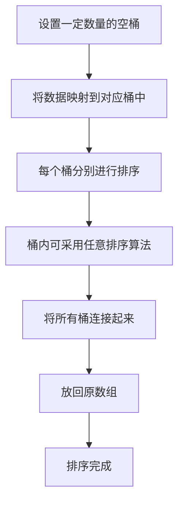

## 本节概述：桶排序

桶排序是一种基于计数的排序算法。工作原理是把数据分到一些有限的桶里面，每个桶分别进行排序，再把所有的桶连接起来放回到原来的数组中。桶排序理解起来非常简单，只要做好映射就可以了。

---

### 核心概念

**算法思想**：
1. 设置一定数量的空桶，并且把数据映射到这些桶里面
2. 每个桶分别进行排序（桶里用什么排序看实际数据情况）
3. 把所有的桶连接起来，把数据放回到原来的数组中

**执行过程**（以分三个桶为例）：
- 第一个桶存储 1 到 4 的元素：3 1 4 2
- 第二个桶存储 5 到 8 的元素：5 7 5 8 6
- 第三个桶存储 9 到 12 的值：9 10 11 12
- 由于数据比较平均，每个桶里的元素个数相同
- 对每个桶分别进行一次选择排序（每次找最小的）
- 排好序后连接起来，排序过程完成

**桶排序属于组合排序**：因为分入桶中的元素可以采用任意一种排序，所以时间复杂度还是取决于每个桶中的元素最后采用的是什么排序。

### 算法步骤

### 复杂度分析

**时间复杂度**：取决于每个桶中元素最后采用的是什么排序算法。由于分入桶中的元素可以采用任意一种排序，时间复杂度不确定。

**空间复杂度**：需要准备这么多桶，最终所有桶中元素加起来和原数组元素个数一样，所以空间复杂度为**大 O N**。

**算法特点**：
- 属于稳定排序
- 但由于桶的数量较多会消耗一些内存空间

**优化方案**：根据数据的分布情况选择合适的桶的大小，尽量减少桶的数量。

> [!TIP]
> 桶排序属于组合排序——桶内可以用任意排序算法。理解起来非常简单，只要做好数据到桶的映射即可。优化关键是根据数据分布选择合适的桶大小，尽量减少桶的数量。

## 本章小结

- 桶排序把数据分到有限的桶中，每桶分别排序后连接
- 时间复杂度取决于桶内采用的排序算法，空间复杂度为大 O N
- 属于稳定排序，但桶数量多会消耗内存
- 优化：根据数据分布选择合适的桶大小，减少桶数量
