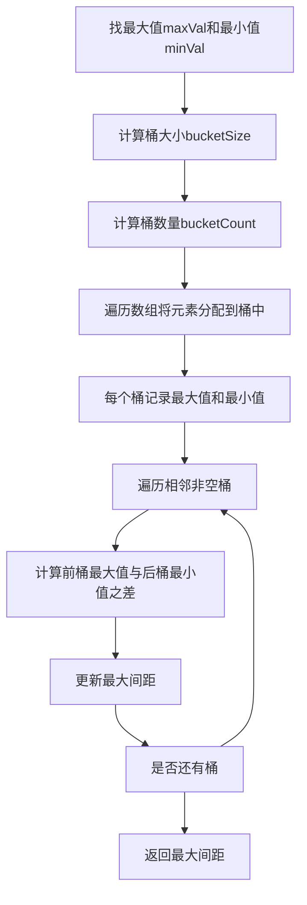

## 本节概述：桶排序 实战

本节选用 LeetCode 第 164 题"最大间距"，这是桶排序最经典的实战题。题目要求在线性时间复杂度内求排序后相邻元素的最大差值，普通的比较排序无法满足线性时间要求，而桶排序可以在大 O N 时间内解决。通过这道题，读者可以深刻理解桶排序的精妙之处——利用桶的特性，最大间距一定出现在相邻桶之间。

---

### 题目描述

**题目名称**：最大间距

**来源平台**：LeetCode

**题目编号**：164

给定一个无序数组 nums，返回数组在排序之后相邻元素之间最大的差值。如果数组元素个数小于 2，则返回 0。

要求：必须编写一个在线性时间内运行并使用线性额外空间的算法。

**输入格式**：一个整数数组 nums。

**输出格式**：一个整数，表示排序后相邻元素的最大差值。

**数据范围**：1 <= 数组长度 <= 10 的 5 次方，0 <= nums 中每个元素 <= 10 的 9 次方。

**示例**：
输入：nums = 3 6 9 1
输出：3

解释：排序后得到 1 3 6 9，相邻最大差值为 3（6 减 3 等于 3，或 9 减 6 等于 3，最大为 3）。

### 解题思路

题目要求线性时间，普通的比较排序（快速排序、归并排序等）都是 O N 乘 log N，无法满足。桶排序可以在大 O N 时间内完成。

**核心思想**：将 n 个元素分配到 n 减 1 个桶中，每个桶记录该桶内的最大值和最小值。由于有 n 个元素和 n 减 1 个桶，根据鸽巢原理，至少有一个桶是空的。最大间距一定出现在相邻非空桶之间（即前一个桶的最大值与后一个桶的最小值之差），而不可能在同一个桶内部。

**为什么最大间距不在桶内部？** 每个桶的宽度为 bucketSize，设为 max 减 min 除以 n 减 1 向下取整。如果数组中最大间距大于 bucketSize，那么这个间距一定跨越了一个空桶，也就是出现在相邻桶之间。而如果最大间距小于等于 bucketSize，那么每个桶内的元素间距都小于 bucketSize，最大间距仍然出现在桶间。

**具体步骤**：
1. 找出数组的最大值和最小值
2. 计算桶的大小和数量
3. 将每个元素分配到对应桶中，记录每个桶的最大值和最小值
4. 遍历相邻非空桶，计算前桶最大值与后桶最小值之差，取最大值



### 代码实现

```cpp
class Solution {
public:
    int maximumGap(vector<int>& nums) {
        int n = nums.size();
        if (n < 2) return 0;
        
        // 找最大值和最小值
        int maxVal = *max_element(nums.begin(), nums.end());
        int minVal = *min_element(nums.begin(), nums.end());
        
        if (maxVal == minVal) return 0;  // 所有元素相同
        
        // 计算桶大小和桶数量
        int bucketSize = max(1, (maxVal - minVal) / (n - 1));
        int bucketCount = (maxVal - minVal) / bucketSize + 1;
        
        // 每个桶记录该桶内的最大值和最小值
        vector<int> bucketMin(bucketCount, INT_MAX);
        vector<int> bucketMax(bucketCount, INT_MIN);
        
        // 将元素分配到桶中
        for (int num : nums) {
            int idx = (num - minVal) / bucketSize;  // 计算桶编号
            bucketMin[idx] = min(bucketMin[idx], num);
            bucketMax[idx] = max(bucketMax[idx], num);
        }
        
        // 遍历相邻非空桶，找最大间距
        int ans = 0;
        int prevMax = bucketMax[0];  // 第一个桶一定非空（包含最小值）
        for (int i = 1; i < bucketCount; i++) {
            if (bucketMin[i] == INT_MAX) continue;  // 空桶跳过
            // 最大间距出现在相邻桶之间
            ans = max(ans, bucketMin[i] - prevMax);
            prevMax = bucketMax[i];
        }
        
        return ans;
    }
};
```

### 代码解析

**桶大小计算**：`bucketSize` 取 max 减 1 和 maxVal 减 minVal 除以 n 减 1 的较大值。取 max 1 是为了防止 maxVal 减 minVal 小于 n 减 1 时除法结果为 0。

**桶编号计算**：元素 num 的桶编号为 num 减 minVal 除以 bucketSize。由于 minVal 映射到 0 号桶，maxVal 映射到最后一个桶，所有元素都能被正确分配。

**桶内信息**：每个桶只需要记录该桶内的最大值和最小值，不需要记录所有元素。因为最大间距不可能在桶内部出现（桶大小就是 bucketSize），只可能出现在相邻桶之间。

**空桶处理**：如果某个桶没有元素（bucketMin 仍为 INT_MAX），则跳过。遍历时维护 prevMax 为前一个非空桶的最大值，当前非空桶的最小值减去 prevMax 就是这两个桶之间的间距。

### 复杂度分析

- 时间复杂度：大 O N。找最大最小值 O N，分配元素到桶 O N，遍历桶 O N，总时间复杂度为 O N。
- 空间复杂度：大 O N。使用 bucketCount 个桶，每个桶记录最大值和最小值，最多 N 个桶。

> [!TIP]
> 最大间距是桶排序最经典的题目。核心思想：n 个元素分到 n 减 1 个桶，最大间距一定出现在相邻桶之间而非桶内。每个桶只记录最大值和最小值即可，不需要桶内排序。注意处理所有元素相同的情况（maxVal 等于 minVal 时返回 0）。

## 本章小结

- 最大间距是桶排序最经典的题目，要求线性时间复杂度，比较排序无法满足
- 核心思想：n 个元素分到 n 减 1 个桶，最大间距出现在相邻桶之间
- 每个桶只记录最大值和最小值，无需桶内排序
- 时间复杂度为大 O N，空间复杂度为大 O N
