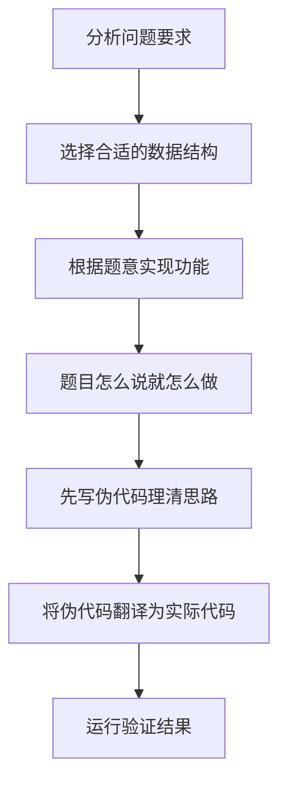
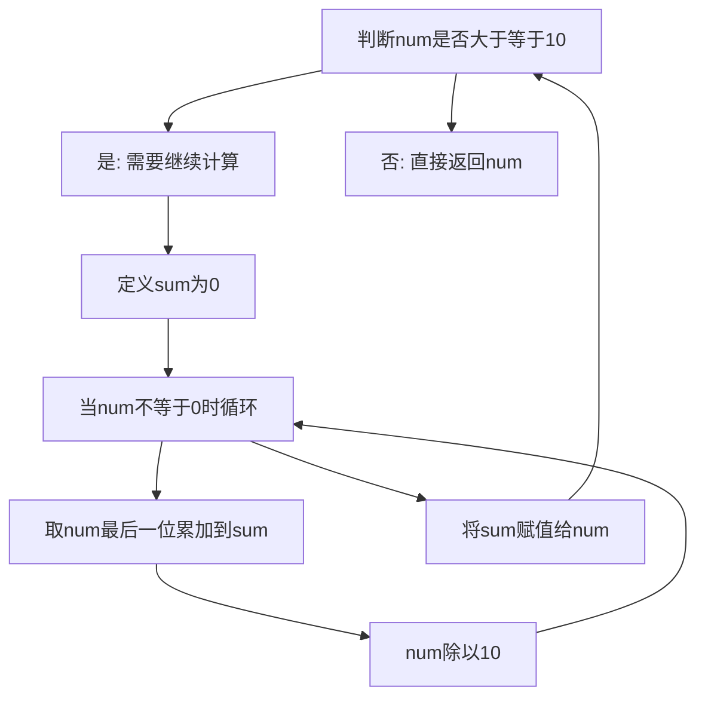

## 本节概述：模拟

模拟算法其实就是没有特定的算法——题目告诉你要怎么做，你就怎么去做，这就叫模拟。模拟题做好了之后，最锻炼耐心，也最训练编码能力。实际上有百分之七八十的题都是模拟题。

---

### 核心概念

**模拟的本质**：题目告诉你要怎么做，你就怎么做。任何题目都可以归为模拟题，但如果用到了其他特定算法（如哈希表、二分枚举等），就归类到对应算法里去。如果题目没有用到任何能够归类的算法，就归到模拟里面。

**关键要素**：对于模拟题而言，最关键的是数据结构的选择。看到一个问题，要选择一个合适的数据结构，然后根据问题来实现功能。常见的数据结构有数组、字符串、矩阵、链表、二叉树等。

**典型例题**：

1. **构建数组**：给定一个从零开始的数组，第 I 个元素是对第 I 个元素再取一次下标的结果。遍历第 I 个元素，把操作抄过去即可完成。

2. **顺序表插入模拟**：给你两个数组 nums 和 index，按照规则创建目标数组。在指定位置插入元素，当需要插入时把后面的元素全部往后移，移完之后再插入进来。这就是顺序表的插入，只是不用考虑扩容问题。

3. **变量操作模拟**：存在一种仅支持四个操作和一个变量 X 的编程语言——加加 X 和 X 加加是 X 加 1，减减 X 和 X 减减是 X 减 1。输入数组的每个元素是字符串，判断是加 1 还是减 1 操作，最后返回 X 的值。

4. **各位数字相加**：给定非负整数 N，反复将各个位上的数字相加，直到最后变成一位数返回结果。例如 38：取末尾 8，38 除以 10 变成 3，3 和 8 相加等于 11；11 继续执行操作，取末尾 1，11 变成 1，1 和 1 相加变成 2。

**通用做法**（以各位数字相加为例）：

```cpp
// 伪代码思路
// 外层循环：当 num 大于等于 10 时继续
while (num >= 10) {
    int sum = 0;
    // 内层循环：取出 num 的每一位
    while (num != 0) {
        sum += num % 10;  // 取最后一位累加到 sum
        num /= 10;        // num 除以 10
    }
    num = sum;  // 将 sum 赋值给 num，继续循环
}
return num;
```

先把伪代码写出来，然后再把伪代码里面每一句话翻译成实际代码。

### 算法步骤



以各位数字相加为例的具体步骤：



### 复杂度分析

模拟算法的时间复杂度是不确定的，取决于具体题目。模拟题本身没有一个固定的复杂度分析方式，需要根据具体问题来分析。

> [!TIP]
> 模拟题最锻炼耐心和编码能力。写代码一定要静下心来，把每一步都写清楚。建议先写伪代码理清思路，再翻译成实际代码。平时能做出来的模拟题，到比赛时不一定能做出来，因为心态不一样。

## 本章小结

- 模拟算法就是"题目怎么说你就怎么做"，没有特定的算法模板
- 最关键的是选择合适的数据结构（数组、字符串、矩阵、链表、二叉树等）
- 建议先写伪代码理清思路，再逐句翻译为实际代码
- 模拟题最锻炼耐心和编码能力，写代码一定要静下心来把每一步写清楚
