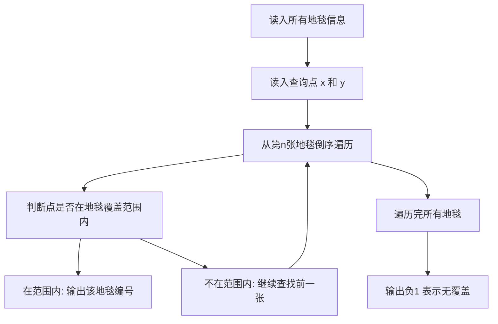

## 本节概述：模拟 实战

本节选用洛谷 P1003"铺地毯"（NOIP 2011 提高组），这是模拟算法最经典的入门题。题目要求模拟地毯铺设过程，从后往前查找覆盖目标点的最上层地毯，完美体现了模拟算法"题目怎么说你就怎么做"的核心思想。

---

### 题目描述

**题目名称**：铺地毯

**来源平台**：洛谷

**题目编号**：P1003

为了准备一个独特的颁奖典礼，组织者在会场的一片矩形区域（可看做平面直角坐标系的第一象限）铺上一些矩形地毯。一共有 n 张地毯，编号从 1 到 n。现在将这些地毯按照编号从小到大的顺序平行于坐标轴先后铺设，后铺的地毯覆盖在前面已经铺好的地毯之上。

地毯铺设完成后，组织者想知道覆盖地面某个点的最上面的那张地毯的编号。注意：在矩形地毯边界上的点也算被地毯覆盖。

**输入格式**：输入共 n 加 2 行。第一行是一个整数 n，表示总共有 n 张地毯。接下来的 n 行中，第 i 加 1 行表示编号 i 的地毯的信息，包含四个整数 a、b、g、k，分别表示铺设地毯的左下角的坐标以及地毯在 x 轴和 y 轴方向的长度。第 n 加 2 行包含两个整数 x 和 y，表示所求的地面点的坐标。

**输出格式**：输出共一行，一个整数，表示所求的地毯的编号。若不存在覆盖该点的地毯则输出负 1。

**数据范围**：对于 100% 的数据，n <= 10000，所有坐标和长度均为非负整数且不超过 10 的 5 次方。

**示例**：
输入：
3
1 0 2 3
0 2 3 3
2 3 3 3
2 3

输出：3

解释：第 1 张地毯覆盖区域为左下角 1 0 到右上角 3 3，第 2 张覆盖 0 2 到 3 5，第 3 张覆盖 2 3 到 5 6。查询点 2 3 被第 3 张地毯覆盖在最上层。

### 解题思路

这道题是典型的模拟题——题目描述了铺设地毯的过程，我们只需要按照题意模拟即可。

关键观察：地毯是按照编号从小到大依次铺设的，后铺的覆盖在前面之上。因此覆盖某个点的最上面的地毯，就是编号最大的覆盖该点的地毯。

解题策略：不需要真正模拟铺设过程，只需要从编号最大的地毯开始倒序查找。对于每张地毯，判断查询点是否落在其覆盖范围内。地毯 i 的覆盖范围是：x 在 a 到 a 加 g 之间，y 在 b 到 b 加 k 之间。第一个满足条件的地毯就是答案。



### 代码实现

```cpp
#include <iostream>
using namespace std;

int a[10005], b[10005], g[10005], k[10005];

int main() {
    int n;
    cin >> n;
    // 读入每张地毯的信息
    for (int i = 1; i <= n; i++) {
        cin >> a[i] >> b[i] >> g[i] >> k[i];
    }
    
    int x, y;
    cin >> x >> y;
    
    int ans = -1;
    // 从最上面的地毯开始倒序查找
    for (int i = n; i >= 1; i--) {
        // 判断查询点是否在地毯 i 的覆盖范围内
        if (x >= a[i] && x <= a[i] + g[i] &&
            y >= b[i] && y <= b[i] + k[i]) {
            ans = i;
            break;  // 找到最上层覆盖地毯，立即结束
        }
    }
    
    cout << ans << endl;
    return 0;
}
```

### 代码解析

**数据存储**：用四个数组 a、b、g、k 分别存储每张地毯的左下角坐标和两个方向的长度。使用 1 到 n 编号，与题目一致。

**倒序查找**：从第 n 张地毯（最上层）开始倒序遍历，这样第一个覆盖查询点的地毯就是最上层的。这比正序遍历并不断更新答案更高效，因为找到后可以立即终止。

**范围判断**：地毯 i 的覆盖范围是从点 a 和 b 到点 a 加 g 和 b 加 k 的矩形区域。查询点 x 和 y 需要同时满足 x 大于等于 a 且小于等于 a 加 g，y 大于等于 b 且小于等于 b 加 k。

**边界处理**：题目说明在矩形地毯边界上的点也算被覆盖，所以判断条件使用小于等于（而非小于）。

### 复杂度分析

- 时间复杂度：大 O N。倒序遍历最多检查 n 张地毯，每张地毯的判断是大 O 1。
- 空间复杂度：大 O N。用四个数组存储 n 张地毯的信息。

> [!TIP]
> 铺地毯是模拟题的经典之作。关键技巧是倒序查找——从最上面的地毯开始找，找到即为答案，无需模拟整个铺设过程。判断点是否在矩形区域内时，边界上的点也算覆盖，所以用小于等于。

## 本章小结

- 铺地毯是模拟算法最经典的题目，体现了"题目怎么说你就怎么做"的核心思想
- 关键技巧是倒序查找：从最上层地毯开始，第一个覆盖目标点的即为答案
- 判断点在矩形内：x 在 a 到 a 加 g 之间且 y 在 b 到 b 加 k 之间，边界也算覆盖
- 时间复杂度为大 O N，空间复杂度为大 O N
