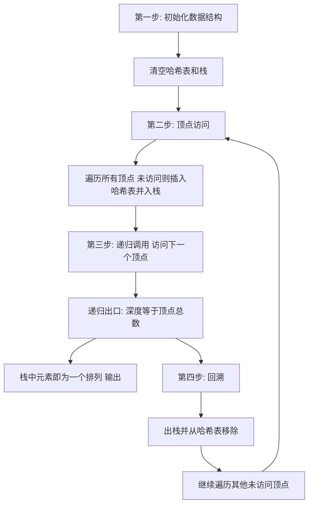

## 本节概述：深度优先搜索

深度优先搜索（DFS）能写很多范式，有很多模板。本节从最简单的开始——完全图的深度优先搜索，用 DFS 去实现全排列。全排列总共有 N 的阶乘种方案，时间复杂度为 O(N 的阶乘)，因此顶点总数最好小于 11。

---

### 核心概念

**算法特点**：

1. 穷举了所有情况
2. 时间复杂度为 O(N 的阶乘)，顶点总数最好小于 11
3. 需要先学数据结构：哈希表和栈

**数据结构**：

- **哈希表 visited**：快速查找某个顶点是否被访问过，插入 O(1)，查找 O(1)
- **栈 stack**：记录顶点的被访问顺序

哈希表是无序的，不知道访问顺序；栈是为了把访问顺序记下来。顶点在栈里就一定在哈希表里，不在栈里就一定不在哈希表里，两者相辅相成。

```cpp
// 伪代码：DFS 求全排列
// 初始化
visited.clear()  // 清空哈希表
stack.clear()     // 清空栈

void dfs(int depth, int N) {
    if (depth == N) {        // 递归出口：深度等于顶点总数
        输出栈中元素       // 栈中元素就是一个排列
        return
    }
    for i = 0 to N-1:       // 遍历所有顶点
        if not visited[i]:  // 如果未被访问
            visited.add(i)  // 插入哈希表
            stack.push(i)   // 入栈
            dfs(depth+1, N) // 递归往下走
            // 回溯
            visited.remove(i) // 从哈希表移除
            stack.pop()       // 出栈
}
// 调用
dfs(0, N)
```

### 算法步骤



**执行过程示例**（4 个顶点 0,1,2,3 的全排列）：

1. 初始：visited 全为 false，stack 为空
2. 访问 0,1,2,3 依次入栈，深度达到 4，得到排列 0123
3. 回溯：3 出栈，2 退栈（2 没有其他可访问顶点）
4. 从 1 出发，访问 3 再访问 2，得到排列 0132
5. 回溯：2,3 退栈，1 退栈
6. 从 0 出发，访问 2,1,3，得到排列 0213
7. 不断回溯和探索，最终得到全部 24 个排列（4 的阶乘）

**递归与回溯的关系**：递归代码非常简洁，但理解起来很难。建议自己画执行过程的图，画多了就能理解整个执行过程。

### 复杂度分析

- 时间复杂度：O(N 的阶乘)
- 虽然时间复杂度很高，但很多实际问题不是完全图，有些边没有，可以对树进行剪枝
- 深度优先遍历本质上是一棵树，顶点数是阶乘级别

> [!TIP]
> 递归代码非常简洁，但理解起来很难。建议自己画执行过程的图，不要只看别人画，自己画才是最有感觉的，画多了就知道整个执行过程是怎么样的。学 DFS 之前务必先学哈希表和栈这两个数据结构。

## 本章小结

- DFS 穷举所有情况，用哈希表判重、用栈记录访问顺序，两者相辅相成
- 递归出口：深度等于顶点总数时，栈中元素就是一个排列
- 回溯：出栈同时从哈希表移除，继续探索其他路径
- 时间复杂度 O(N 的阶乘)，顶点数最好小于 11
- 遍历过程本质上是一棵树，实际问题可以剪枝降低复杂度
