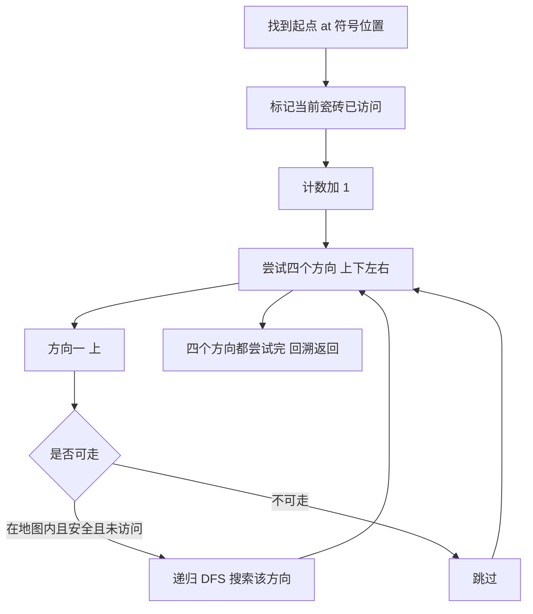

## 本节概述：深度优先搜索 实战

本节选用洛谷 P1683「入门」——这是 DFS 最经典的入门题，在二维网格中从起点出发向四个方向搜索，统计能走到的瓷砖数量，完美展示了 DFS「一条路走到底，走不通就回溯」的核心思想。

---

### 题目描述

**入门** | 洛谷 P1683 | 难度：普及-

不是任何人都可以进入桃花岛的，黄药师最讨厌像郭靖一样呆头呆脑的人。所以，他在桃花岛的唯一入口处修了一条小路，这条小路全部用正方形瓷砖铺设而成。有的瓷砖可以踩，我们认为是安全的，而有的瓷砖一踩上去就会喷出要命的毒气，那你就死翘翘了，我们认为是不安全的。你只能从一块安全的瓷砖上走到与它相邻的四块瓷砖中的任何一个上，但它也必须是安全的才行。

由于你是黄蓉的朋友，她事先告诉你哪些砖是安全的、哪些砖是不安全的，并且她会指引你飞到第一块砖上（第一块砖可能在任意安全位置），现在她告诉你进入桃花岛的秘密就是：如果你能走过最多的瓷砖并且没有死，那么桃花岛的大门就会自动打开了。

注意：瓷砖可以重复走过，但不能重复计数。

**输入格式**：第一行两个正整数 W 和 H，分别表示小路的宽度和长度。以下 H 行为一个 H*W 的字符矩阵。每一个字符代表一块瓷砖。其中，`.` 代表安全的砖，`#` 代表不安全的砖，`@` 代表第一块砖。

**输出格式**：输出一行，只包括一个数，即你从第一块砖开始所能安全走过的最多的砖块个数（包括第一块砖）。

**数据范围**：1 <= W, H <= 20。

**示例**：
输入：
```
11 9
.#.........
.#.#######.
.#.#.....#.
.#.#.###.#.
.#.#..@#.#.
.#.#####.#.
.#.......#.
.#########.
...........
```
输出：
```
59
```

### 解题思路

**核心思想**：从起点 `@` 出发，用 DFS 向上下左右四个方向搜索所有连通的安全瓷砖，每走到一块新瓷砖就计数加一。

DFS 的搜索过程：
1. 从起点开始，标记当前瓷砖为已访问，计数加一
2. 尝试向四个方向（上下左右）移动
3. 如果新位置在地图内、是安全瓷砖（`.` 或 `@`）且未被访问，递归搜索
4. 如果四个方向都走不通，回溯返回



### 代码实现

```cpp
#include <iostream>
#include <string>
using namespace std;

const int MAXN = 25;
char grid[MAXN][MAXN];  // 地图
bool visited[MAXN][MAXN]; // 访问标记
int w, h;               // 宽度和高度
int ans;                // 答案计数

// 四个方向：上、右、下、左
int dx[4] = {-1, 0, 1, 0};
int dy[4] = {0, 1, 0, -1};

void dfs(int x, int y) {
    visited[x][y] = true;  // 标记访问
    ans++;                 // 计数
    
    // 尝试四个方向
    for (int i = 0; i < 4; i++) {
        int nx = x + dx[i];
        int ny = y + dy[i];
        
        // 检查边界
        if (nx < 0 || nx >= h || ny < 0 || ny >= w) continue;
        
        // 检查是否可走（安全且未访问）
        if (!visited[nx][ny] && (grid[nx][ny] == '.' || grid[nx][ny] == '@')) {
            dfs(nx, ny);
        }
    }
}

int main() {
    cin >> w >> h;
    
    int startX, startY;
    
    // 读取地图，找到起点
    for (int i = 0; i < h; i++) {
        for (int j = 0; j < w; j++) {
            cin >> grid[i][j];
            if (grid[i][j] == '@') {
                startX = i;
                startY = j;
            }
        }
    }
    
    ans = 0;
    dfs(startX, startY);
    
    cout << ans << endl;
    
    return 0;
}
```

### 代码解析

1. **方向数组 `dx[4]` 和 `dy[4]`**：表示上下左右四个方向的偏移量。`dx = {-1, 0, 1, 0}` 表示行号变化，`dy = {0, 1, 0, -1}` 表示列号变化。用循环代替四段重复代码

2. **`visited[x][y] = true`**：进入 DFS 第一件事就是标记访问，防止重复计数。注意题目说「瓷砖可以重复走过，但不能重复计数」，所以即使能重复走，也只计一次

3. **边界检查 `if (nx < 0 || nx >= h || ny < 0 || ny >= w)`**：防止数组越界。注意行数是 h（高度），列数是 w（宽度）

4. **可走判断 `grid[nx][ny] == '.' || grid[nx][ny] == '@'`**：安全瓷砖包括 `.`（普通安全砖）和 `@`（起点，也是安全砖）。`#` 是不安全的，不能走

5. **不需要回溯 `visited`**：与搜索排列/组合不同，这里只需要统计能到达多少块瓷砖，不需要尝试所有路径。每块砖只需访问一次，所以标记后不需要取消

### 复杂度分析

- 时间复杂度：O(W*H)，每块瓷砖最多被访问一次
- 空间复杂度：O(W*H)，地图和访问标记数组，递归栈深度最多 W*H

> [!TIP]
> 本题不需要回溯 `visited` 标记。因为题目只要求「能走过最多的瓷砖个数」，每块砖只计数一次。如果需要找「所有可能路径」才需要回溯。DFS 网格搜索题要注意区分「求连通块大小」和「求路径数量」两种不同需求。

## 本章小结

- DFS 的核心是「一条路走到底，走不通就回溯」
- 方向数组 `dx/dy` 是网格搜索题的标配，用循环代替重复代码
- 进入 DFS 时立即标记访问，防止重复进入和死循环
- 网格搜索题要注意：边界检查、可走条件判断、是否需要回溯
- 「求连通块大小」不需要回溯 `visited`，「求所有路径」才需要
