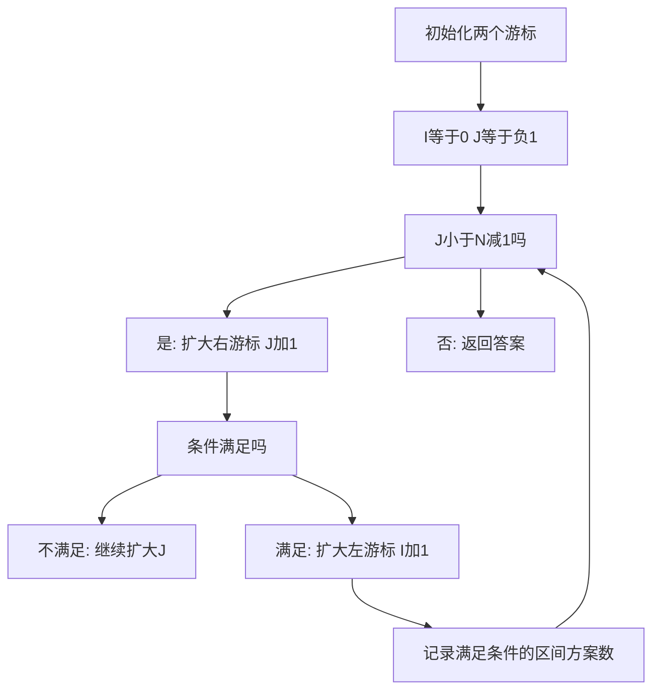

## 本节概述：滑动窗口

滑动窗口在一些算法教程中叫双指针，也叫拾取法。像一把尺子一样有两个游标（左游标和右游标），时间复杂度为 O(N)。滑动窗口的特点是简单、直观易懂，属于算法里相对最简单的算法之一，时间和空间效率都比较高。如果数据范围在 10 的 5 次到 10 的 7 次，大概率就是用滑动窗口来实现。

---

### 核心概念

**问题特点**：滑动窗口解决的问题特点一般比较明显。例如给定一个 N 个元素的零一数组，数组长度为 10 的 6 次，还有一个整数 K，求满足子数组和大于等于 K 的子数组数目。

**朴素算法**：枚举两个端点，I 从 0 开始，J 从 I 开始。对于每个 I，J 不断增大直到子数组和满足条件，然后统计以 I 开头满足条件的区间个数。每次枚举 I 都要重新枚举 J，时间复杂度为 O(N 的平方)，对于 10 的 6 次的数组完全无法满足条件。

**滑动窗口**：与朴素算法的区别在于，滑动窗口中 J 不需要归位，I 和 J 都只往前走、不回退。两个游标在一直往前走的过程中实际上是相互独立的，所以时间复杂度是加法关系而非乘法关系，总时间复杂度为 O(N)。

### 算法步骤



**滑动窗口算法步骤**：

1. **初始化**：I 从 0 开始（数组第一个下标），J 从 -1 开始（代表一开始是空窗口，保证第一个是空窗口）
2. **控制右游标**：固定左游标 I，当右游标 J 小于 N-1 时，扩大右游标（J 变为 J+1）
3. **条件判定**：根据题目条件判定，如果条件不满足，继续扩大右游标；如果条件满足，扩大左游标（I 变为 I+1）
4. **记录答案**：在迭代窗口 I、J 的过程中，记录最优区间或满足条件的区间方案数
5. **返回答案**

**代码框架**：

```cpp
// 滑动窗口框架代码
int slide_window(int N, int arr[], ...) {
    int i = 0, j = -1;
    while (j < N - 1) {
        j += 1;              // 扩大右游标
        // 更新窗口状态（如 sum += arr[j]）
        if (条件满足) {
            // 计算并记录答案（如 answer += N - j）
            // 缩小左游标（如 i += 1, sum -= arr[i]）
        }
    }
    return answer;
}
```

关键细节：当左游标往右移动时，需要实时更新窗口内的状态（如 sum 减去 arr[i] 的值），这样可以在 O(1) 的时间复杂度内更新 sum，而不需要用 for 循环重新计算。

### 复杂度分析

- 朴素算法：O(N 的平方)，每次枚举 I 都要重新枚举 J
- 滑动窗口：O(N)，I 和 J 都不回退只往前走，两者相互独立是加法关系
- 空间复杂度：不需要利用额外的数组空间，大部分题目只需要数组即可，少部分需要哈希表

> [!TIP]
> 如果数据范围在 10 的 5 次、10 的 6 次、10 的 7 次，大概率就是用滑动窗口来实现。滑动窗口中 J 不需要归位到 I 的位置，这是与朴素算法的关键区别。

## 本章小结

- 滑动窗口也叫拾取法，用两个游标像尺子一样滑动
- 初始化：I=0，J=-1（保证第一个是空窗口）
- 核心区别：J 不回退，I 和 J 只往前走，时间复杂度为加法关系 O(N)
- 左游标移动时需实时更新窗口状态，保证 O(1) 更新
- 数据范围在 10 的 5 次到 10 的 7 次时大概率用滑动窗口
