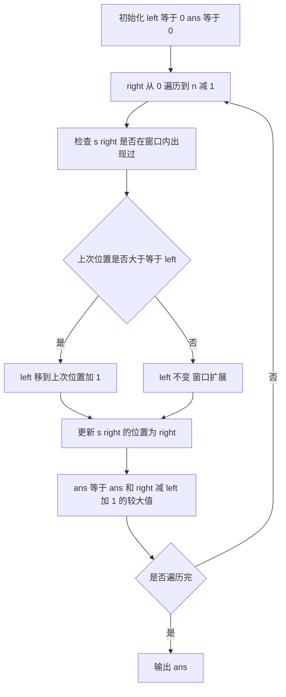

## 本节概述：滑动窗口 实战

本节选用 LeetCode 第 3 题「无重复字符的最长子串」——这是滑动窗口最经典的题目，通过维护一个不重复的窗口并不断扩展、收缩，完美展示了滑动窗口的核心模式。

---

### 题目描述

**无重复字符的最长子串** | LeetCode 3 | 难度：中等

给定一个字符串 `s`，请你找出其中不含有重复字符的最长子串的长度。

**输入格式**：一个字符串 `s`

**输出格式**：一个整数，表示无重复字符的最长子串的长度

**数据范围**：
- 0 <= s.length <= 5 * 10^4
- s 由英文字母、数字、符号和空格组成

**示例**：
输入：s = "abcabcbb"
输出：3
解释：因为无重复字符的最长子串是 "abc"，所以其长度为 3。

输入：s = "bbbbb"
输出：1
解释：无重复字符的最长子串是 "b"，长度为 1。

### 解题思路

**核心思想**：维护一个滑动窗口 [left, right]，窗口内的字符都不重复。右指针不断扩展窗口，当遇到重复字符时左指针收缩窗口，直到窗口内无重复。

具体步骤：
1. 用一个哈希表（或数组）记录每个字符最近一次出现的位置
2. 右指针 `right` 从左到右遍历字符串
3. 如果 `s[right]` 已经在窗口内出现过（即上次出现位置 >= left），将 `left` 移动到上次出现位置 + 1
4. 更新字符的最新位置
5. 每次更新窗口大小 `right - left + 1`，取最大值



### 代码实现

```cpp
#include <iostream>
#include <string>
#include <algorithm>
using namespace std;

class Solution {
public:
    int lengthOfLongestSubstring(string s) {
        // 记录每个字符最近一次出现的位置，初始化为 -1
        int lastPos[256];
        fill(lastPos, lastPos + 256, -1);
        
        int left = 0;      // 窗口左边界
        int ans = 0;       // 最长长度
        
        for (int right = 0; right < s.size(); right++) {
            // 如果当前字符在窗口内出现过，收缩左边界
            if (lastPos[s[right]] >= left) {
                left = lastPos[s[right]] + 1;
            }
            
            // 更新当前字符的最新位置
            lastPos[s[right]] = right;
            
            // 更新最长长度
            ans = max(ans, right - left + 1);
        }
        
        return ans;
    }
};

int main() {
    Solution sol;
    
    cout << sol.lengthOfLongestSubstring("abcabcbb") << endl;  // 输出: 3
    cout << sol.lengthOfLongestSubstring("bbbbb") << endl;     // 输出: 1
    cout << sol.lengthOfLongestSubstring("pwwkew") << endl;    // 输出: 3
    
    return 0;
}
```

### 代码解析

1. **`lastPos[256]`**：用数组代替哈希表，记录每个字符最近一次出现的下标。初始化为 -1 表示尚未出现。由于字符种类有限（ASCII 256 种），数组比 `unordered_map` 更快

2. **`if (lastPos[s[right]] >= left)`**：判断当前字符是否在当前窗口 [left, right) 内出现过。注意条件是 `>= left`，只有上次出现位置在窗口内才需要收缩。如果上次出现在窗口外，不影响当前窗口

3. **`left = lastPos[s[right]] + 1`**：将左边界直接跳到重复字符上次出现位置的后一位，而不是逐步左移。这是「跳跃式收缩」，效率更高

4. **`lastPos[s[right]] = right`**：无论是否收缩，都要更新字符的最新位置，为后续判断做准备

5. **`ans = max(ans, right - left + 1)`**：窗口大小就是当前无重复子串的长度，取所有位置的最大值

### 复杂度分析

- 时间复杂度：O(n)，右指针遍历一次字符串，每个字符的 left 更新是跳跃式的，总移动次数不超过 n
- 空间复杂度：O(1)，`lastPos` 数组大小固定为 256，与输入规模无关

> [!TIP]
> 滑动窗口的关键在于「跳跃式收缩」：当遇到重复时，left 直接跳到重复字符上次位置的下一个位置，而不是一步一步收缩。这样保证右指针只前进不后退，总时间复杂度 O(n)。

## 本章小结

- 滑动窗口适用于「连续子数组/子串」的优化问题
- 窗口维护两个指针 left 和 right：right 扩展窗口，left 收缩窗口
- 用哈希表或数组记录窗口内元素的状态，判断是否需要收缩
- 「跳跃式收缩」是保证 O(n) 时间复杂度的关键：left 直接跳到目标位置而非逐步移动
