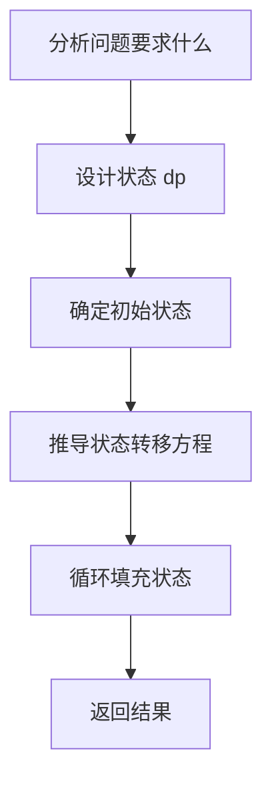

## 本节概述：线性 DP

线性DP是动态规划入门，最简单的动态规划形式。学习动态规划时不要一上来就背抽象概念（最优子结构、重叠子问题、无后效性），而应从简单的例题着手，按照自己的方式去理解，刷题才是最重要的。

---

### 核心概念

**基本概念**

动态规划的时间复杂度等于状态数乘以状态转移的消耗。对于线性DP，状态是线性排列的，通过设计状态和状态转移方程来求解问题。

**问题1：爬楼梯**

有一个N级的楼梯，每次可以爬1或2级，问有多少种不同的方法可以爬到第N级。

- **状态设计**：`dp[i]` 表示爬到第i级的方案数
- **初始状态**：`dp[0] = 1`（原地），`dp[1] = 1`（只能从0爬过来）
- **状态转移方程**：`dp[i] = dp[i-1] + dp[i-2]`（只能从i-1级或i-2级过来）

```cpp
dp[0] = 1;
dp[1] = 1;
for (int i = 2; i <= n; i++) {
    dp[i] = dp[i-1] + dp[i-2];
}
```

**问题2：最大子数组和**

给定N个元素的数组A，求一个子数组使其元素和最大。

- **状态设计**：`dp[i]` 表示以第i个元素结尾的最大子数组和
- **初始状态**：`dp[0] = A[0]`（以第0个元素结尾，该元素必选，即使为负数）
- **状态转移方程**：`dp[i] = A[i] + max(dp[i-1], 0)`（如果 `dp[i-1]` 大于等于0则连接上来，否则不选更优）

```cpp
dp[0] = A[0];
for (int i = 1; i < n; i++) {
    dp[i] = A[i] + max(dp[i-1], 0);
}
```

**问题3：最长递增子序列**

给定N个元素的数组A，求最大的子序列长度，序列中元素单调递增。

- **状态设计**：`dp[i]` 表示以第i个元素结尾的最长递增子序列的长度
- **初始状态**：`dp[0] = 1`（一个元素不需要满足单调性，只要自己就可以）
- **状态转移方程**：`dp[i] = max(dp[j] + 1)`，其中 `j < i` 且 `A[j] < A[i]`（满足递增条件，在所有满足条件的j中找最大值）

```cpp
for (int i = 0; i < n; i++) {
    dp[i] = 1;
    for (int j = 0; j < i; j++) {
        if (A[j] < A[i]) {
            dp[i] = max(dp[i], dp[j] + 1);
        }
    }
}
```

**问题4：数字三角形**

给定N行的三角形，找出自顶向下的最小路径和，每步只能移动到下一行中相邻的节点（下标相同或下标加1）。

- **状态设计**：`dp[i][j]` 表示从顶部走到 `(i, j)` 位置的最小路径和
- **初始状态**：`dp[0][0] = triangle[0][0]`
- **状态转移方程**：`dp[i][j] = triangle[i][j] + min(dp[i-1][j-1], dp[i-1][j])`（从上一行相邻两个位置取最小值）

```cpp
dp[0][0] = triangle[0][0];
for (int i = 1; i < n; i++) {
    for (int j = 0; j <= i; j++) {
        dp[i][j] = triangle[i][j] + min(dp[i-1][j-1], dp[i-1][j]);
    }
}
```

### 算法步骤



线性DP的编码步骤：

1. 定义初始状态（直接定义为常量）
2. 利用循环进行状态转移，套用状态转移方程不断填充状态
3. 注意循环的顺序（线性DP可能有多层循环和多维数组）

### 复杂度分析

| 问题 | 状态数 | 状态转移消耗 | 时间复杂度 |
|---|---|---|---|
| 爬楼梯 | O(N) | O(1) | O(N) |
| 最大子数组和 | O(N) | O(1) | O(N) |
| 最长递增子序列 | O(N) | O(N) | O(N^2) |
| 数字三角形 | O(N^2) | O(1) | O(N^2) |

> [!TIP]
> 动态规划的时间复杂度等于状态数乘以状态转移的消耗。状态转移方程中变量导致数组下标越界的情况，就可以确定那些是初始状态了，初始状态不要套用状态转移方程，直接定义成常量。状态转移的过程一定是单向的，把每个状态理解成节点，状态转移理解成边，动态规划的求解就是在一个有向无环图（DAG）上进行递推计算。

## 本章小结

- 线性DP是动态规划入门，从简单例题着手理解，不要先背抽象概念
- 状态设计原则：问题要求什么，状态就尽量定义成什么
- 时间复杂度 = 状态数 x 状态转移消耗
- 初始状态的确定方法：套入状态转移方程后导致下标越界的必然是初始状态
- 状态转移一定是单向的，DP状态图是一个有向无环图，一般与拓扑排序联系起来
