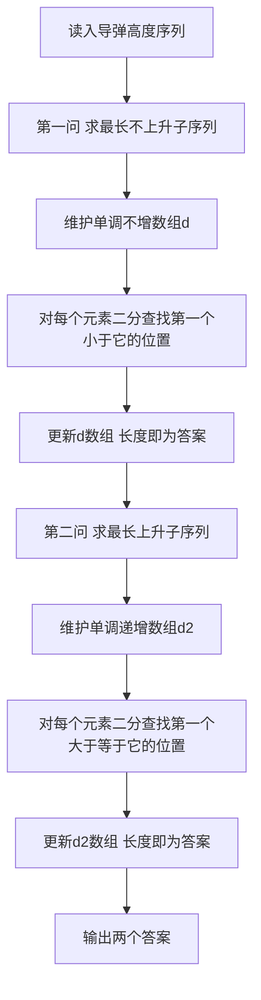

## 本节概述：线性 DP 实战

本节选取洛谷 P1020 [NOIP1999 提高组] 导弹拦截，这是线性 DP 中最经典的题目之一，考察最长不上升子序列和 Dilworth 定理的应用。

---

### 题目描述

**题目名称**：[NOIP1999 提高组] 导弹拦截
**来源平台**：洛谷
**题目编号**：P1020

某国为了防御敌国的导弹袭击，发展出一种导弹拦截系统。但是这种导弹拦截系统有一个缺陷：虽然它的第一发炮弹能够到达任意的高度，但是以后每一发炮弹都不能高于前一发的高度。某天，雷达捕捉到敌国的导弹来袭。由于该系统还在试用阶段，所以只有一套系统，因此有可能不能拦截所有的导弹。

输入导弹依次飞来的高度（雷达给出的高度数据是不大于 50000 的正整数，导弹个数不超过 100000），计算这套系统最多能拦截多少导弹，如果要拦截所有导弹最少要配备多少套这种导弹拦截系统。

**输入格式**：一行，为导弹依次飞来的高度。

**输出格式**：两行，第一行为最多能拦截的导弹数，第二行为要拦截所有导弹最少要配备的系统数。

**数据范围**：导弹高度为正整数且不超过 50000，导弹个数最多 100000 个。需要 O(n log n) 做法。

**示例**：
输入：
```
389 207 155 300 299 170 158 65
```
输出：
```
6
2
```

### 解题思路

**第一问**：求最长不上升子序列（即 LIS 的变体，允许相等且递减）。系统每发炮弹不能高于前一发，所以是求最长的非递增子序列。

**第二问**：求最少需要多少套系统。根据 Dilworth 定理，将序列划分为最少的不上升子序列的数量，等于最长上升子序列的长度。因此第二问就是求最长上升子序列（严格递增）的长度。

由于数据量达到 10^5，O(n^2) 的朴素 DP 会超时，需要用 O(n log n) 的二分优化做法。



### 代码实现

```cpp
#include <iostream>
#include <vector>
#include <algorithm>
using namespace std;

int main() {
    vector<int> a;
    int x;
    // 读入导弹高度
    while (cin >> x) {
        a.push_back(x);
    }

    int n = a.size();
    if (n == 0) {
        cout << 0 << endl << 0 << endl;
        return 0;
    }

    // ========== 第一问：最长不上升子序列 ==========
    // 维护一个单调不增的数组 d1
    // 对于每个元素，找到 d1 中第一个小于它的位置并替换
    vector<int> d1;
    for (int i = 0; i < n; i++) {
        // upper_bound 在单调不增数组中找第一个严格小于 a[i] 的位置
        auto it = upper_bound(d1.begin(), d1.end(), a[i], greater<int>());
        if (it == d1.end()) {
            d1.push_back(a[i]);
        } else {
            *it = a[i];
        }
    }
    int ans1 = d1.size();

    // ========== 第二问：最长上升子序列 ==========
    // 维护一个单调递增的数组 d2
    // 对于每个元素，找到 d2 中第一个大于等于它的位置并替换
    vector<int> d2;
    for (int i = 0; i < n; i++) {
        // lower_bound 在单调递增数组中找第一个大于等于 a[i] 的位置
        auto it = lower_bound(d2.begin(), d2.end(), a[i]);
        if (it == d2.end()) {
            d2.push_back(a[i]);
        } else {
            *it = a[i];
        }
    }
    int ans2 = d2.size();

    cout << ans1 << endl;
    cout << ans2 << endl;

    return 0;
}
```

### 代码解析

- **第一问（最长不上升子序列）**：维护数组 `d1` 为单调不增序列。对每个元素用 `upper_bound` 配合 `greater<int>()` 查找第一个严格小于当前值的位置并替换。如果当前值比所有元素都大（即能延伸序列），则追加。`d1` 的长度就是最长不上升子序列的长度。

- **第二问（最长上升子序列）**：维护数组 `d2` 为单调递增序列。对每个元素用 `lower_bound` 查找第一个大于等于当前值的位置并替换。这是经典的 LIS O(n log n) 做法。

- **Dilworth 定理**：第二问的本质是将序列划分为最少的不上升子序列，根据 Dilworth 定理，这个数量等于最长上升子序列的长度。这是本题最精妙之处。

- **upper_bound vs lower_bound**：
  - `upper_bound(d1.begin(), d1.end(), a[i], greater<int>())`：在单调不增数组中找第一个严格小于 `a[i]` 的位置。
  - `lower_bound(d2.begin(), d2.end(), a[i])`：在单调递增数组中找第一个大于等于 `a[i]` 的位置。

### 复杂度分析

- 时间复杂度：O(n log n)，每个元素进行一次二分查找。
- 空间复杂度：O(n)，存储导弹高度和维护辅助数组。

> [!TIP]
> 本题的精髓在于 Dilworth 定理：将序列划分为最少的不上升子序列的数量等于最长上升子序列的长度。第一问是求最长不上升子序列（注意是"不上升"即允许相等），第二问是求最长严格上升子序列。两者用 upper_bound 和 lower_bound 的区别正好对应"允许相等"和"严格递增"。

## 本章小结

- 导弹拦截是线性 DP 的经典题，考察 LIS 的二分优化做法。
- 第一问求最长不上升子序列，第二问求最长上升子序列。
- Dilworth 定理：最少不上升子序列划分数等于最长上升子序列长度。
- O(n log n) 做法：用 upper_bound 处理"不上升"（允许相等），用 lower_bound 处理"严格上升"。
