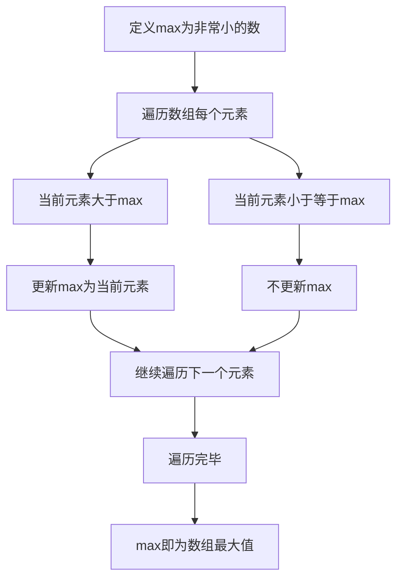

## 本节概述：线性枚举

线性枚举是最基础的暴力算法，简单有效。当你遇到一个问题不知道怎么做的时候，就可以用线性枚举来开拓思路。它不需要数据结构基础也能学习，是第一个必须掌握的算法。

---

### 核心概念

**问题描述**：对于一个数组 4356271，有两个问题——求这个数组里的最大值，以及求这个数组里所有元素的和。

**求最大值**：除了数组以外，定义一个变量 max，初始化为一个非常小的数。然后开始遍历数组：遍历到 4 的时候，4 大于 max，所以把 max 更新为 4；遍历到 3 的时候，3 小于 max 所以不更新。一旦大于 max 就更新，小于就不管。最后 max 存储的值就是数组的最大值。

**求和**：定义一个 sum 变量，每取到第一个元素时把它累加到 sum 上，再枚举下一个数再累加，等数组遍历完毕后，sum 存储的就是所有元素的和。

这两种操作都叫线性枚举——按照线性关系枚举每一个元素并且做判断。

```cpp
// 求最大值
int getMax(int N, int A[]) {
    int max = -INFINITE;  // 初始化为一个非常小的数
    for (int i = 0; i < N; i++) {
        if (A[i] > max) {
            max = A[i];  // 当前元素大于max则更新
        }
    }
    return max;
}

// 求和
int getSum(int N, int A[]) {
    int sum = 0;
    for (int i = 0; i < N; i++) {
        sum += A[i];  // 将所有元素累加到sum上
    }
    return sum;
}
```

其中 -INFINITE 是一个常量，可以自己定义，比如负的 1 万、负的 2 万、负的 100 万都可以，反正不能比数组里面元素大就好了。

### 算法步骤



求和的步骤类似：定义 sum 初始化为 0，遍历数组将每个元素累加到 sum 上，遍历完毕后返回 sum。

### 复杂度分析

线性枚举的时间复杂度为大 O 乘以 N 乘以 M，其中 N 是线性表的长度（数组长度），M 是每次操作的量级。对于求最大值和求和，因为比较操作比较简单，所以 M 为 1，整体时间复杂度就是大 O N。

由于线性枚举需要遍历表中的每个元素，在处理大规模数据时可能需要使用更加高效的算法来提高搜索速度。后续章节会讲解优化算法，包括二分查找、哈希表、前缀和以及双指针。

> [!TIP]
> 线性枚举是第一个必须学的算法，不需要数据结构基础也能学习。当遇到不知道怎么做的问题时，可以先用线性枚举开拓思路。

## 本章小结

- 线性枚举是一种暴力算法，简单有效，按线性关系枚举每个元素并做判断
- 求最大值通过维护 max 变量，比较更新；求和通过 sum 变量累加
- 时间复杂度为大 O N，后续可通过二分查找、哈希表、前缀和、双指针等算法进行优化
