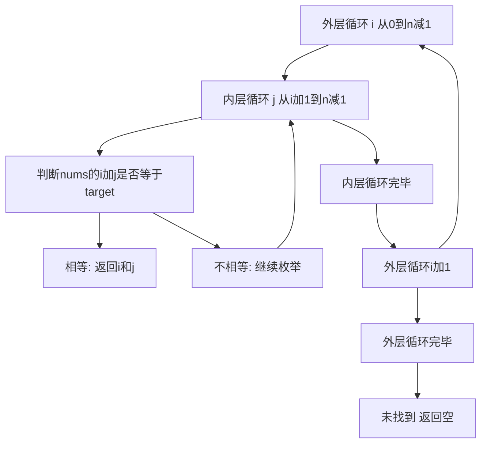

## 本节概述：线性枚举 实战

本节选用 LeetCode 第 1 题"两数之和"，这是 LeetCode 上最经典的入门题目。通过这道题，读者可以深刻理解线性枚举的核心思想——用双重循环暴力枚举所有可能的组合，找到满足条件的答案。

---

### 题目描述

**题目名称**：两数之和

**来源平台**：LeetCode

**题目编号**：1

给定一个整数数组 nums 和一个整数目标值 target，请你在该数组中找出和为目标值 target 的那两个整数，并返回它们的数组下标。

你可以假设每种输入只会对应一个答案。但是，数组中同一个元素在答案里不能重复出现。你可以按任意顺序返回答案。

**输入格式**：第一行为数组 nums，第二行为整数 target。

**输出格式**：返回两个下标组成的数组。

**数据范围**：2 <= 数组长度 <= 10 的 4 次方，负 10 的 9 次方 <= nums 中每个元素 <= 10 的 9 次方，负 10 的 9 次方 <= target <= 10 的 9 次方。只会存在一个有效答案。

**示例**：
输入：nums = 2 7 11 15，target = 9
输出：0 1

解释：因为 nums 等于 2 加上 7 等于 9，所以返回 0 和 1。

### 解题思路

线性枚举的思路非常直观：用两重循环枚举所有可能的数对。外层循环枚举第一个数，内层循环枚举第二个数，判断两数之和是否等于 target。

具体来说：外层循环变量 i 从 0 开始遍历到 n 减 1，内层循环变量 j 从 i 加 1 开始遍历到 n 减 1。每次判断 nums 中下标 i 和 j 的元素之和是否等于 target，如果相等就返回这两个下标。

由于题目保证只有一个答案，所以一旦找到就可以立即返回，不需要继续枚举。



### 代码实现

```cpp
class Solution {
public:
    vector<int> twoSum(vector<int>& nums, int target) {
        int n = nums.size();
        // 外层循环枚举第一个数
        for (int i = 0; i < n; i++) {
            // 内层循环枚举第二个数，从 i+1 开始避免重复
            for (int j = i + 1; j < n; j++) {
                // 判断两数之和是否等于目标值
                if (nums[i] + nums[j] == target) {
                    return {i, j};  // 找到答案，立即返回
                }
            }
        }
        return {};  // 题目保证有解，这行不会执行到
    }
};
```

### 代码解析

**外层循环**：变量 i 从 0 遍历到 n 减 1，枚举第一个数的下标。

**内层循环**：变量 j 从 i 加 1 开始遍历到 n 减 1，枚举第二个数的下标。从 i 加 1 开始是为了避免重复使用同一个元素，同时也避免和之前已经判断过的组合重复。

**判断条件**：每次取 nums 中下标 i 和 j 的元素，判断它们的和是否等于 target。因为题目保证只有一个答案，找到后立即返回即可。

### 复杂度分析

- 时间复杂度：大 O N 方。两重嵌套循环，最坏情况下需要枚举所有数对，数量为 N 乘 N 减 1 除以 2。
- 空间复杂度：大 O 1。只使用了常数个临时变量，不需要额外空间。

> [!TIP]
> 两数之和是线性枚举最经典的入门题。暴力解法用双重循环枚举所有数对，思路简单直接。虽然时间复杂度是大 O N 方，但作为入门题完全够用。后续可以用哈希表将时间复杂度优化到大 O N。

## 本章小结

- 两数之和是线性枚举最经典的应用，用双重循环暴力枚举所有可能的数对
- 内层循环从 i 加 1 开始，避免重复使用同一元素和重复判断
- 时间复杂度为大 O N 方，空间复杂度为大 O 1
- 后续可通过哈希表优化到大 O N 时间复杂度
