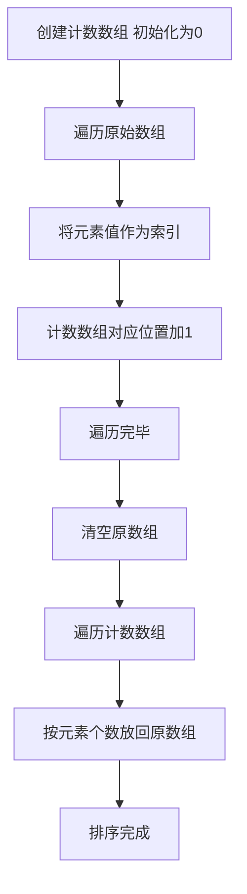

## 本节概述：计数排序

计数排序是一种基于哈希的排序算法。它的基本思想是统计每个元素的出现次数，然后根据统计结果将元素依次放入排序后的序列中。这种排序算法适合整数的排序，并且要求数据范围较小。

---

### 核心概念

**算法思想**：
1. 创建一个计数数组，用于记录每个元素的出现次数，初始化所有元素为出现 0 次
2. 遍历原始数组，将每个元素的值作为索引，在计数数组对应位置加 1
3. 清空原数组，遍历计数数组，按照数组中元素个数放回到原数组

**关键点**：将每个元素的值作为索引——这是每个新学这个算法的人最难理解的一点。理解了这一点，算法就很简单了。

**执行过程**（以数组 231321422462 为例）：
- 创建计数数组，从 1 到 9 初始化每个元素为 0
- 遍历原数组进行计数：1 出现 2 次，2 出现 4 次，3 出现 2 次，4 出现 2 次，5 出现 0 次，6 出现 1 次
- 从 1 到 9 枚举，把元素一个一个取出来：取出 1（2 个），取出 2（4 个），取出 3（2 个），取出 4（2 个），取出 6（1 个）
- 排序完成，元素个数与原数组一致

**与前三种排序的区别**：
- 计数排序不是基于比较的排序
- 时间复杂度相对较低
- 但对数据范围有要求（前三种排序对数据范围无要求）

### 算法步骤

### 复杂度分析

计数排序有四个循环：

1. **第一个循环**：初始化计数器数组。若计数器元素个数为 K，时间复杂度为 O(K)
2. **第二个循环**：枚举每个数字并计数。值即索引，查找为 O(1)，计数为 O(1)，总枚举过程为 O(N)
3. **第三个循环**：枚举所有范围内的数字，时间复杂度为 O(K)
4. **第四个循环**：嵌套在第三个循环内，总共最多走 N 次。虽然是嵌套，但与第三个循环是相加关系，不是相乘关系

总时间复杂度为**大 O N 加 K**，其中 N 代表元素个数，K 代表元素范围。空间复杂度为**大 O K**。

例如有两个数 1 和 10000，时间复杂度就是 10000，因为要遍历进行初始化和计数。

**算法优点**：
- 不是基于比较的排序
- 时间复杂度相对较低

**算法缺点**：
- 需要额外的计数数组空间
- 局限于整数，且范围尽量小，大于 10 的 6 次就比较吃力

**优化方案**：
1. 初始化计数器数组时可采用系统函数（如 C 语言的 memset），纯内存操作优于循环
2. 第三个循环中当排序个数达到 N 个时可以提前结束退出循环
3. 范围可以不是 1 到 K，比如负 10 的 5 次到 10 的 5 次也可以，通过加偏移实现：放入时加偏移，取出时也加偏移

> [!TIP]
> 计数排序的关键是"将每个元素的值作为索引"，理解了这一点算法就很简单。范围不限于 1 到 K，可以加偏移处理负数情况。初始化可用 memset 替代循环，排序完成 N 个元素后可提前退出。

## 本章小结

- 计数排序基于哈希思想，统计每个元素出现次数后依次放回
- 时间复杂度为大 O N 加 K，空间复杂度为大 O K
- 不是基于比较的排序，适合整数且数据范围较小的场景
- 优化：用 memset 初始化、提前退出循环、加偏移处理负数范围
