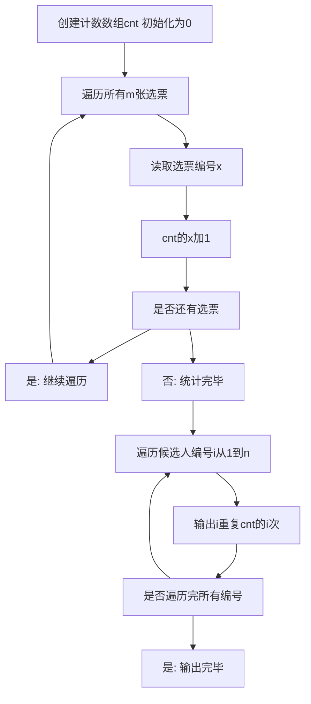

## 本节概述：计数排序 实战

本节选用洛谷 P1271"选举学生会"（深基 9 例 1），这是计数排序最经典的实战题。题目要求将大量选票按候选人编号排序，选票编号范围很小（1 到 999）但数量很大（最多 200 万张），完美契合计数排序"数据范围小但元素多"的使用场景。通过这道题，读者可以深刻理解计数排序"用元素的值作为索引"的核心思想。

---

### 题目描述

**题目名称**：选举学生会

**来源平台**：洛谷

**题目编号**：P1271

学校正在选举学生会成员，有 n 名候选人，每名候选人编号分别从 1 到 n，现在收集到了 m 张选票，每张选票都写了一个候选人编号。现在想把这些堆积如山的选票按照投票数字从小到大排序。

**输入格式**：第一行输入 n 和 m。第二行输入 m 个整数，每两个整数之间用空格隔开，表示每张选票上的候选人编号。

**输出格式**：一行输出排序后的选票编号，每两个整数之间用空格隔开。

**数据范围**：1 <= n <= 999，1 <= m <= 2000000。

**示例**：
输入：
3 10
3 1 2 3 2 1 3 2 1 3

输出：
1 1 1 2 2 2 3 3 3 3

解释：3 名候选人编号 1 到 3，10 张选票。按编号排序后，3 张投 1 号、3 张投 2 号、4 张投 3 号。

### 解题思路

这道题的特点是：选票数量 m 很大（最多 200 万），但候选人编号范围 n 很小（最多 999）。如果用比较排序，时间复杂度至少是 m 乘 log m，约 200 万乘 21 等于 4200 万次操作。而计数排序只需遍历一遍选票统计数量，再按编号顺序输出即可，时间复杂度是 m 加 n，远快于比较排序。

计数排序的核心思想：
1. 创建一个计数数组 cnt，下标对应候选人编号 1 到 n
2. 遍历所有选票，将每张选票的编号作为下标，对应位置加 1
3. 遍历计数数组，按编号顺序输出每个编号出现的次数



### 代码实现

```cpp
#include <iostream>
using namespace std;

int cnt[1005];  // 计数数组，下标为候选人编号

int main() {
    ios::sync_with_stdio(false);
    cin.tie(0);
    
    int n, m;
    cin >> n >> m;
    
    // 统计每个候选人编号出现的次数
    for (int i = 0; i < m; i++) {
        int x;
        cin >> x;
        cnt[x]++;  // 将选票编号作为数组下标，计数加1
    }
    
    // 按候选人编号从小到大输出
    for (int i = 1; i <= n; i++) {
        for (int j = 0; j < cnt[i]; j++) {
            cout << i << " ";
        }
    }
    cout << endl;
    return 0;
}
```

### 代码解析

**计数数组**：定义大小为 1005 的数组 cnt，下标对应候选人编号 1 到 n。初始时所有元素为 0（全局数组自动初始化为 0）。

**统计阶段**：遍历 m 张选票，每读到一张选票编号 x，就将 cnt 的 x 加 1。这就是计数排序的核心——"将元素的值作为索引"，通过数组下标直接定位。

**输出阶段**：从编号 1 遍历到 n，对每个编号 i 输出 cnt 的 i 次。由于是按编号顺序遍历，输出结果自然有序。

**快读优化**：由于 m 最多 200 万，使用 `ios::sync_with_stdio(false)` 和 `cin.tie(0)` 加速输入输出，避免超时。

### 复杂度分析

- 时间复杂度：大 O N 加 M。统计阶段遍历 m 张选票，输出阶段最多遍历 n 个编号并输出 m 次，总时间复杂度为 m 加 n。
- 空间复杂度：大 O N。使用大小为 n 加 1 的计数数组。

> [!TIP]
> 计数排序的关键是"将元素的值作为索引"。这道题完美展示了计数排序的适用场景：数据范围小（编号 1 到 999）但数量大（200 万张选票）。当 m 远大于 n 时，计数排序的 m 加 n 远优于比较排序的 m 乘 log m。注意使用快读优化以处理大量输入数据。

## 本章小结

- 选举学生会是计数排序最经典的题目，选票数量大但编号范围小，完美契合计数排序场景
- 核心：将选票编号作为数组下标统计出现次数，再按编号顺序输出
- 时间复杂度为大 O N 加 M（N 为编号范围，M 为选票数量），空间复杂度为大 O N
- 大量输入时使用快读优化（ios::sync_with_stdio(false)）避免超时
