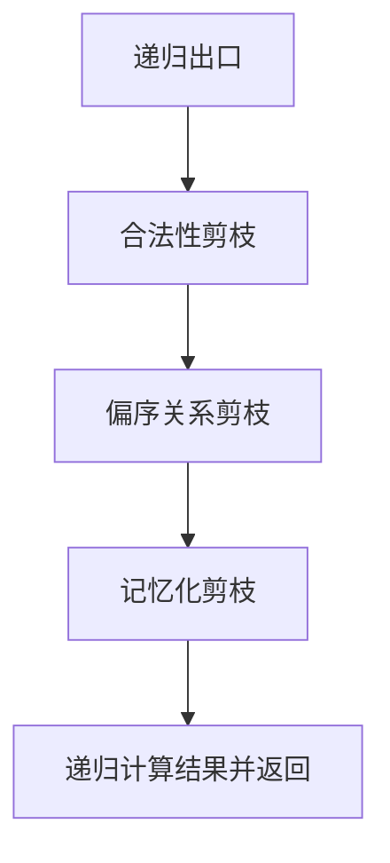

## 本节概述：记忆化搜索

记忆化搜索是在搜索问题中使用的一种优化技术，利用缓存把已经计算过的内容存起来，要用到的时候直接从缓存中读取，避免重复计算。记忆化搜索本质上是一种动态规划，传统动态规划是从前往后递推，而记忆化搜索是从后往前递归。

---

### 核心概念

**记忆化搜索的本质**

记忆化搜索本质上是动态规划，所有的动态规划都可以用记忆化搜索来实现。它的核心思想是：用深度优先搜索（DFS）来实现框架，再利用动态规划"空间换时间"的思想，用数组或哈希表记录已计算的重叠子问题的结果。

**以斐波那契数列为例**

斐波那契数列递推公式：`F(n) = F(n-1) + F(n-2)`，当 `n <= 1` 时返回1。

用递归调用时，过程是一棵二叉树：计算F(5)需要先计算F(4)，F(4)需要计算F(3)和F(2)......这样会构建出一棵递归树。

**递归的时间复杂度**

初看是O(2^N)，但实际上左子树高度比右子树高，不是严格的完全二叉树，实际时间复杂度是一个大于1的数的N次方，仍然是指数级。随着N增大，时间消耗呈指数级增长。

**重叠子问题**

递归树中存在大量重叠子问题：相同的子树形状一模一样，F(3)被计算了两次，F(2)被计算了三次。如果能把每个F(i)只计算一次，问题就解决了。

**优化思路**

用一个哈希表把F(i)计算出的结果存储在 `H[i]` 位置，这样每次计算F(i)的时间复杂度变成O(1)，总共需要计算F(2)到F(N)，总时间复杂度变成O(N)。

```cpp
// 递归 + 记忆化
int f(int n) {
    if (n <= 1) return 1;           // 递归出口
    if (H[n] 存在) return H[n];     // 查：哈希表有值直接返回
    H[n] = f(n-1) + f(n-2);         // 增：计算后存入哈希表
    return H[n];
}
```

通过记忆化，整个时间复杂度从树形结构变成链式结构，把指数级的时间复杂度变成了多项式级别。

### 算法步骤

记忆化搜索框架共五步：



1. **递归出口**：任何递归都需要出口，没有出口会产生栈溢出
2. **合法性剪枝**：保证参数的合法性，如搜索迷宫时走到障碍物或走出迷宫范围都是不合法的，需要剪掉
3. **偏序关系剪枝**：动态规划实际上是一个有向无环图（DAG），状态转移是单向的，如果发现不该去的地方要剪掉
4. **记忆化剪枝**：如果已经计算过，从哈希表中取出直接返回；如果没有计算过，计算后存入哈希表
5. **递归计算结果并返回**：递归调用自身，把参数变起来

### 复杂度分析

- **优化前**（纯递归）：指数级时间复杂度
- **优化后**（记忆化搜索）：O(N)，每个子问题只计算一次

> [!TIP]
> 记忆化搜索相比传统动态规划有两个优势：第一，可以忽略边界判断，不需要在状态转移时考虑数组下标越界，只在递归出口用if-else判断合法性即可，更加清晰；第二，编码方便，不需要关心子问题的枚举顺序，也不用管数组下标越界，只要按照DFS思路暴力搜索，超时后再加一步记忆化即可。哈希表只是一种实现方式，只要找到一种支持快速增和快速查的数据结构都可以。

## 本章小结

- 记忆化搜索是利用缓存避免重复计算的优化技术，本质上是动态规划
- 传统DP从前往后递推，记忆化搜索从后往前递归
- 实现只需在递归基础上加两步：有值直接返回（查），无值计算后存入（增）
- 框架五步：递归出口、合法性剪枝、偏序关系剪枝、记忆化剪枝、递归计算并返回
- 优势：可忽略边界判断、编码方便，不用关心枚举顺序和下标越界
