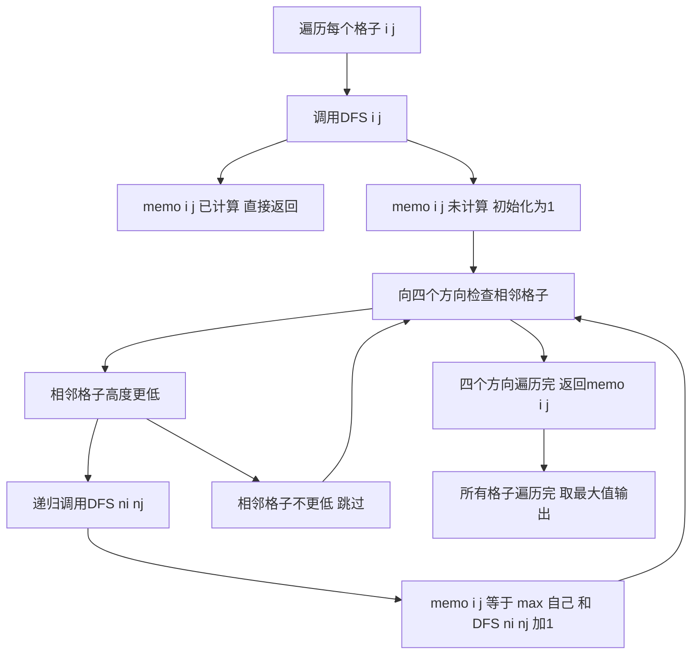

## 本节概述：记忆化搜索 实战

本节选取洛谷 P1434 [SHOI2002] 滑雪，这是记忆化搜索最经典的题目。通过这道题可以彻底理解"搜索加记忆化等于动态规划"这一核心思想。

---

### 题目描述

**题目名称**：[SHOI2002] 滑雪
**来源平台**：洛谷
**题目编号**：P1434

Michael 喜欢滑雪。他来到一个滑雪场，这个滑雪场是一个 R 行 C 列的矩阵，每个格子有一个高度。Michael 可以从一个格子滑到上下左右相邻的格子，但只能从高滑到低。求最长滑坡的长度（经过的格子数）。

**输入格式**：第一行为 R 和 C（1 <= R, C <= 100）。接下来的 R 行，每行 C 个整数，表示高度。高度之间用一个空格间隔。

**输出格式**：输出一行一个整数，表示区域中最长滑坡的长度。

**数据范围**：1 <= R, C <= 100，0 <= h <= 10000，h 为整数。

**示例**：
输入：
```
5 5
1 2 3 4 5
16 17 18 19 6
15 24 25 20 7
14 23 22 21 8
13 12 11 10 9
```
输出：
```
25
```

### 解题思路

**朴素 DFS**：从每个格子出发，向四个方向搜索，如果相邻格子高度更低就继续滑。但这样会有大量重复搜索，最坏复杂度 O((RC)^2) = O(10^8)，可能超时。

**记忆化搜索**：用 `memo[i][j]` 记录从格子 (i, j) 出发的最长滑坡长度。如果已经计算过，直接返回，避免重复计算。每个格子只计算一次，总复杂度降为 O(RC)。

状态转移：`memo[i][j] = 1 + max(memo[ni][nj])`，其中 (ni, nj) 是所有高度低于 (i, j) 的相邻格子。如果没有更低的相邻格子，则 `memo[i][j] = 1`。



### 代码实现

```cpp
#include <iostream>
#include <cstring>
#include <algorithm>
using namespace std;

const int N = 105;
int R, C;
int height[N][N];
int memo[N][N]; // 记忆化数组：memo[i][j] = 从(i,j)出发的最长滑坡长度

// 四个方向：上、下、左、右
int dx[4] = {-1, 1, 0, 0};
int dy[4] = {0, 0, -1, 1};

int dfs(int x, int y) {
    // 如果已经计算过，直接返回（记忆化的核心）
    if (memo[x][y] != 0) {
        return memo[x][y];
    }

    // 至少包含自己，长度为1
    memo[x][y] = 1;

    // 向四个方向搜索
    for (int d = 0; d < 4; d++) {
        int nx = x + dx[d];
        int ny = y + dy[d];
        // 边界检查
        if (nx < 0 || nx >= R || ny < 0 || ny >= C) continue;
        // 只能从高滑到低
        if (height[nx][ny] < height[x][y]) {
            // 递归搜索相邻格子，取最大值
            memo[x][y] = max(memo[x][y], dfs(nx, ny) + 1);
        }
    }

    return memo[x][y];
}

int main() {
    ios::sync_with_stdio(false);
    cin.tie(0);

    cin >> R >> C;

    // 读入高度矩阵
    for (int i = 0; i < R; i++) {
        for (int j = 0; j < C; j++) {
            cin >> height[i][j];
        }
    }

    // 初始化记忆化数组为0（表示未计算）
    memset(memo, 0, sizeof(memo));

    int ans = 0;
    // 从每个格子出发尝试滑雪
    for (int i = 0; i < R; i++) {
        for (int j = 0; j < C; j++) {
            ans = max(ans, dfs(i, j));
        }
    }

    cout << ans << endl;

    return 0;
}
```

### 代码解析

- **memo 数组**：`memo[x][y]` 存储从 (x, y) 出发的最长滑坡长度。初始化为 0 表示未计算。如果 `memo[x][y] != 0`，说明已经计算过，直接返回，避免重复递归。这是记忆化搜索的核心。
- **DFS 递归**：从当前格子出发，向四个方向检查相邻格子。如果相邻格子高度更低（可以滑过去），则递归计算从该格子出发的最长滑坡，`memo[x][y] = max(memo[x][y], dfs(nx, ny) + 1)`。
- **终止条件**：如果一个格子四周没有更低的格子，它的最长滑坡长度就是 1（只有自己）。
- **答案**：遍历所有格子作为起点，取最大值。

### 复杂度分析

- 时间复杂度：O(RC)，每个格子最多被计算一次，记忆化保证了不重复。
- 空间复杂度：O(RC)，记忆化数组和递归栈。

> [!TIP]
> 记忆化搜索的本质是将递归中的重复子问题结果缓存起来。这道题中，从 (x, y) 出发的最长滑坡长度是确定的，无论从哪个路径到达 (x, y)，答案都一样。因此用 memo 数组缓存即可。记忆化搜索和动态规划是等价的，只是思考角度不同：记忆化搜索是"自顶向下"，DP 是"自底向上"。

## 本章小结

- 记忆化搜索 = DFS + 缓存，本质是动态规划的自顶向下实现。
- memo 数组记录已计算的结果，避免重复递归，将指数级复杂度降为多项式级。
- 滑雪问题是记忆化搜索的经典应用，状态转移依赖相邻格子的高度关系。
- 记忆化搜索的优势在于代码直觉、自然，不需要像 DP 那样推导状态转移顺序。
